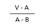

---

## BaekJ Brz) 1271. 엄청난 부자2

[Top Page](#)  

#### 문제 링크

 [Baekjoon 1271](https://www.acmicpc.net/problem/1271)  

#### 풀이 언어

Python

#### 답안 코드

```python
T = list(map(int,input().split()))
Answer = list()
Answer.append(T[0]//T[1])
Answer.append(T[0]%T[1])

print(*Answer)
```

#### 풀이 과정에 대한 사담

연산자 기초 활용 능력을 테스트 하는 문제인 것 같다.  
list를 사용하여 값을 저장하고 각 요구 출력 별로 각각 구한 뒤,  
append를 사용하여 추가하고,  
애스터리스크 리스트로 마무리.  

---

## BaekJ Brz) 2338. 긴자리 계산

[Top Page](#)  

#### 문제 링크

 [Baekjoon 2338](https://www.acmicpc.net/problem/2338)  

#### 풀이 언어

Python

#### 답안 코드

```python
A = int(input())
B = int(input())

print(A+B)
print(A-B)
print(A*B)
```

#### 풀이 과정에 대한 사담

그냥 + - * 쓸 줄 아냐를 묻는 정말 기초적인 문제.  

---

## BaekJ Brz) 2420. 사파리 월드

[Top Page](#)  

#### 문제 링크

 [Baekjoon 2420](https://www.acmicpc.net/problem/2420)  

#### 풀이 언어

Python

#### 답안 코드

```python
N, M = map(int,input().split())
print(abs(N-M))
```

#### 풀이 과정에 대한 사담

절대값 명령어(abs)를 몰라서 검색 찬스를 좀 썼다.  
그리고 M, N을 동시에 한 줄에 쓸 수 있다는 것을 처음 알았다(이 또한 검색 찬스)  
이 참에 기억해둬야겠다.  

---

## BaekJ Brz) 2338. 긴자리 계산

[Top Page](#)  

#### 문제 링크

 [Baekjoon 2338](https://www.acmicpc.net/problem/2338)  

#### 풀이 언어

Python

#### 답안 코드

```python
A = int(input())
B = int(input())

print(A+B)
print(A-B)
print(A*B)
```

#### 풀이 과정에 대한 사담

그냥 + - * 쓸 줄 아냐를 묻는 정말 기초적인 문제.  

---

## BaekJ Brz) 2588. 곱셈

[Top Page](#)  

#### 문제 링크

 [Baekjoon 2588](https://www.acmicpc.net/problem/2588)  

 [답안 링크](http://boj.kr/5f7d002cdc2e49edaf2343559dc12370)

#### 풀이 언어

Python

#### 답안 코드

```python
num_01 = str(input()) # 1번 입력
num_02 = str(input()) # 2번 입력

for num_Index in range (len(num_02)-1, -1, -1): # 각 자리별로 계산하게 반복함
    print(f'{int(num_01)*int(num_02[num_Index])}') # 자릿수별 곱셈 구하기
print(f'{int(num_01)*int(num_02)}') # 진짜배기 곱셈 구하기
```

#### 풀이 과정에 대한 사담

알고리즘 스터디 그룹 1주차의 4일차 문제, 문제 선택자는 나.  

각 자릿수 별로 곱셈이 이루어지게 하고, 그걸 출력하면 끝인 간단한 알고리즘이다.  
다양한 방법이 있지만, 나는 가장 간단하게 str(문자열)의 성질을 활용하여 그걸 반복하게 하고,  
int로 형변환 시킨 상태로 한자리씩 구하는 방식으로 solving했다.  

---

## BaekJ Brz) 2480. 주사위 세개

[Top Page](#)  

#### 문제 링크

 [Baekjoon 2480](https://www.acmicpc.net/problem/2480)  

 [답안 링크](http://boj.kr/6c6afd4d623f47e4b8455b2308efe956)

#### 풀이 언어

Python

#### 답안 코드

```python
data = list(map(int, input().split())) # 받아 적을 공간을 만든다.

if data[0] == data[1] and data[1] == data[2]: # 3개가 다 똑같을 경우 간단하다. 1?000점을 만들 식 1개만 만들면 된다.
    print(f'{10000+data[0]*1000}')
elif data[0] == data[1] or data[1] == data[2] or data[0] == data[2]: # 2개일 경우 각각의 경우의 수를 다 나열한다.
    if data[0] == data[1] and data[1] == data[2]:
        same_Value = data[1] # 1번 데이터를 키값으로 밸류에 저장
    elif data[1] == data[2] or data[0] == data[2]:
        same_Value = data[2] # 2번 데이터를 키값으로 밸류에 저장
    else:
        same_Value = data[0] # 0번 데이터를 키값으로 밸류에 저장
    print(1000+same_Value*100) # 그리고 키값으로 저장된 중복된 밸류를 집어넣어서 출력하면 된다.
else:
    print(f'{max(data)*100}') # 간단하다 가장 높은 수가 출력되게 max를 이용하면 끝!
```

#### 풀이 과정에 대한 사담

알고리즘 스터디 그룹 1주차의 1일차 문제, 문제 선택자는 J1학우님.  

3개 다 같은 숫자의 주사위이거나, 다 다른 주사위인 경우의 수를 출력하는 것은 매우 쉽다.  
문제는 2개만 같을 경우인데, 다양한 방법이 있을것으로 추측되나, 나는 다소 무식한 방법을 쓰기로 하였다.  
간단히 말하자면 모든 경우의 수를 if문을 사용하여 same_Value 값에 저장하고 그 값을 집어넣게 하면 된다.  

---

## BaekJ Brz) 25304. 영수증

[Top Page](#)  

#### 문제 링크

 [Baekjoon 25304](https://www.acmicpc.net/problem/25304)  

 [답안 링크](http://boj.kr/d8876504d11c4cfc98c56d9c5cde1733)

#### 풀이 언어

Python

#### 답안 코드

```python
total_Price = int(input()) # 총액 입력

total_Goods = int(input()) # 물건의 종류 수 입력

goods_list = [] # 굿즈 가격을 저장할 리스트 추가

for goods_Index in range(0, total_Goods): # 물건의 종류 수에 따라 반복 실행
    
    goods = list(map(int, input().split())) # 굿즈의 가격과 갯수를 입력받음
    goods_Total_Price = goods[0] * goods[1] # 가격 X 갯수 저장
    goods_list.append(goods_Total_Price) # 리스트에 추가

if total_Price == sum(goods_list): # 처음 입력한 총액이 리스트내 물건들의 총액과 같을시
    print('Yes') # 예스 예스 예스!
else:
    print('No') # 아님 말고.
```

#### 풀이 과정에 대한 사담

알고리즘 스터디 그룹의 2일차 문제, 문제 선택자는 J2학우님.  

주어진 조건이 꽤나 많지만, 실제로는 간단하다.  
그냥 영수증 내역을 입력시켜서 총액과 같은지 아닌지 구현시키는 알고리즘을 만드는 문제다.  
가장 성가실 수 있는 부분은 물건 가액과 갯수를 입력시키는 목록이 가변이라서 이를 구현해야 된다는 점인데,  
for문을 사용하여서 물건 종류 갯수에 따라 가변할 수 있도록 구현시키면, 이외에 어려운 점은 없어보인다.  

---

## BaekJ Brz) 5086. 배수와 약수

[Top Page](#)  

#### 문제 링크

 [Baekjoon 5086](https://www.acmicpc.net/problem/5086)  

 [답안 링크](http://boj.kr/76eace83d4d5406faab44d0b58891f19)

#### 풀이 언어

Python

#### 답안 코드

```python
while True: # 0 0 이 입력되어야 종료된다는 조건이 붙었으므로 While 문을 사용하여 무한 반복한다.
    nums = list(map(int, input().split())) # 2가지 숫자를 받아야 하므로 list, map을 사용

    if nums[1] > nums[0] and nums[1] % nums[0] == 0: # factor의 경우
        print("factor")
    elif nums[0] > nums[1] and nums[0] % nums[1] == 0: # multiple의의 경우
        print("multiple")
    elif nums[0] == 0 and nums[1] == 0: # 탈출코드
        break # while 조건문 관계없이 탈출함.
    else:
        print("neither") # 이외의 경우는 neither
```

#### 풀이 과정에 대한 사담

알고리즘 스터디 그룹의 3일차 문제, 문제 선택자는 P학우님.  

모르고 지나칠 뻔 했는데 조건문에 0 0 으로 끝내라는 조건이 있다.  
나도 이것때문에 첫번째 시도에서는 실패했는듯.  
그러므로 while문을 써서 무한 반복하게 만든다음, list-map 구조로 숫자를 받고,  
0 0이 나올때까지 무한반복하는 코드를 짰다.  

---

## BaekJ Brz) 2845. 파티가 끝나고 난 뒤

[Top Page](#)  

#### 문제 링크

 [Baekjoon 2845](https://www.acmicpc.net/problem/2845)  

 [답안 링크](http://boj.kr/c1ce6e56f7e447b48eb44f51f5945460)

#### 풀이 언어

Python

#### 답안 코드

```python
how_many_people = list(map(int, input().split())) # 상근이가 생각하고 있는 사람 수
mess_media = list(map(int, input().split())) # 신문 기사에 나온 사람 수

fact_check = [] # 참가자의 수가 몇 명 만큼 잘못 되었는지 검색

for fact_checker in mess_media: # 신문 마다 팩트 체크 개시
    if fact_checker == how_many_people[0] * how_many_people[1]: # 일치하면
        fact_check.append(0)
        # 0 출력. 사실 그냥 if-else 없이 fact_check.append(fact_checker - how_many_people[0] * how_many_people[1]) 만 해도 되긴할듯.
    else:
        fact_check.append(fact_checker - how_many_people[0] * how_many_people[1]) # 차이가 발생하면 차이만큼 입력

print(*fact_check) # 언패킹하면서 출력
```

#### 풀이 과정에 대한 사담

알고리즘 스터디 그룹의 5일차 문제, 문제 선택자는 G학우님.  

상근이가 생각하고있는 사람의 수와 신문 기사에 나온 사람의 수를 단순히 비교하여서 그 차이만큼 출력하면 그만인 간단한 문제.  

주의할 점은 'fact_checker - how_many_people[0] * how_many_people[1]' 를  
'how_many_people[0] * how_many_people[1] - fact_checker'로 잘못 입력시키는 일이 없도록 하는 정도?  

---

## BaekJ Brz) 10811. 바구니 뒤집기

[Top Page](#)  

#### 문제 링크

 [Baekjoon 10811](https://www.acmicpc.net/problem/10811)  

 [답안 링크](http://boj.kr/faade4b97ef54d5dbf0ef7731a4f4e9b)

#### 풀이 언어

Python

#### 답안 코드

```python
N, M = map(int, input().split()) # 바구니 정보와 역순으로 뒤집을 명령어 횟수를 정하기

baguni_list = [] # 바구니 세팅

for i in range(1, N+1): # 바구니 리스트 생성
    baguni_list.append(i)

for i in range(M): # 역순으로 뒤집을 횟수 사전에 입력한 만큼 역순으로 뒤집기
    start, end = map(int, input().split()) # 시작지점과 종료 지점 입력
    for j, k in zip(range(start-1, end-1), range(end-1, start-2, -1)): # 인덱스 정보를 입력해야하는데, 동시에 정방향으로 동시에 역방향으로 가야하니 zip 함수 활용
        if j == k or j > k: # 만약 j == k(즉 중간값)이거나 j값이 k 값을 초월하면 더이상 바뀌지 말아야하므로 break 시킨다.
            break
        else: # 그 이외의 경우라면
            baguni_list[j], baguni_list[k] = baguni_list[k], baguni_list[j] # 스와프 시킨다.

print(*baguni_list) # 그 후 언패킹하여 프린트

```

#### 풀이 과정에 대한 사담

알고리즘 스터디 그룹의 6일차 문제.  

파이썬이라서 쉽게 풀 수 있는 문제 중 하나인데, 이유는 파이썬은 스와프 기능을 지원해서,  
일일이 A 값은 임시값에 옮기고 B 값을 A에 옮기고, 임시값에 옮긴걸 다시 B 값에 옮기는 행동을 안 해서 되기 때문이다.  
자바때는 이거 꽤 귀찮았다.  
어쨋든 역순으로 바꾸는건 zip함수를 이용해서 두 인덱스들을 동시에 늘리고 줄이고를 한 뒤 스와프 방식을 이용해서 옮기고,  
만약 j == k(즉 중간값)이거나 j값이 k 값을 초월하면 더이상 바뀌지 말아야하므로 break 시키는 방식으로 마무리하였다.  

---

## BaekJ Brz) 2869. 달팽이는 올라가고 싶다

[Top Page](#)  

#### 문제 링크

 [Baekjoon 2869](https://www.acmicpc.net/problem/2869)  

 [답안 링크](http://boj.kr/84f2c9ac6f074a008672e78b42110a43)

#### 풀이 언어

Python

#### 답안 코드

```python
import math # 수학 공식용 모듈 import

A, B, V = map(int, input().split()) # 값 입력

day = ((V - A) / (A - B)) # 후술

day_final = math.ceil(day) + 1 # 마지막으로 1 더하면

print(day_final) # 값이 출력된다.

```

#### 풀이 과정에 대한 사담

알고리즘 스터디 그룹의 7일차 문제. 문제 선택자는 J1 학우님.

```python
A, B, V = map(int, input().split())

day = 0

for i in range(V+1):
    day += 1
    V -= A
    if V <= 0:
        break
    V += B

print(day)

```

사실 수포자의 쉼터 출신자로서 반복문으로 표현한다면 이렇게 표현하면 풀 수 있는 문제이나,  
이 문제는 0.25초 만에 결과를 출력해내야하므로, 해당 식은 쓸 수 없다.



주어진 문제의 경우 공식으로 나타내면 이러한 공식에다가, 올림한 뒤 1 더하면 값이 나온다.  
이 공식을 그대로 코드로 옮기면 된다.  

---

## BaekJ Brz) 10870. 피보나치 수 5

[Top Page](#)  

#### 문제 링크

 [Baekjoon 10870](https://www.acmicpc.net/problem/10870)  

 [답안 링크](http://boj.kr/339b5e2eb5ad4084adb342465583367d)

#### 풀이 언어

Python

#### 답안 코드

```python
def fibo(fibo_num):
    fibo_1 = 0  # 문제에 제시된 0부터 시작.
    fibo_2 = 1  # 그리고 다음 자리수인 1 추가. 이게 기준점이 될 예정.
    if fibo_num == 0: # 제시된 자리수에 0이 있었으므로 0의 조건도 기재. 피보나치 수열의 0번은 0이다.
        return 0
    if fibo_num == 1 or fibo_num == 2: # 피보나치 수는 1, 1, 2, 3, 5, ... 이다. 즉 1이나 2면 무조건 1이다.
        return 1
    for i in range(1, fibo_num): # if 가 아닐시 정상적인 피보나치 수가 출력
        fibo_1, fibo_2 = fibo_2, fibo_2 + fibo_1 # 반복문을 활용하여 계속 갱신시킴

    return fibo_2 # 반복이 끝나면 fibo_2 리턴

fibo_num = int(input()) # 구할 피보나치 수 자릿수 구하기.

result = fibo(fibo_num) # 값 저장

print(result) # 출력

```

#### 풀이 과정에 대한 사담

알고리즘 스터디 그룹의 문제. 문제 제시자는 나.  
피보나치 수열은 재귀 알고리즘을 사용하기 가장 알맞은 예시 중 하나로 꼽힌다.  
근데 나는 일부로 for문을 사용하는 반복문으로 풀어보았다.  ~~결코 재귀에 안 익숙해서가 아니다~~
for 반복문을 활용하면 계속 fibo_1과 fibo_2를 갱신시킴으로서 피보나치를 구현시킬 수 있다.  

---

## BaekJ Brz) 25501. 재귀의 귀재

[Top Page](#)

#### 문제 링크

[Baekjoon 25501](https://www.acmicpc.net/problem/25501)

[답안 링크](http://boj.kr/339b5e2eb5ad4084adb342465583367d)

#### 풀이 언어

Python

#### 답안 코드

```python
def recursion(s, l, r):
    global call_resursion # 카운트 하기위해 전역변수 설정
    call_resursion += 1 # recursion의 횟수를 세기위한 += 1
    if l >= r: return 1
    elif s[l] != s[r]: return 0
    else: return recursion(s, l+1, r-1)

def isPalindrome(s):
    return recursion(s, 0, len(s)-1)

testcase = int(input())
for tc_idx in range(1, testcase + 1):
    call_resursion = 0
    target_word = input()
    print(f'{isPalindrome(target_word)} {call_resursion}') # 지문에서 시키는 대로 출력하자.
```

#### 풀이 과정에 대한 사담
이 역시 알고리즘 스터디에서 G학우님이 뽑아준 문제.  
말이 재귀의 귀재이지, 재귀에 대한 답안은 다 문제에 선제시되어있어서, 사실상 def개념과 변수를 써먹을 줄 아는지,  
그리고 이 코드들을 이해할 수 있는지만 할 수 있다면 브론즈 2 치고는 쉬운 문제인 편이다.  
나는 글로벌 변수를 이용하여 간단히 풀었다.  

---

## BaekJ Brz) 1333. 부재중 전화

[Top Page](#)

#### 문제 링크

[Baekjoon 1333](https://www.acmicpc.net/problem/1333)

[답안 링크](https://www.acmicpc.net/source/share/cd9c3e9af9e54f098a57dbd046953402)

#### 풀이 언어

Python

#### 답안 코드

```python
album_include, song_len, phone_bell = map(int, input().split()) # 정보 입력

ans = 0 # 답 추출용
do_not_disturb = [] # 노래 지속 시간과 노래 빈 시간 시각화

for i in range(album_include): # 지도 제작
    for j in range(song_len):
        do_not_disturb.append(1) # 노래 들리는 부분

    if i == album_include-1: # 노래가 끝나는 부분에는 멈추도록
        break
    else: # 노래와 노래 사이
        for _ in range(5):
            do_not_disturb.append(0) # 노래 안 들리는 부분

ringringring = 0 # 전화 울리는 구간을 설정

while True:
    if ringringring >= len(do_not_disturb): # 노래가 끝났다면
        ans = ringringring # 노래 끝나고 받음
        break
    elif do_not_disturb[ringringring] == 0: # 전화를 받을 수 있다면
        ans = ringringring # 답으로 설정.
        break
    else: # 받을 수 없다면
        ringringring += phone_bell # 다음 벨 울리는 지점으로 이동

print(ans)
```

#### 풀이 과정에 대한 사담
여러가지 푸는 방법이 있을 것 같지만, 나는 가장 익숙한 리스트로 지도를 그리는 방식으로 풀었다.  
문제에서 노래 사이에는 5초간의 무음 구간이 있다고 하고 있으므로 노래가 끝난 직후부터 0으로 전화를 들을 수 있는 구간을 설정한다.  
그렇게해서 노래가끝날때까지의 지도가 완성됐다면,  
이제 전화벨이 울리는 곳을 이용하여 답을 구하면 된다.  
빈 구간인 0이면 그 곳이 첫 전화를 받을 수 있는 답이 될거고, 아니면 계속 반복시키면 된다.  
while문을 사용하였으므로 break로 탈출지점을 만들어 두는 것을 잊지말자.  

---

## BaekJ Brz) 1373. 2진수 8진수

[Top Page](#)

#### 문제 링크

[Baekjoon 1373](https://www.acmicpc.net/problem/1373)

[답안 링크](http://boj.kr/14db677ceed54f2e9f11b1b5fe1365cc)

#### 풀이 언어

Python

#### 답안 코드

```python
num_input = input()

bi_ten = int(num_input, 2) # 2진수 -> 10진수 변환

ten_oct = oct(bi_ten) # 10진수 -> 8진수 변환

answer = ''

for i in ten_oct[2:]: # 변환된 8진수 앞 2글자 제거
  answer += i

print(answer)
```

#### 풀이 과정에 대한 사담
```python
num_input = input()


sum_result = 0
reverse_num = ''

for i in num_input: # 뒤집기
  reverse_num = i + reverse_num

for i in range(len(reverse_num)): # 2진수를 수동으로 해보자
  if i==0:
    sum_result += int(reverse_num[i]) * 1
  else:
    sum_result += int(reverse_num[i]) * (2**(int(i)))

oct_list = []
cycle_num = sum_result

while True:
  after_oct = cycle_num // 8
  list_add = cycle_num % 8
  oct_list.append(list_add)
  if after_oct != 0:
    cycle_num = after_oct
  else:
    break

oct_list.reverse()

answer = ''

for i in oct_list:
  answer = answer + str(i)

print(answer)
```
처음에는 이렇게 풀려고 했었는데,(8진수 부분은 다른 사람 코드를 참조했다.) 문제에서 자릿수를 무식하게 많이 내주어서 이렇게 풀었다간 시간초과로 실패하기 때문에,  
순순히 함수를 써서 풀었다. 물론 알고리즘 통과 유무를 확인할 수 없으니 테스트 케이스에 대한 답만 확인가능하고 이 식이 작동 되는지는 모르겠다.  
그냥 함수만 잘 쓰면 되는 문제.  

---

## BaekJ Brz) 12605. 단어순서 뒤집기

[Top Page](#)

#### 문제 링크

[Baekjoon 12605](https://www.acmicpc.net/problem/12605)

[답안 링크](http://boj.kr/eafff46f37f1426ea664763385be1d2f)

#### 풀이 언어

Python

#### 답안 코드

```python
testcase = int(input())

for tc_idx in range(1, testcase+1):
    word_list = input().split()

    for i, j in zip(range(len(word_list)), range(len(word_list)-1, -1, -1)):
        if i < j: # ij가 추월하지 않는 한,
            word_list[i], word_list[j] = word_list[j], word_list[i] # swap

    print(f'Case #{tc_idx}:', *word_list)
```

#### 풀이 과정에 대한 사담
워밍업 풀이 문제.  
분류에는 스택이라 되어있지만, 솔직히 스와프로 푸는게 더 쉽다.  

---
