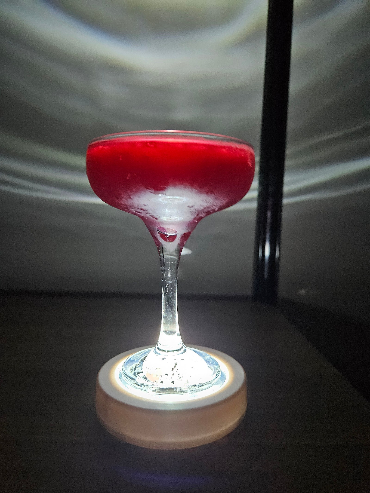
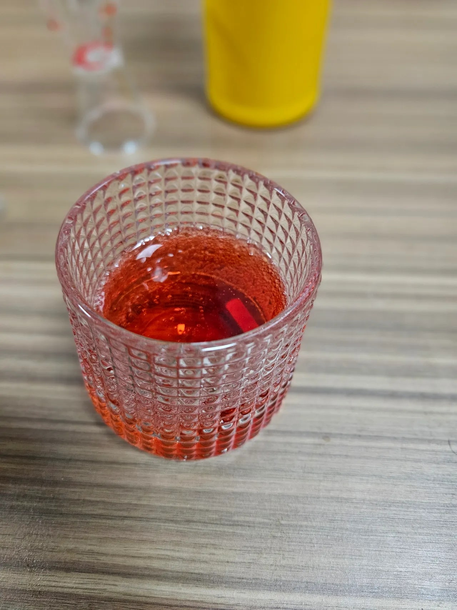

## 면책조항

해당 페이지는 제가 개발한 레시피가 아닌 다른 사람이나 단체가 만들어 둔 레시피를 가져온 것 입니다. 출처나 영상을 남겨두고, 별도로 레시피 내용을 기재하지는 않습니다. 상세 레시피는 링크나 영상을 참조 부탁드립니다.  

This page is not a recipe I developed, but a recipe made by someone or an organization. Only leave original Source, and I don't write down the recipe separately. Please refer to the link or video for detailed recipes.  

---

## 환타 하와이안

[Top Page](#)  

  
[영상 제작자: Zstile](https://www.youtube.com/@ZsTile)  

> 재료
> 
> > Blue Curaçao syrup  
> > Cocopalm  
> > Pineapple juice  
> > Fanta  

상세 레시피는 원본 영상 참조.  

### 그래서 만들었어?

<iframe width="560" height="315" src="https://www.youtube.com/embed/KsjqUwWy1YE?si=jbOXmBjx8LLRNs33" title="YouTube video player" frameborder="0" allow="accelerometer; autoplay; clipboard-write; encrypted-media; gyroscope; picture-in-picture; web-share" referrerpolicy="strict-origin-when-cross-origin" allowfullscreen></iframe>

### 맛은 어땠어?

약간 다 녹여둔 조스바 같은 느낌?　재료도 간단해서 생각날때 만들 예정.

---

## 서퍼시퍼

[Top Page](#)  

[링크](https://holdeniscomming.tistory.com/entry/4-%EB%AC%B4%EC%95%8C%EC%BD%9C-%EC%B9%B5%ED%85%8C%EC%9D%BC-%EB%A0%88%EC%8B%9C%ED%94%BC-%EC%84%9C%ED%8D%BC%EC%8B%9C%ED%8D%BC-%EB%A7%8C%EB%93%9C%EB%8A%94-%EB%B2%95Supper-Sipper-%EB%B0%94%EC%9D%B4%EC%98%AC%EB%A0%9B-%ED%96%A5%EA%B8%B0)  
Original Post: 취하는 이야기  

> 재료  
> > Grape Juice  
> > Sweet & Sour Mix(변형, 원본 레시피의 레몬주스와 동량)  
> > Simple Syrup  
> > Sparkling Water  

상세 레시피는 원본 링크 내용 참조.  

### 그래서 만들었어?

  

### 맛은 어땠어?

웰치스. 기분좋게 신맛이 스쳐지나가면서 포도 탄산음료를 마시는 기분이 낫던 기분.  

---

## 셜리 템플

[Top Page](#)  

[링크](https://everythinginthebar.blogspot.com/2011/01/i-60-cocktails-iba-international.html)  
IBA 레시피(참조 자체는 Everythinginthebar 참조)  

> 재료  
> > Ginger Ale 90%  
> > Granadin Syrup 10%   

잔에 진저에일 먼저 넣고, 그레나딘 시럽 투하. 살살 섞고 마시기.  

### 그래서 만들었어?

  

### 맛은 어땠어?

석류풍의 달달구리함이라 머리 쓰는 작업을 할때 당분 때려넣기 좋은 음료수.   
