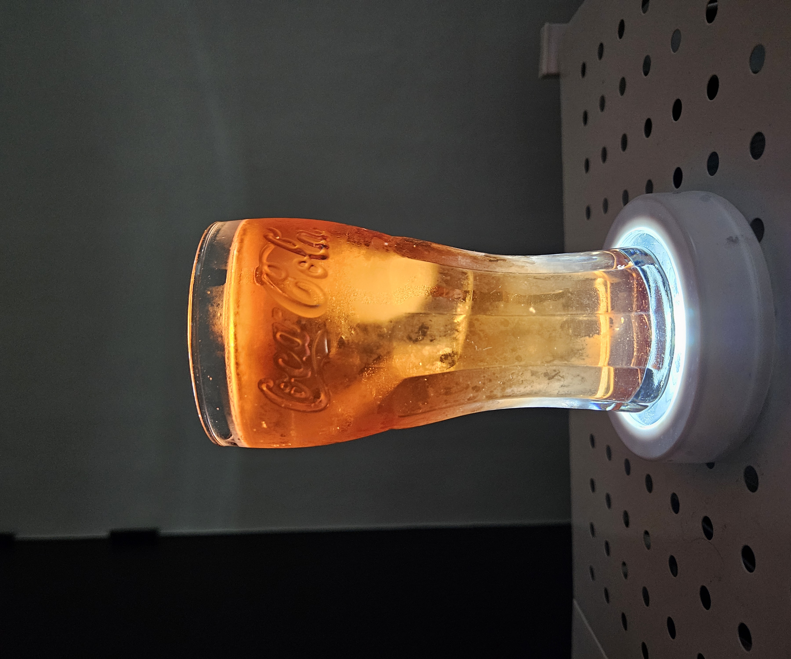

## 면책조항

해당 페이지는 제가 개발한 레시피가 아닌 다른 사람이나 단체가 만들어 둔 레시피를 가져온 것 입니다. 출처나 영상을 남겨두고, 별도로 레시피 내용을 기재하지는 않습니다. 상세 레시피는 링크나 영상을 참조 부탁드립니다.

This page is not a recipe I developed, but a recipe made by someone or an organization. Only leave original Source, and I don't write down the recipe separately. Please refer to the link or video for detailed recipes.

---

## 엘 디아블로(El Diablo)

[Top Page](#)  

  
[영상 제작자: Zstile](https://www.youtube.com/@ZsTile)    

> 재료
> 
> > Tequila Reposado(변형)  
> > Crème de Cassis   
> > Lemon Juice   
> > Grenadine Syrup 2tsp(선택)  

자세한 레시피는 원본 영상 참조.  

### 그래서 만들었어?
<iframe width="560" height="315" src="https://www.youtube.com/embed/S9mTOTw7VU0?si=y_jaFKZbjD2xAUv6" title="YouTube video player" frameborder="0" allow="accelerometer; autoplay; clipboard-write; encrypted-media; gyroscope; picture-in-picture; web-share" referrerpolicy="strict-origin-when-cross-origin" allowfullscreen></iframe>  

  

### 맛은 어땠어?

데킬라에 카시스 향 첨가. 끝.   
데킬라 특유의 홍삼향이 강한 편이다. 원래는 실버 데킬라를 추천했지만,  
데킬라 이미지가 꽤 강할 것 같아서, 집에 있는 데킬라 중 가장 강한 1800 레포사도를 일부러 사용하였다.  
개인적으로 데킬라 향 자체는 호이기 때문에 잘 마실 수 있으나(본인은 홍삼농축즙도 잘만 빨아마시는 사람이다),  
데킬라 향이 불호인 사람이라면, 이 칵테일은 꽤 데킬라 향이 강한 축에 속하기 때문에 불호를 표할 가능성이 매우 높아보인다.  

---
