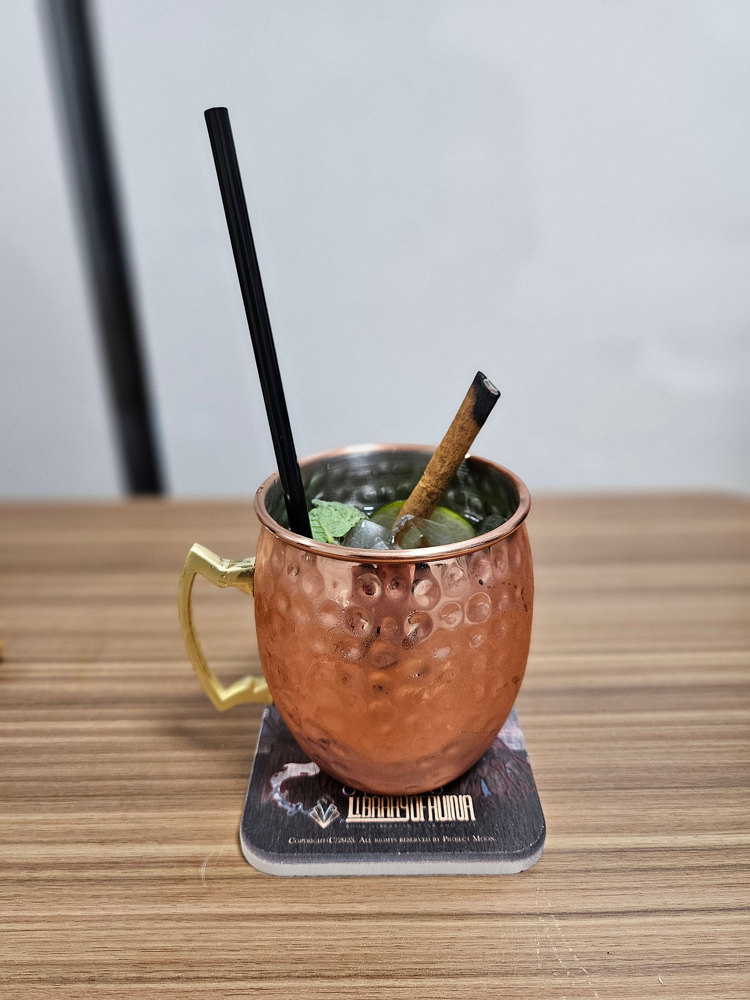

## 면책조항

해당 페이지는 제가 개발한 레시피가 아닌 다른 사람이나 단체가 만들어 둔 레시피를 가져온 것 입니다. 출처나 영상을 남겨두고, 별도로 레시피 내용을 기재하지는 않습니다. 상세 레시피는 링크나 영상을 참조 부탁드립니다.

This page is not a recipe I developed, but a recipe made by someone or an organization. Only leave original Source, and I don't write down the recipe separately. Please refer to the link or video for detailed recipes.

## 모스코뮬

[모스코뮬](https://namu.wiki/w/%EB%AA%A8%EC%8A%A4%EC%BD%94%20%EB%AE%AC)  
IBA 공식 레시피. 현재 공식 레시피는 삭제.  

> 재료
> > Vodka 45ml  
> > Lime Juice 10ml    
> > Ginger Bear 120ml
> > Mint Leaf(개인 변형)
> > Cinamon Stick(개인 변형)

1. 잔에 라임주스, 보드카, 진저비어, 얼음, 민트 잎을 넣는다.  
2. 잘 섞는다.  
3. 계피스틱을 꽂고 토치로 살짝 지져준다.  

### 그래서 만들었어?

  

### 맛은 어땠어?

시원하고 상쾌함.  
여름에 마신다면 다른 어떤 술도 바랄 필요 없는 최적의 술.  
약간의 시트러스함과 약간의 생강향 그리고 그걸 덮어버리는 상쾌함.  
