여행 일자는 2023년 1월 12일 입니다.  
이 여행은 친구가 사진 마니아라서 관련하여 도움을 많이 받았습니다.  

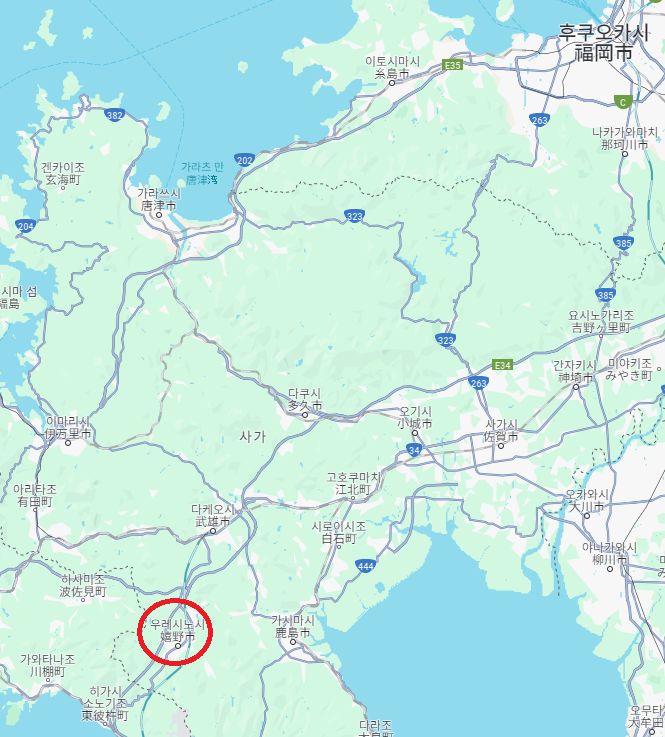  

보통 후쿠오카 여행을 가면 떠오르는 온천 여행지는 오이타현의 유후인, 벳푸, 아소시의 쿠로카와 온천을 먼저 떠올리고는 합니다만, 우레시노도 온천 마을로서서 알음알음 유명한 편입니다.  

거리는 오지(?)의 사가현답게 가까운 편은 아닙니다.  
실제로 저는 기타큐슈에서 버스를 타고 4시간 넘게 걸려서 도착한 곳이기도하고,  

후쿠오카에서 출발해도 2시간이 훨신 넘게 걸린다고합니다.  
기차를 타고가면 릴레이카모메-북큐슈신칸센을 타고 총 1시간 20분가량을 달려야 도착하는 곳입니다.  

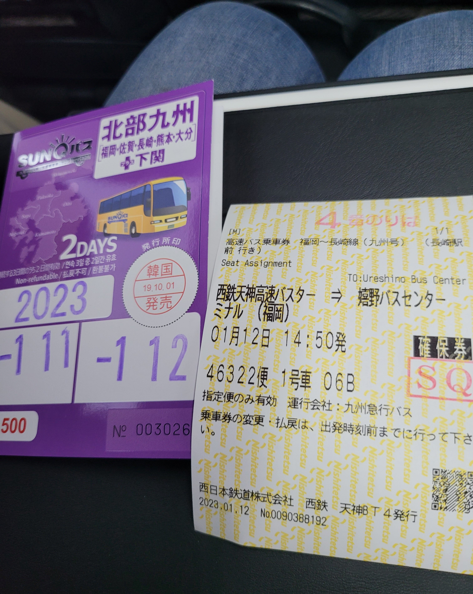

이 여행은 SUNQ(산큐)패스를 끊고 버스 여행을 하였습니다.  
그런데 산큐 패스를 쓰다보니 느끼는 거지만, 이게 후쿠오카 주변 근거리 여행(기타큐슈-시모노세키 정도)에는 참 좋은 패스인건 맞는데, 그 이상은 가면 차라리 돈 좀 더 주고 JR 레일패스를 사는게 더 좋아보이는것 같아요.  
실제로 이 이후 동생들이랑 간 여행은 JR패스로 끊고 갔었고 그게 훨씬 더 좋은 경험이었던 것 같습니다.  
아 지금은 규슈 JR패스도 일부 개악이 되어서 이것도 경로 고려해보고 사야하긴하네요.  

​만약, 3박4일 미만의 후쿠오카 근교만 둘러보는 여행은 버스값도 아낄꼄 SUNQ패스가 좋아보이고, 4박 5일 이상의 규슈 지역 단위로 둘러볼 여행을 갈꺼면 JR패스가 합리적인 선택이라 생각됩니다!  
당연하지만 이동반경이 크지 않은 여행이라면 그냥 돈내고 가는게 제일 좋구요.  

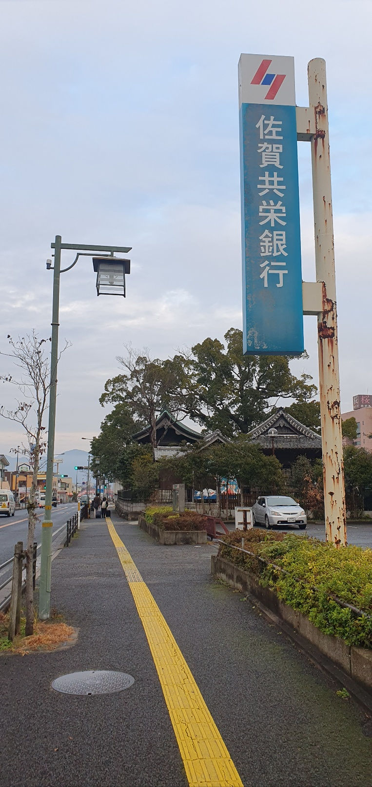
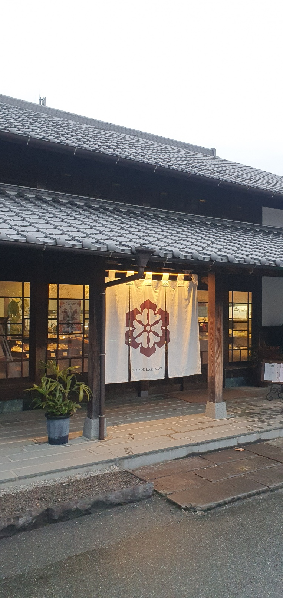
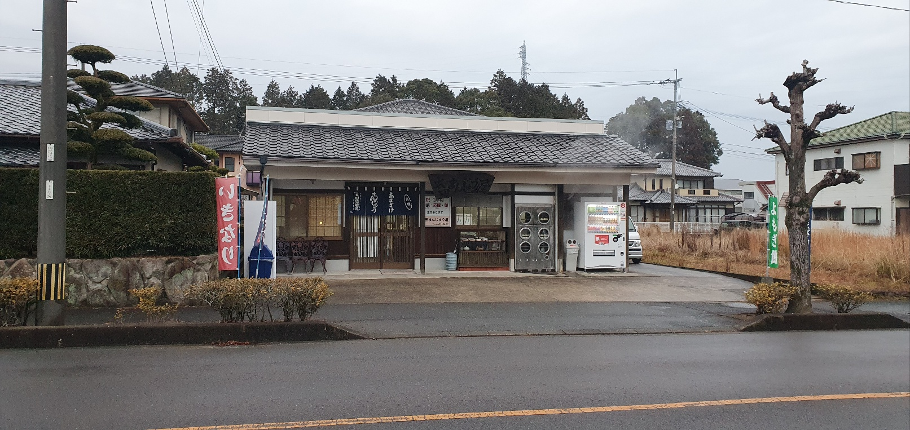
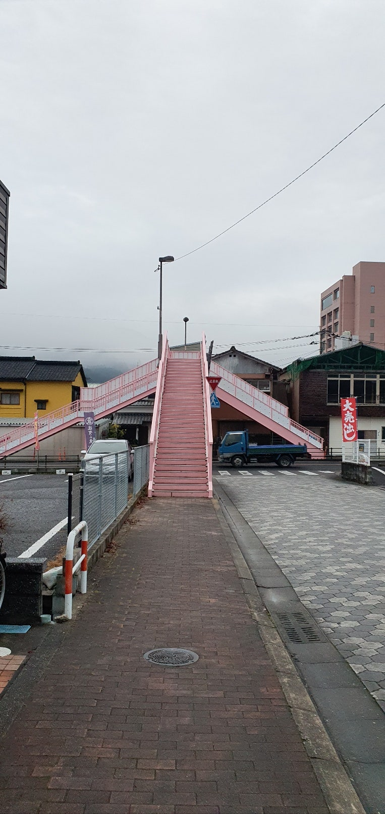
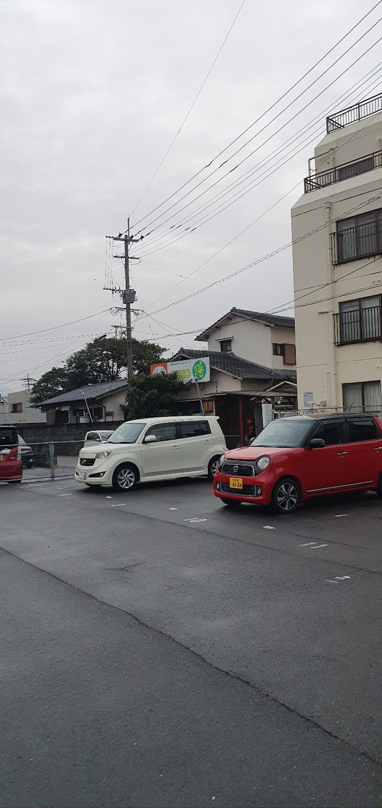
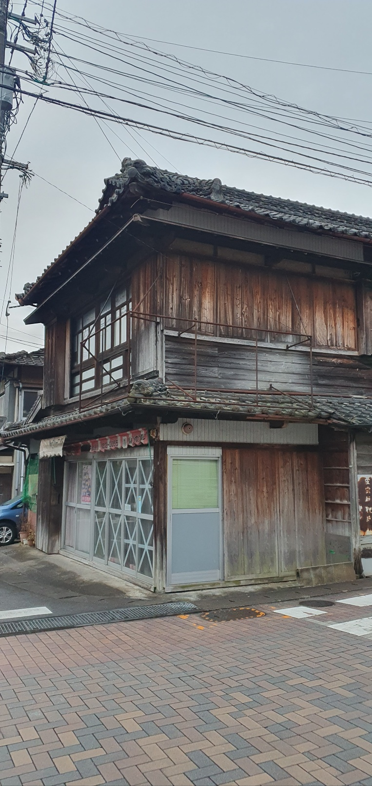

그렇게 버스에서 내려서 본 우레시노 시는 온천 관광지 치고는 다소 조용한 곳이었습니다.  
여기는 진짜배기 시골동네라 읍내만 벗어나면 정말 고요한 시골 주택가인데,  
읍내도 맨홀아래에 있는 온천관에서 김만 모락모락올라오는 고요한 온천마을 분위기가 특징적이었습니다.  

우레시오 읍내 사진.  정말 고요합니다.  

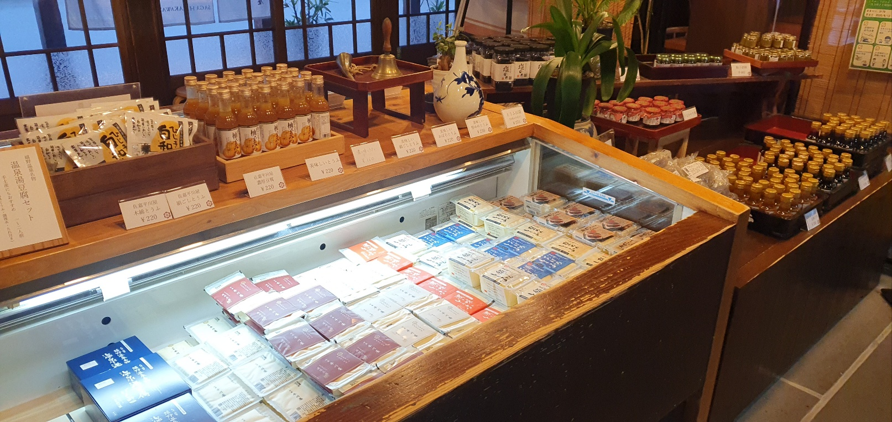
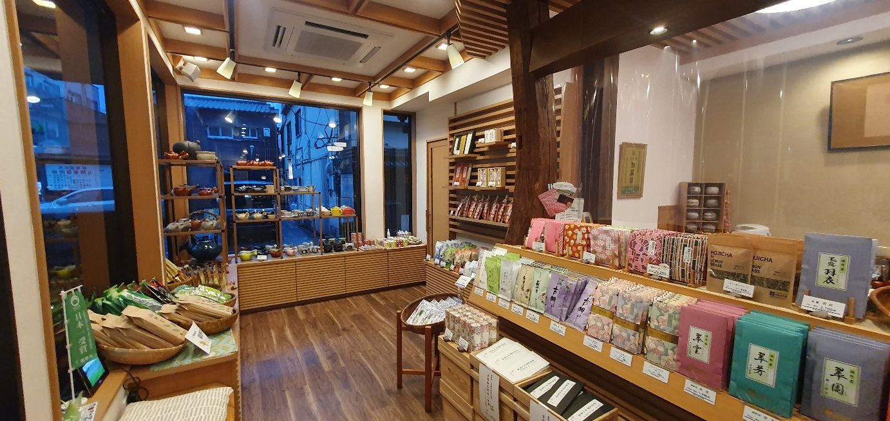
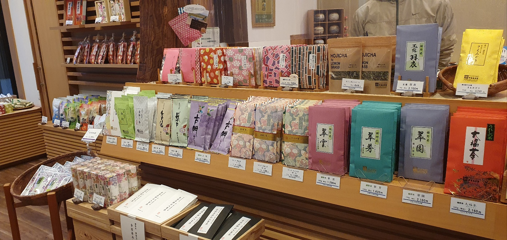
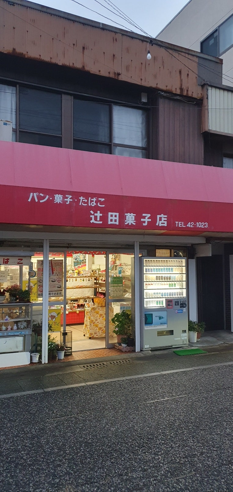
 
우레시노시도 저번에 올렸던 우지시처럼 녹차로 유명한 동네입니다.  
다만 우지처럼 막 알려져 있는 곳은 아니고 곳곳에 녹차 판매점과 자그마한 찻집정도만 있는,  
정말 고요한 시골 녹차마을에 더 가까운 점이 틀린 점인것 같습니다.  

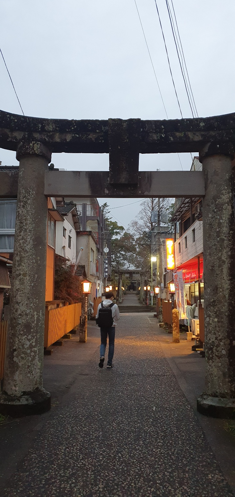

그렇게 걷고있는 절 몰래 찍은 친구.  

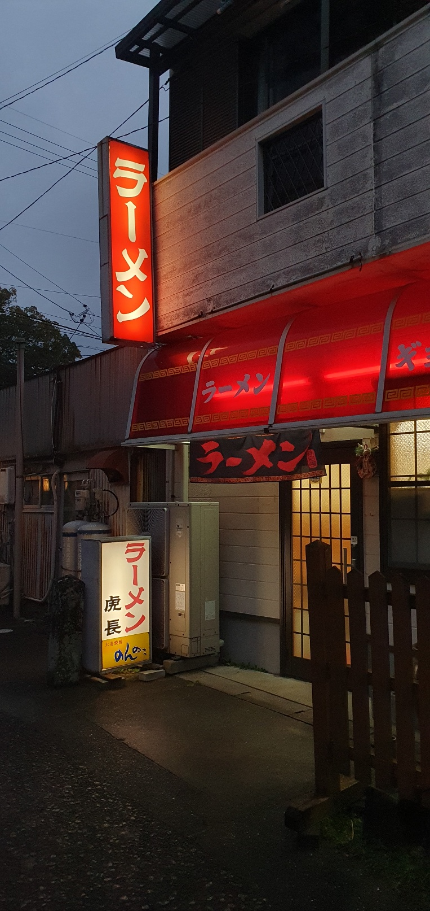

사실 저녁으로는 온천두부(유두부)를 먹으려고헀었는데 아쉽게도 도착한시간이 애매해서,  
유두부집은 다 닫아서 정처없이 걷다가 라멘집 하나 들어갔습니다.  

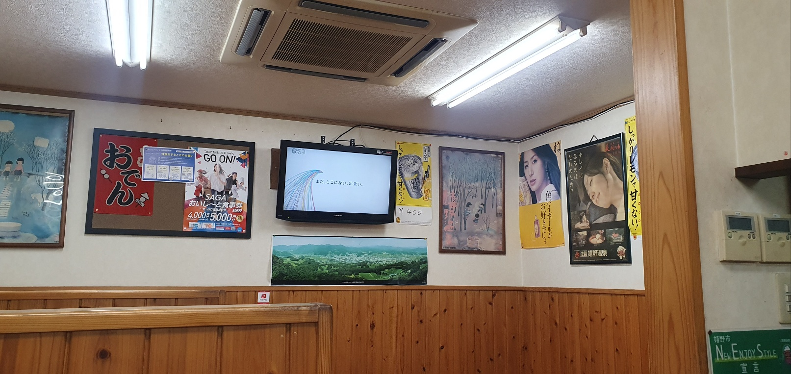
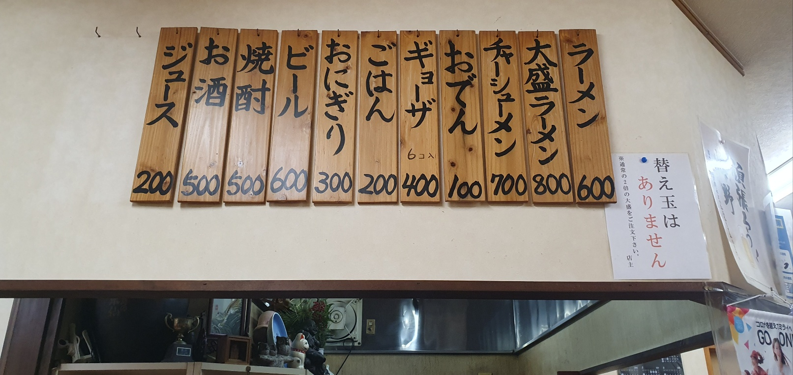
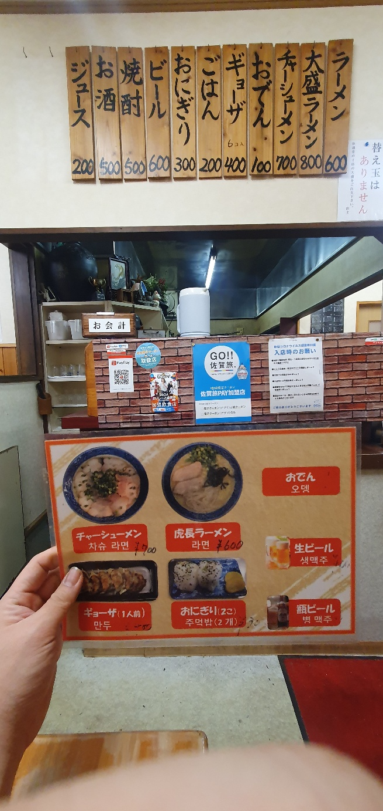

우레시노는 한국분들이 많이 오셔서 그런지 이런 동네 라면집조차 한국어 메뉴판이 있을 정도였습니다.  

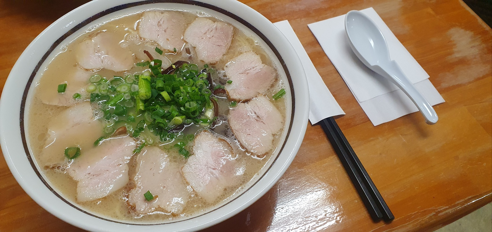

저는 차슈라멘을 시켜서 먹었는데, 돈코츠라멘하면 후쿠오카라고 하지만 여기 동네 라멘집도 깔끔하고 순박한 맛이 있어서 좋았던 것 같습니다.  
가끔씩은 사전에 조사하고 가는 집들보다 우발적으로 찾아서 가는 집에서 숨겨진 맛집을 발견한다는 여행후기들이 괜한 말이 아닌 것 같습니다.  

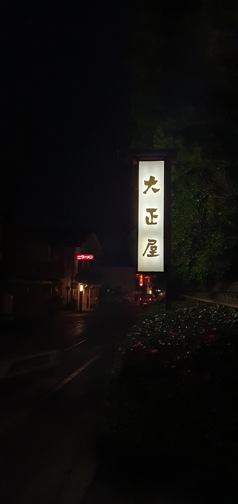

밥을 먹고 나오니 진짜 어두워져서 아무것도 안 보이기 시작했습니다.  
그러나 무섭고 불안한 느낌보다는 시골 전체가 잠든 느낌이 더 강했던것같습니다.  

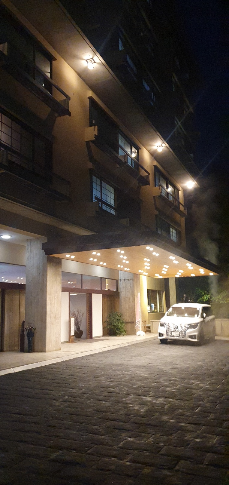

자 밥을 먹고 조금만 걸어다녔고, 온천마을에 왔으면 온천을 즐겨야하는 것이 인지상정.  
저희는 이 타이쇼야(大正屋)라는 온천 료칸의 온천을 히가에리(당일치기)로 즐겼습니다.  
입욕료는 1,100엔으로 가격대는 다소 있는 편이었습니다.  

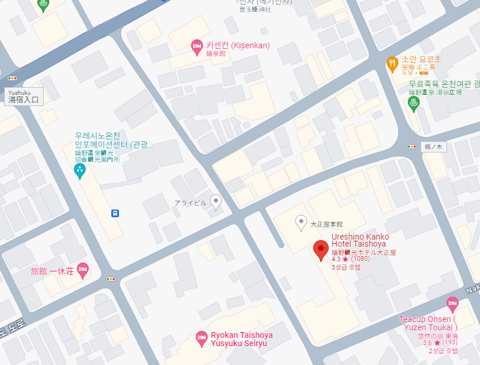

[공식 홈페이지](https://www.taishoya.com/lg_ko/)  

여기가 저희가 이용한 온천료칸의 위치와 주소입니다.  
우레시노를 비롯한 다양한 온천마을은 보통 투숙객용으로만 개방하는 온천이 있고, 당일치기(히가에리)도 허용하는 곳이 있습니다.  
또한, 요일-시간대 별로 받는곳도 있고 상시 오픈하는곳도 있습니다. 또한, 투숙객이 많거나 욕탕 청소나 점검때문에 예고도없이 닫는 경우도 있습니다.  
따라서 사전에 조사하고 당일날에도 한번 료칸에 전화하여  

---
**오늘의 생활 일본어**  
---

きょう   ひがえり  にゅうよく  
今日、日帰り    入浴できますか?  
쿄오 히가에리 뉴요쿠 데키마스까?  
오늘 당일치기 입욕 가능한가요?  

---

라고 문의해보는 편이 좋을 것 같습니다.  
저희도 여러곳 전화해보고 여기는 가능하다고해서 방문하였습니다.  

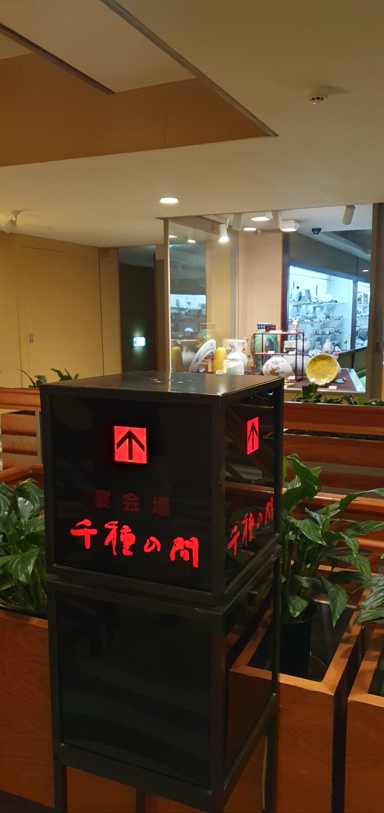
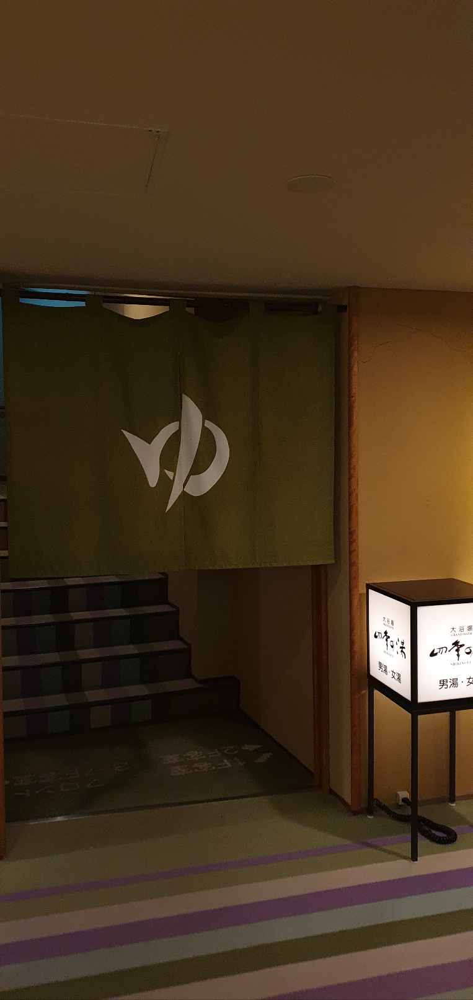

료칸 내부는 제가 개인적으로 가봤던 하코네 온천처럼 기분좋은 나무향이 나고 고요하면서도 정갈한 분위기가 매력적이었습니다. 사진은 안 찍었지만 우레시노의 료칸답게 내부 기념품 점에서는 다양한 녹차 기념품을 팔고있었습니다.  

온천 내부에서 사진은 금지사항이기 때문에(기본 매너죠? 어디 치한으로 잡혀갈 일은 없으니까요.)  
홈페이지 소개 사진으로 갈음합니다.  

저희가 갔던 타이쇼야는 투숙객 전용이 욕탕이 2개정도 있고, 공용 욕탕이 1개 있습니다.  
일단 저희가 간 공용 욕탕은 커다란 대욕탕 하나 있고 개인이 씻을 수 있는 세면 공간이 따로있는 공중욕탕식 구성으로 이루어져있습니다.  
이 미끈미끈거리는 알칼리 천연 온천수로 목욕을 하니 몇일동안 다닌 여독이 싹 풀리는 기분이 너무 좋았습니다. (여행 거의 막바지 날에 갔습니다.)  

보통 일본 온천은 인공 온천(그나마 괜찮은 곳은 온천수를 물탱크차로 가져와서 쓰지만, 진짜 양심 없는 곳은 수돗물 데워서 온천 성분만 집어넣어서 운영하는 곳도 있습니다)이 많다고 하지만 여기는 원천수를 끌어와서 쓰는곳이라 물이 확실히 다르긴 하더라구요. 오죽하면 홈페이지에서 가장 강조하는게 진짜배기 온천수를 쓰는 온천이라고 말할 정도니까요(本物の温泉にようこそ。)  
다만 아쉬운 점은 당일치기 목욕은 노천탕이 없는 온천이라 바깥 찬바람 맞으면서 아래는 따시고 위는 차가운 이상적인 목욕을 즐기지 못한 점은 그랬습니다.  
저희가 간 날이 하필이면 다수의 온천 료칸에서 점검중인 날이었어서 혹시나 여기 가실 계획이 있으신 분들은 목욕탕 구성이랑 운영여부를 꼭 확인하고 방문하는 편이 좋을 것 같습니다.  

참고로 일본의 욕장은 들어가기전에 한번 몸을 씻고 들어가는게 예의이자 매너.  
모두가 쓰는 물인만큼 한번 몸을 씻고 들어가는것이 뒷사람을 위한 매너입니다.  

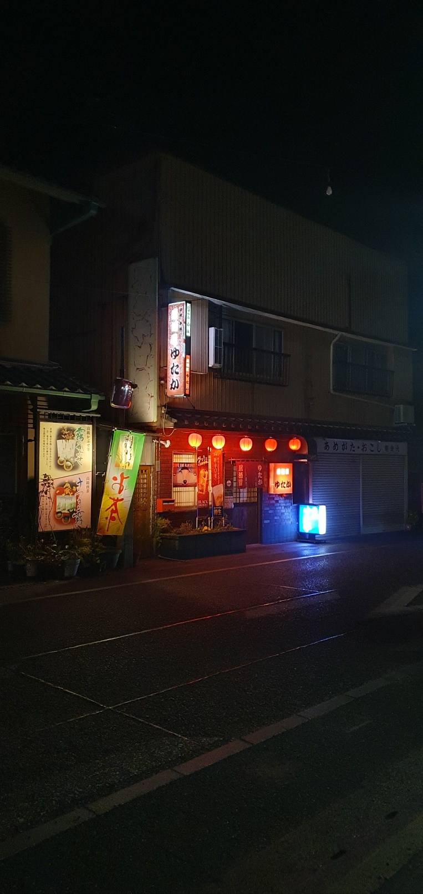
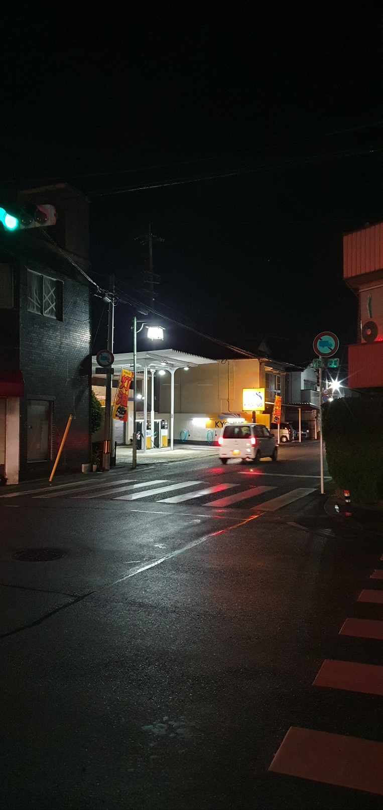
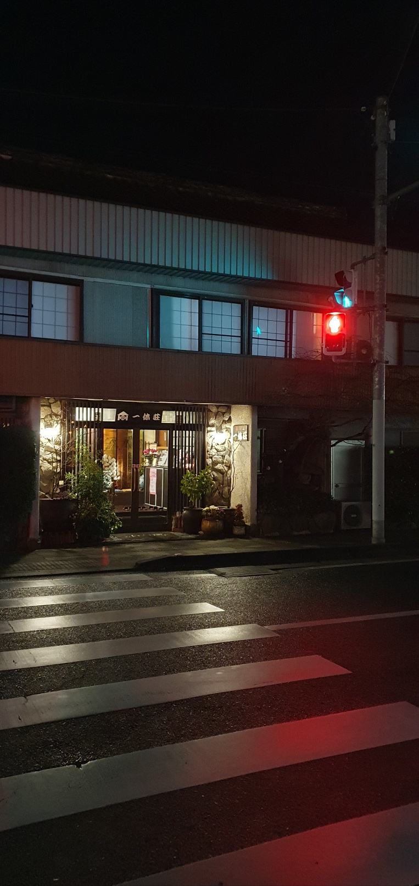
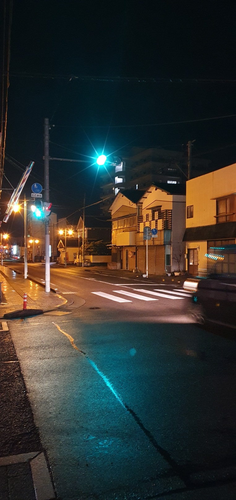

그렇게 목욕하고 버스정류장으로 가고있는데, 이제는 진짜 한밤중(밤 7시~8시)사이라 거리에 돌아다니는 사람은 단 한명도 없었습니다.  
오직 간간히 돌아다니는 자동차와 저랑 친구 둘뿐이었죠.  

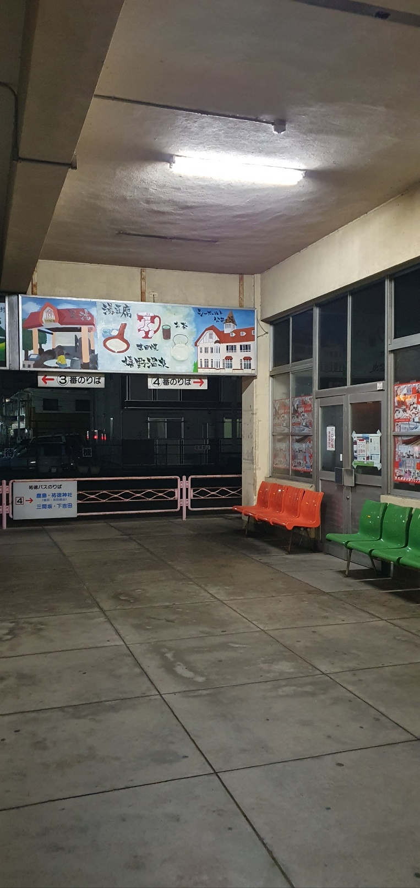
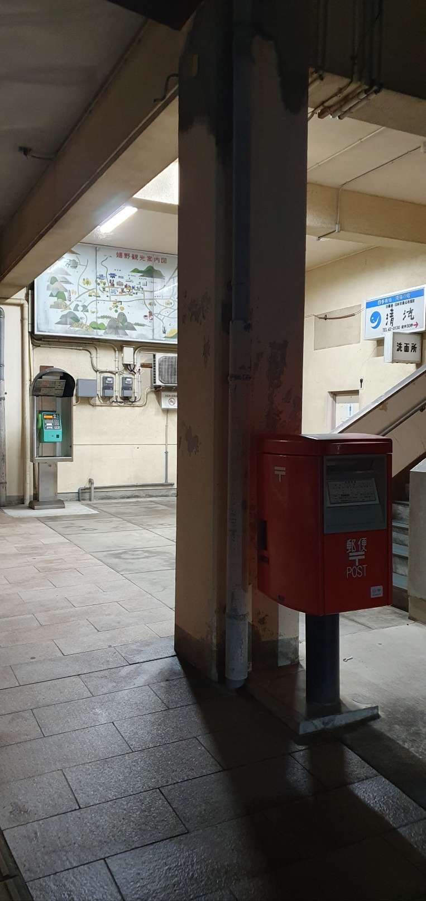

영업 종료하고 문이 굳게 닫힌 우레시노 읍내 버스 정류장.  
시내 정류장은 7시 이전차까지만 운행을 했고,  
저희는 8시 차를 타야하기에 우레시노IC까지 산책하는겸 조용히 걸어가서 거기 임시 정류장에서 탔습니다.  

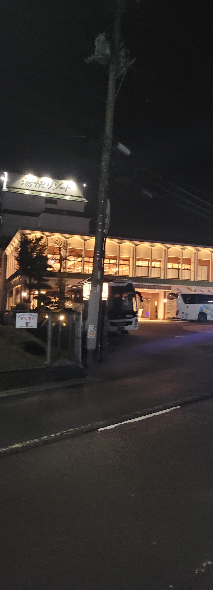

가는길에 찍은 또다른 온천 료칸.  
우레시노는 이런 호텔, 리조트형식의 온천 료칸도 정말 많았던 것 같습니다.  

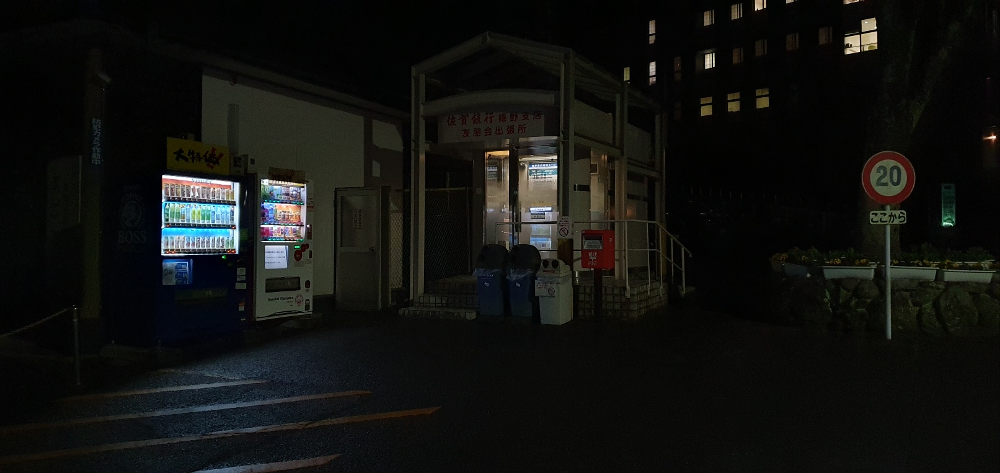

과속 금지!  

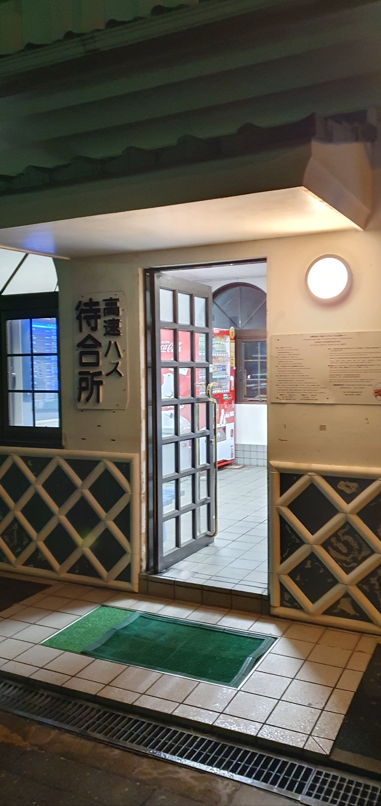
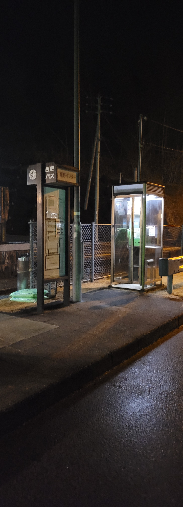

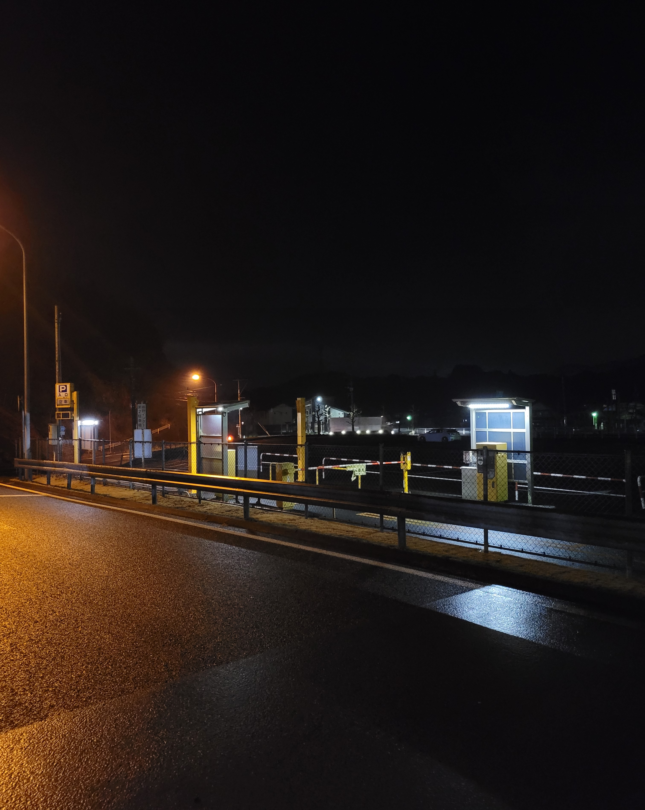

한 20분 걸려서 도착한 버스 임시 대합소에서 한 몇분 기다리다가 버스가 오고 저희는 차를 타고 바로 후쿠오카 숙소로 돌아갔습니다. 후쿠오카 숙소에 도착하니 11시더군요.  
우레시노는 온천은 가고싶은데 벳푸나 유후인의 복작복작한 느낌이 싫고 그렇다고 쿠로카와 온천의 높은 가격대가 부담된다면 충분히 가볼만한 장소라고 생각됩니다.  
벳푸나 유후인보다 거리상으로도 가깝고 만약 나가시키를 여행경로에 염두해두고 있다면, 동선상 유리한 점도 많다고 생각됩니다.  
이곳도 자칭 일본 3대 미용온천이라고 불리는 만큼 물 자체도 좋은 축에 속하는 편이기도하고,  
가는길에 녹차 기념품 몇개 가지고 가면 딱 좋아보이더라구요.  

이 글에 쓰인 사진의 85% 이상은 사진찍는 취미를 가진 동행 친구가 찍어줬습니다.  
다음 여행 이야기로 돌아오겠습니다.  
