여행 일자는 24년 1월 22일 이었습니다.

  
다들 알다시피 도쿄 디즈니랜드랑 양대 일본 대형 프랜차이즈 유원지로 유명한 USJ입니다.  
라지만... 사실 저는 INFP다보니까 놀이공원은 별로 좋아하는 편이 아닙니다. --친구 만나는거도 눈에 안 보이는 활력 게이지 쫙짝 줄어드는 사람이예요.--  
오히려 기빨리고... 어린 시절처럼 파워도 안 나오고... 특히나 이런데는 사람구경만 하다 오기 십상이라  
불호에 가까웠습니다. 약간, 거기 투자할 돈으로 딴데 가거나 저녁을 더 비싼거 먹는걸 더 가치있어하는 타입?  
하지만 우리 하늘보다도 높으신 1호 여동생님의 강렬한 요청이 있었어서, 특~별히 가게 되었습니다.  
하지만 이러한 생각이 무색할 정도로 USJ에서는 정말 재밌게 잘 놀다온 기억이 남아서 저도 놀라웠습니다.  

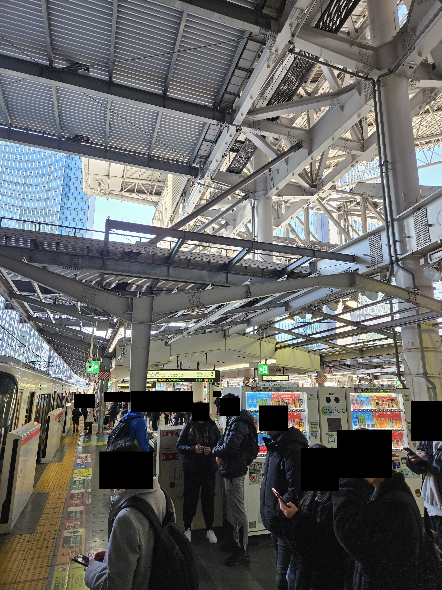  
놀이공원 가는날의 우메다의 하늘은 엄청나게 화창합니다.  
사실 비온다는 예보가 있었는데... 다행이도 맑군요.  

  
USJ로 가기위해서 우메다역에서 유니버셜시티 방면 지하철을 기다리고 있었습니다.  
평일 아침 출퇴근+외국분들까지 합쳐져 복작복작거리네요.  
역시 대도시의 기차/지하철은 여행객들의 기대와 직장인들의 찌듦이 있는... 한국이나 일본이나 만감교차의 플랫폼이네요.  

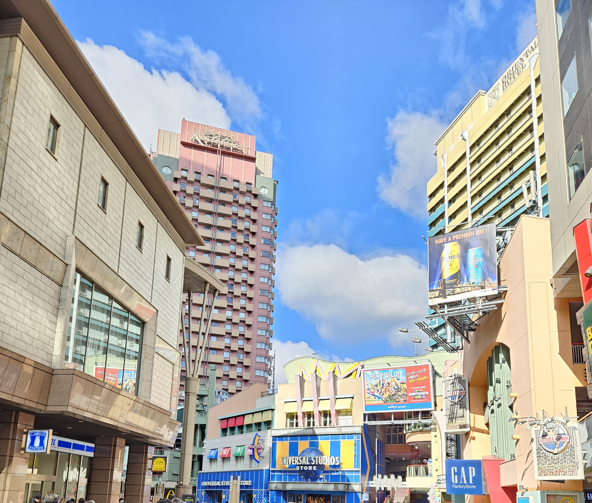  
유니버셜 시티역에서 내리자마자 여긴 어매리카의 분위기다 라고 광고를 하고있습니다.  
동생들은 카메라 켜고 이리찍고 저리찍고 여기서부터 방방뛰고있었어요.  

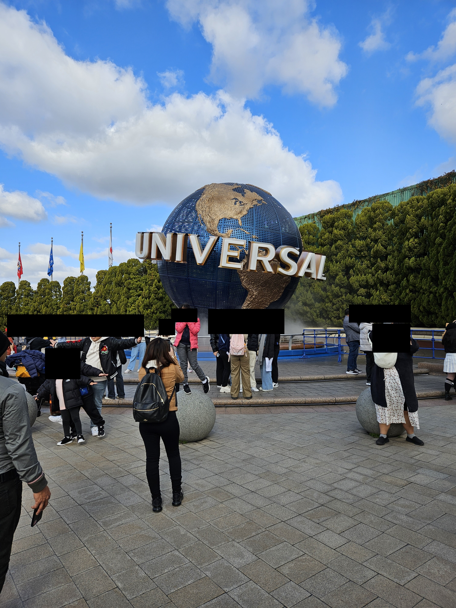  
유니버셜 스튜디오 지점마다 꼭 있는 명물인 유니버셜 스튜디오 랜드마크.  
재팬지점도 사진 꼭 찍고 들어가는 명물 코스더라구요.  
마침 지나가던 한국분 가족이 계셔서 부탁드리고 저랑 동생이랑 같이 찍었습니다.  
물론 동생의 초상권을 위해 해당 사진은 생략...  

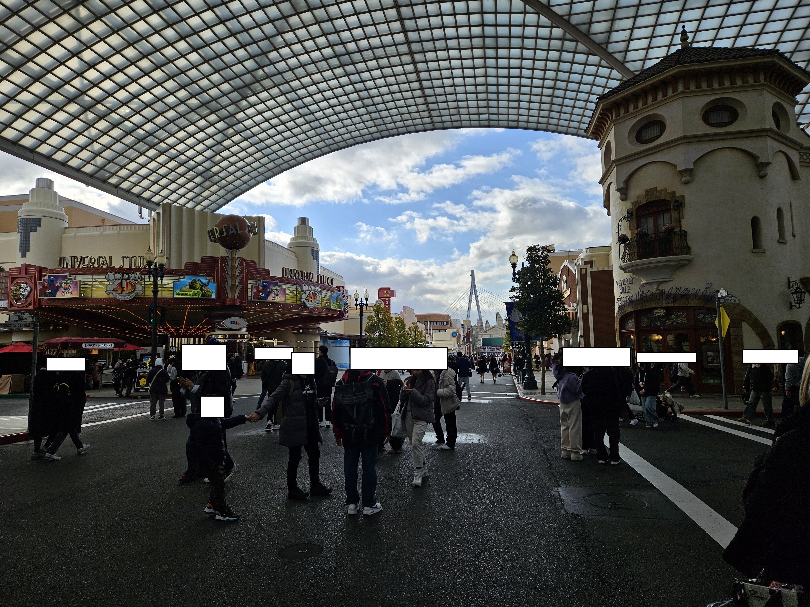  
들어가자마자 드넓은 돔과 미쿡식 거리 분위기가 드디어 USJ에 도착했음을 느끼기 해주었습니다.  

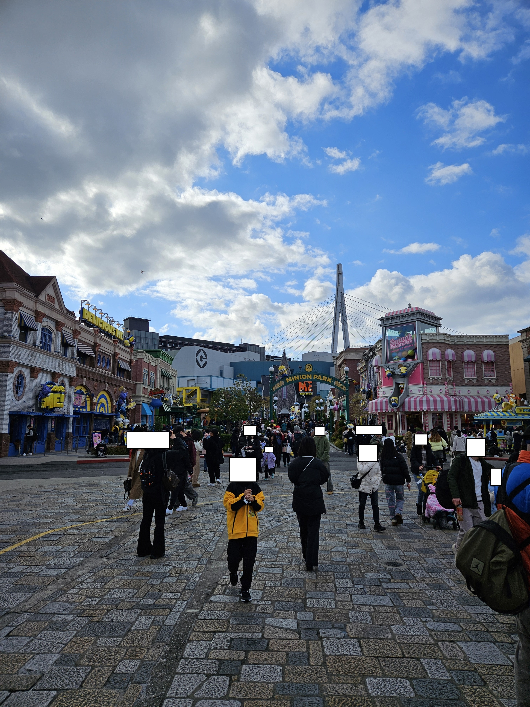  
저희 부모님은 사진을 찍어서 보내줬을때, 일본에 간게 아니라 미국에 간거 아냐라고 했던말이 지금와서 생각해보면 맞을지도... 모르겠네요.  

자 그럼 드디어 놀이기구 탑승의 시간인데
아시다시피 USJ는 아무런 대비를 하지 않고 가면...
정말 하루죙~~~~~~~~~~일 기다리다 그냥 집에 가는 기분 나쁜 경험을 하게 되거든요.

이날 최장 대기시간 놀이기구는

### 무려 300분!
그게 아니더라도 전반적으로 평균 100~150분의 대기시간들을 가지고 있었답니다.  
참고로 이날은 월요일 이라구요. 1월 말이니까 일본 학생들도 다들 3학기 중이구요.(지금 생각해보니 대학생들은 있으려나요)  
즉, 외국인 관광객 말고는 거의 없다고 봐도 되는 시즌.  
그런데도 이렇게 줄이 겁나게 길단말이죠. (물론, 이정도 줄은 우리나라에서도 흔한 일이지만 여튼 전 싫습니다 뿌뿌)  
이쯤되면 사람 과메기 말리듯이 세워두는건지 놀이기구를 타러 온건지 헷갈리게 만들게 되는 현상입니다.  

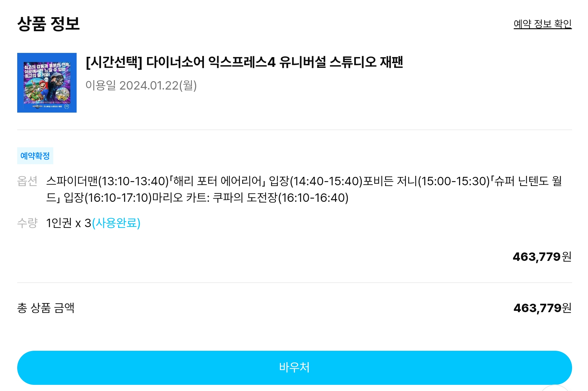  
그래서 어쩔 수 없이 저는 사전에 익스프레스 4를 사서 닌텐도 입장 확약권을 받는 김에 놀이기구도 몇개는 확실히 타고 가자고 생각했었습니다.  

어흐흑 내돈...  

우리나라 롯데월드 매직패스같은 가격 생각하면 큰코 다치는것 같아요. 겁나 비싸...  
그래도 결론을 말하자면 이거 산건 결코 후회하지는 않았습니다.  
이거 없었으면 얼마나 불평불만하면서 놀았을지... 상상조차 하기 싫네요.  

일단 첫 고정타임 입장 시간이 13:10인만큼 첫 놀이기구는 일부러 줄 서서 타는걸로 하나 타기로 했어요.  

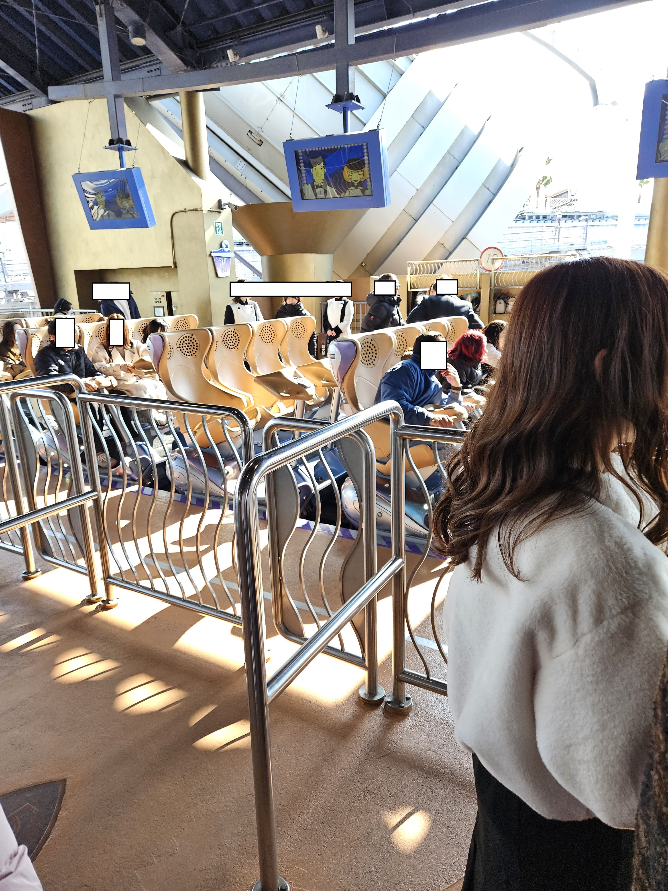  
먼저 탄 놀이기구는 할리우드 드림 더 라이드.  
가장 스탠다드한 롤러코스터로 격렬도도 적당하고 그렇다고 아주 강도가 낮지도 않은  
정석에 가까운 롤러코스터였던것 같습니다.  

역방향, 정방향 이렇게 두개가 동시에 운행되고있었는데, 저나 동생이나 역방향을 탔다간 멀미로 속을 게워낼게 뻔하였기 때문에 정방향으로 타기로 하였습니다.  
참고로 줄은 역방향이 한 30분 정도 더 길었던 것 같습니다.  

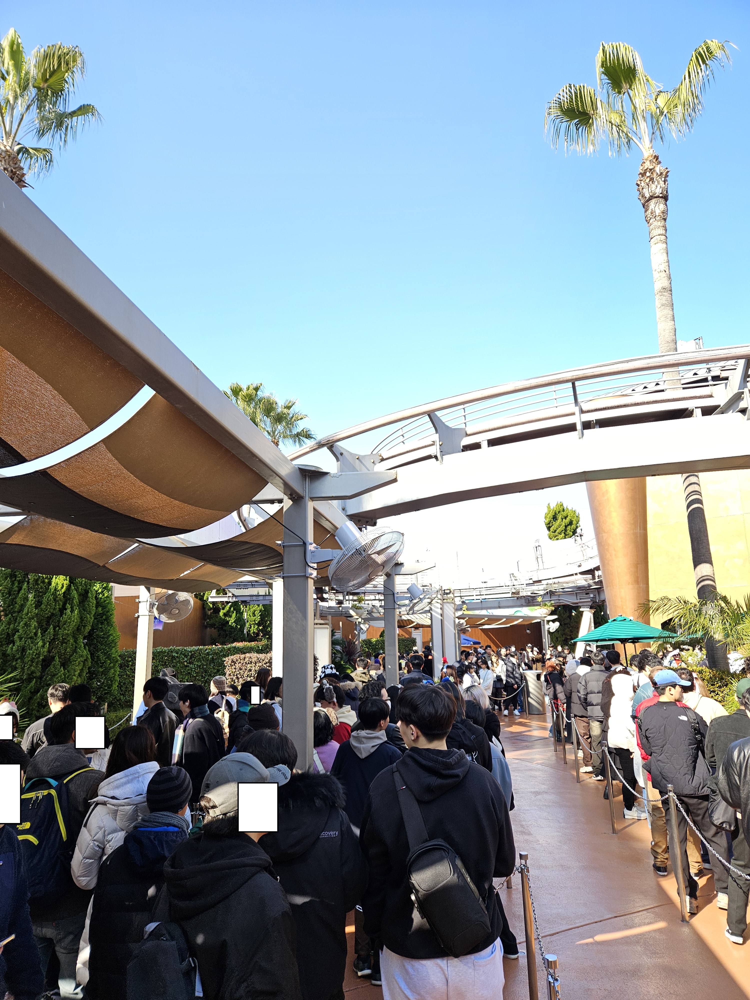  
아 물론 그렇다고 정방향이 줄이 안 긴건 아니구요.... ㄱ-  
그래도 한 80분 정도 기다린 것 같습니다.  
줄 자체는 매우매우매우 긴데, 이 놀이기구 보통이 아닌게 한번에 롤러코스터를 방향마다 3-4개씩 동시에 운영하고 있어서 손님 회전이 진짜 미친듯하게 빨랐어요. 그냥 사람들이 훅훅 들어갑니다.  
공식영상이 너무 오래된 영상이라 해당 영상으로 갈음하겠습니다.  

<iframe width="560" height="315" src="https://www.youtube.com/embed/ye4lfxIx6xg?si=ctrLTC-pmf5C1HwS" title="YouTube video player" frameborder="0" allow="accelerometer; autoplay; clipboard-write; encrypted-media; gyroscope; picture-in-picture; web-share" referrerpolicy="strict-origin-when-cross-origin" allowfullscreen></iframe>

  
추신: 주의사항은 한국어도 지원됩니다... 워낙에 중국분들 한국분들 많이 놀러오는지라... 뒤에는 영어로도 적혀있습니다. USJ는 일본어를 전혀 몰라도 즐기는데는 문제가 없습니다. 조금... 해설이 가미된 놀이기구를 이해하는데는 좀 아쉬울 수 있겠지만요...

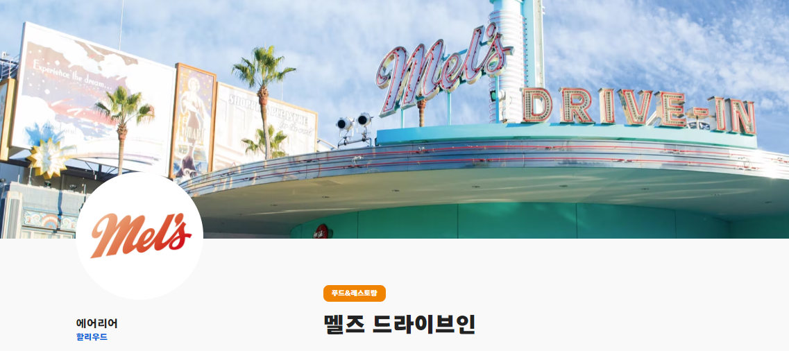  
그런다음 점심을 햄버거로 간단하게 먹었습니다.  
사진 누락된건 워낙 정신이 없었어 가지고 아쉽네요. 홈페이지 사진으로 대체...  
저희 일부러 11시 30분에 일찍먹으러 왔었는데, 그 선택이 맞았습니다.  
이때도 솔직히 자리 잡으려고 좀 서성이다가 나자마자 바로 엉덩이 깔고 앉았는데,  
이후 저희 한참 밥 먹고있는데, 진짜... 자리를 노리는 사람들도 인산인해를 이루더군요.  

  
그 문제의 300분 대기 놀이기구, 스파이더맨입니다.  
왜 300분 대기냐. 사실 저희가 갔는 날의 스파이더맨이 마지막 운영일이라고 하더라구요.  
이게 스파이더맨이 마블쪽으로 저작권이 넘어갔다보니까,  
아무래도 저작권 문제때문에 없어지는 것 같았어요.  
그 쥐는 저작권에 한해서는 가차가 없으니까요.  
저희는 미리사둔 익스프레스 4를 이용하여서 프리패스 이용.  
옆에 아아아아아주 길게 줄을 섰는데 저희는 수욱 들어가니까 약간의 죄악감이 느껴졌다는건 안 비밀...  

  
내부사진은 이랬습니다.  
엄청 재밌었습니다. 다크라이드 형식의 실내형 4D 어트랙션이었는데  
없어지는게 너무 아쉬울 정도로 박진감 넘치고 즐거운 경험이었습니다.  
역대 스파이더맨에 등장했던 악역들이 등장하고 막 공중으로 날라가기도하고, 이리저리 휘날리기도 하고 어우...  

<iframe width="560" height="315" src="https://www.youtube.com/embed/l9IuAW7teBc?si=pbn24bXsgqbevNKT" title="YouTube video player" frameborder="0" allow="accelerometer; autoplay; clipboard-write; encrypted-media; gyroscope; picture-in-picture; web-share" referrerpolicy="strict-origin-when-cross-origin" allowfullscreen></iframe>

지금은 없어진 놀이기구라 공식영상이 없어서 해당 영상으로 대체합니다.  

  
이후에 잠시 산책하고 바로 해리포터 구역으로 왔습니다. 어우... 해리포터 팬이라면 이 USJ에 오게된 유일한 이유이기도 합니다. INFP인 저와 마찬가지로 I성향인 막내동생이 굳이 놀이공원에 따라오게된 가장 큰 이유.  
둘 다 해리포터 찐팬이라는 것. 재현도부터 미쳐 돌아가네요.  
비밀의 방때의 날아다니는 자동차와 호그스미드의 모습까지.  

  
해리포터의 마을을 고대로 구현해둔 무시무시한 고증력은 놀라울 따름이었습니다.  
그리고 아예 입구를 하나의 어트랙션처럼 꾸며서 해리포터 첫 지팡이를 사는 장면을 연출로 해뒀는데,  
입장객중 1명을 선택하는데 그 사람이 해리포터의 지팡이 선택 장면의 주인공이 되어볼 수 있다고 하네요.  
지팡이를 살 생각이 없더라도 10분정도 기다려서 한번 경험해볼만한 일이었던것같습니다.  
네, 눈치채셨나요?  올리밴더슨에서는 실제로 이 테마파크에서 쓸 수 있는 지팡이를 판답니다.  
가격은 5000엔이 넘는 굉장히 사악한 가격이지만,  
솔직히 스코틀랜드에서 만들어진 찐 공식 지팡이 굿즈를 산다고 생각한다면 아깝지는 않은 것 같아요.  
물론 저는.... 지갑이 이미 충분히 얇아진 관계로...  

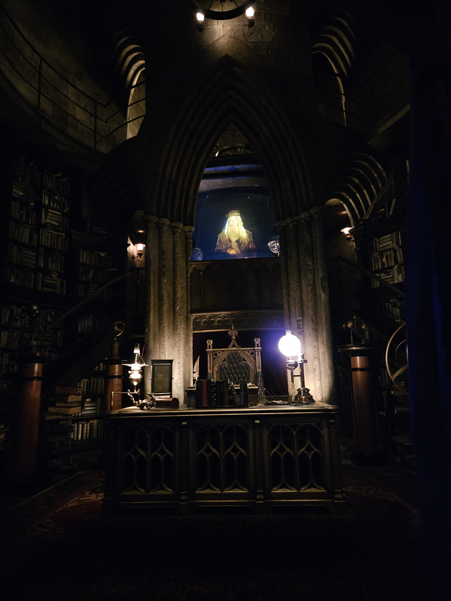

  
그 다음 해리포터의 호그와트 성을 구현하여 놀이기구로 만든 해리포터 앤 더 포비든 저니!  
마찬가지로 저희는 익스프레스 패스로 130분의 줄을 기다릴 필요없이 5분만에 바로 입장했습니다.  
아쉽게도 재팬 지점의 포비든 저니인만큼 일본어로 번역된 버전으로 나오긴하지만...  

앞의 스파이더맨과 마찬가지로 다크 라이딩 형식의 4D 어트랙션인데요.  
빗자루를 타고 해리포터 세계관을 탐험하는 느낌이 인상적이었습니다.  
다만... 이게 상당히 멀미가 심합니다. 뱃멀미말고는 잘 안 느끼는 저도 타고 내리고 나서  
속이 미슥거리더라구요. 타실분들은 참고하시는 편이 좋을 것 같아요.  

<iframe width="560" height="315" src="https://www.youtube.com/embed/CpjqPl8zckM?si=Om_-TN7xy4Reti0b&amp;start=52" title="YouTube video player" frameborder="0" allow="accelerometer; autoplay; clipboard-write; encrypted-media; gyroscope; picture-in-picture; web-share" referrerpolicy="strict-origin-when-cross-origin" allowfullscreen></iframe>

탑승시 영상은 공식 동영상으로 갈음합니다.  

<iframe width="560" height="315" src="https://www.youtube.com/embed/6JBcxFDzjvY?si=Mf0iFbGcsMi_vK5u" title="YouTube video player" frameborder="0" allow="accelerometer; autoplay; clipboard-write; encrypted-media; gyroscope; picture-in-picture; web-share" referrerpolicy="strict-origin-when-cross-origin" allowfullscreen></iframe>

말고도 이런 신기한 굿즈들도 참 많았던것 같아요.  
해리포터 영화를 본분이라면 누구나 기억하는 호그와트 움직이는 지도.  

    
이후에도 이런 두꺼비 공연도 하고 참 재미난 것들이 많은 곳인것 같습니다.  

  
다음으로는 슈퍼 닌텐도 월드로 들어갔습니다.  

슈퍼 닌텐도 월드는 현 시점 USJ에서 유일하게 추첨제로 들어갈 수 있는 구역으로  
어플로 추첨권 신청을 해서 뽑혀야 들어갈 수 있는 인원 통제 구역 중 하나입니다.  

그도 그럴게 슈퍼 닌텐도 월드는 유니버셜 스튜디오 중에서 오사카에만 있는 어트랙션 구역이라  
희소성이 있어서 서양권 분들도 많이 방문하시는 곳이고,(곧 미국에도 생긴다고 듣긴 했습니다)  
그게 아니더라도 테마 구현도/완성도도 매우 높고 일본에서도 인기가 많은 곳이라  
진짜 거짓말 안 하고 인원 통제를 안 하면 답도 없을정도로 사람이 많은 곳이었습니다.  

가끔씩은 해리포터 위저딩 월드 테마도 추첨권이 걸리는 경우도 있지만 제가 갔는 날은 USJ 비수기에 속하다보니(입장권도 제일 싼 날이었습니다) 사람이 그렇게까진 터져나가진 않아서 자유입장이 가능했습니다.  

여튼 이러한 슈퍼 닌텐도 구역에 들어갈 수 있는 방법은 총 4가지가 있는데,  

그나마 돈 추가로 안쓰면서도 확실한 방법은 USJ 오픈런을하여 바로 슈퍼 닌텐도 월드로 달려가는 방법이 있습니다. 당연히 오픈런을 하면 선착순으로 입장하게 되기 때문에 추첨없이 바로 들어갈 수 있는 것이죠.  
다만, 저희 가족은 굳이... 아침 일찍 힘들게 일아나서 오픈 1-2시간전부터 줄서서 기계같이 놀이공원을 공략하는 것은 몸과 마음이 둘다 너무 힘들기 때문에 굳이 그러진 않았습니다. 그랬다간 아침에 약한 제가 죽어요...  

또 다른 방법은 앞서 말한 USJ 어플로 추첨권을 끊어두고 기다리는 방법이 있습니다. 다만, 이건 저도 해본적이 없어서 뭐라 말씀 드릴게 없는것 같습니다.  

세번째 방법은 입장권과 확약권을 함께파는 플랜이 있습니다. 물론 우리나라에서도 구매 가능하고, 아마 돈을 가장 적게 들이면서 굳이 오픈런 안하고 확실하게 들어갈거면 이게 제일 좋은 방법이라 생각됩니다.  

마지막 방법은 저희가 쓴 방법으로 확정 놀이기구 비대기 입장권인 익스프레스 권을 사는건데, 무작정 사는건 아니고 익스프레스 권중에 슈퍼 닌텐도 월드 놀이기구를 타는게 포함된 걸 사면 됩니다. 가장 비싼 방법입니다만, 저희는 어짜피 다른 놀이기구도 함께 확실히 타기위해 샀기 때문에 이 방법을 택했습니다.  

  
들어가는 길 부터 슈퍼 마리오 기구들이 보이는게 드디어 슈퍼 닌텐도 월드에 들어온 것이 실감이 납니다.  

참고로 슈퍼 닌텐도 월드라고 적혀있지만, 실제로는 마리오 테마파크라 보시면 됩니다.  
다른 닌텐도 캐릭터는 이 구역에 등장하지 않으니 참고해 주시면 될것같습니다.  

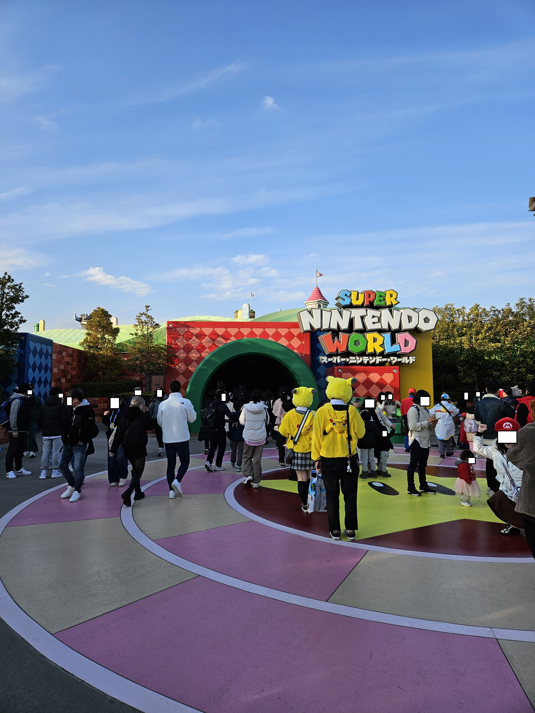  
걷다가 보니 드디어 슈퍼 닌텐도 월드 입구에 도착했습니다.  
다만 들어가기 시작하자 전 걱정부터 되었습니다.  
확약권 검사 장소부터 지금 입구까지의 이 인파...  

물론 제가 닌텐도를 DS세대부터 스위치까지 가지고 논 사람으로써  
꼭 가보고 싶은 장소였지만, 뭔가 쎼한 분위기를 느끼긴 했습니다.  

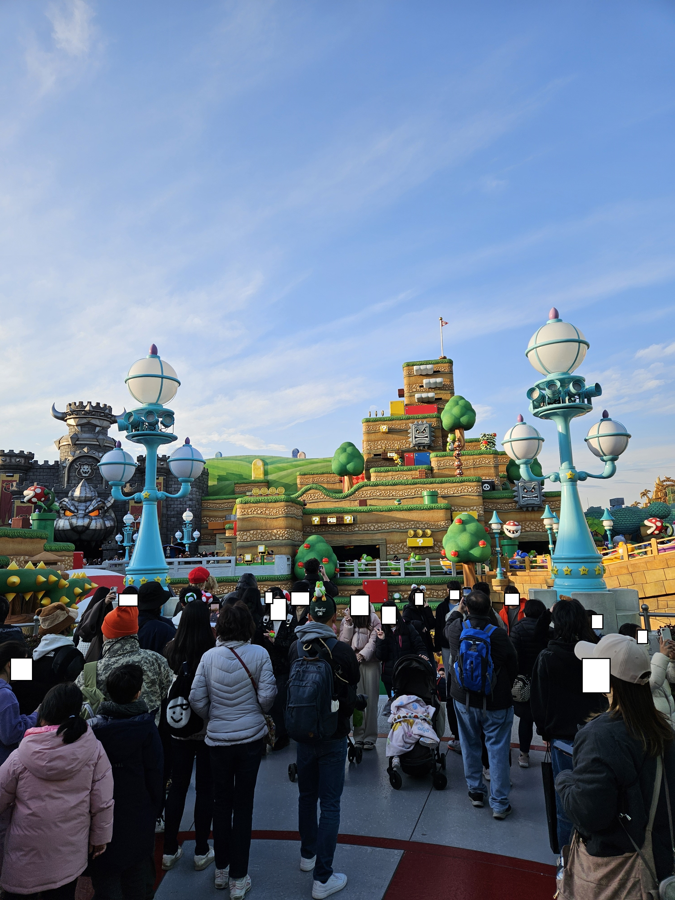
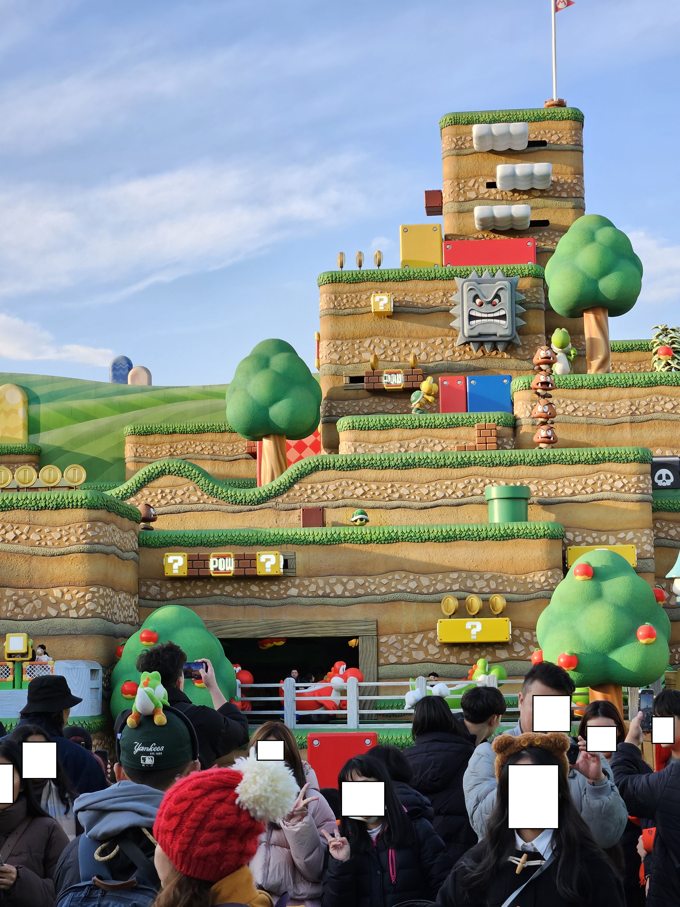  
네 그리고 그 예상은 정답입니다~~~  
어우 긴말은 필요없고 이 USJ에 있는 사람의 40%의 인파가 다 여기있다고 생각해도 무방할 정도로 사람이 정말 많았습니다.  
너무 인파가 많아서 휩쓸려 다니다보니 사진조차 제대로 찍기 힘들 정도더라구요.  

그래도 닌텐도 월드의 구현도는 훌륭할 정도로 모든 배경들이 움직이고 사방에서 코인먹는 소리가 나는 것이 닌텐도 월드에 들어왔다는 것이 실감날 정도였습니다.  

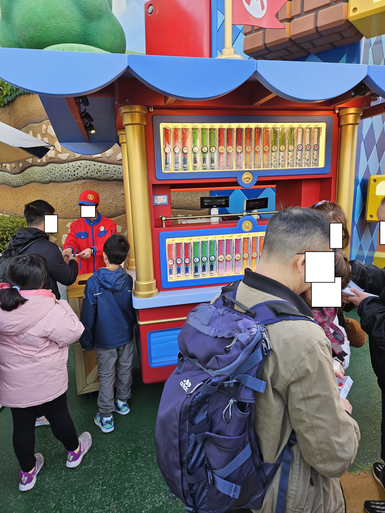  
참고로 위저딩 월드의 지팡이처럼 여기서도 놀이기구와 상호작용이 가능한 팔찌를 굿즈로 팔고 있습니다.  
가격은 지팡이보단 훨씬 착했지만 3천엔 대였던가...  

이 팔찌를 끼고 물음표박스같은걸 치면 코인 먹는 소리가 난다고 하고,  
각종 놀이기구들에 팔찌를 접촉시키면 스코어보드같은게 인터넷과 연동된다고 해요.  

하지만 저희는 여기 자주 놀러오는 사람이 아니고, 팔찌 없어도 놀이기구를 즐기는데 큰 문제는 없기 때문에 생략했습니다.  
가장 큰 이유는 그거 상호작용하는 오브젝트들 해보려고 서있는 줄이... 어 음... 안 하는게 낫겠더라구요.  

하지만 만약에 그래도 팔찌를 사는게 괜찮다 싶은 사람을 소개시켜준다면,  
자신이 3DS나 스위치를 가지고 있고, 아미보 호환 게임(마리오 시리즈, 동물의 숲 시리즈 등등)이 있다면 팔찌를 사는게 나쁘지 않다고 생각되는데, 일단 저 팔찌 문양과 호환되는 아미보랑 연결이 되어있다고 합니다.  
(예를들면 저 빨간색 M은 마리오 아미보 판정이 되고, 핑크색 왕관은 피치 아미보 판정이 됩니다)  
저야 아미보에 큰 관심이 없고 집에 아미보가 많아서 굳이 안 사도 되지만, 사실 아미보를 3000엔대에 구할 수 있다면, 꽤 괜찮은 가격으로 보이기도 합니다.  
더 저렴한 아미보 카드는 물량을 구하기 힘들고, 아미보 피규어는 아미보 기능만 이용해먹을 사람이라면 너무 비싼데, 팔찌는 3000엔 대로 딱 중간에 있으니까요.  

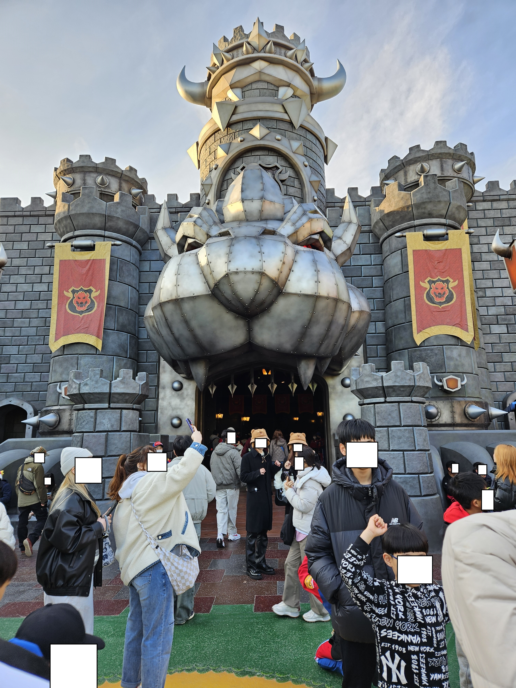  
그리고 슈퍼 닌텐도 월드에서 저희가 탈 놀이기구는 마리오카드 쿠파의 도전장 이었습니다.  
이 역시 익스프래스 패스로 빠르게 진입했습니다. 여기는 그래도 인기있는 놀이기구다보니 익스프레스 패스 줄을 서고도 한 10분 기다렸던 것 같습니다.  

어떤 놀이기구냐 하면 오락실에 있는 총으로 쏘는 게임과 레이싱 게임을 합쳐둔 4D 놀이기구 였습니다.  
4명이서 각자 상대 카트나 적들을 HUD고글(!!!)로 조준하여 핸들의 버튼으로 쏴서(마리오카트 보면 그 거북이 아이템 던지는거 있잖아요. 그걸 고글로 조준하여 발사한다는 개념입니다.)으로 쏴서 점수경쟁하는 게임이라 보시면 됩니다.  

생각도 못한 하이테크 기술을 접목시킨 놀이기구를 타니 참 과학이란 대단해! 소리가 절로 나오더군요.  

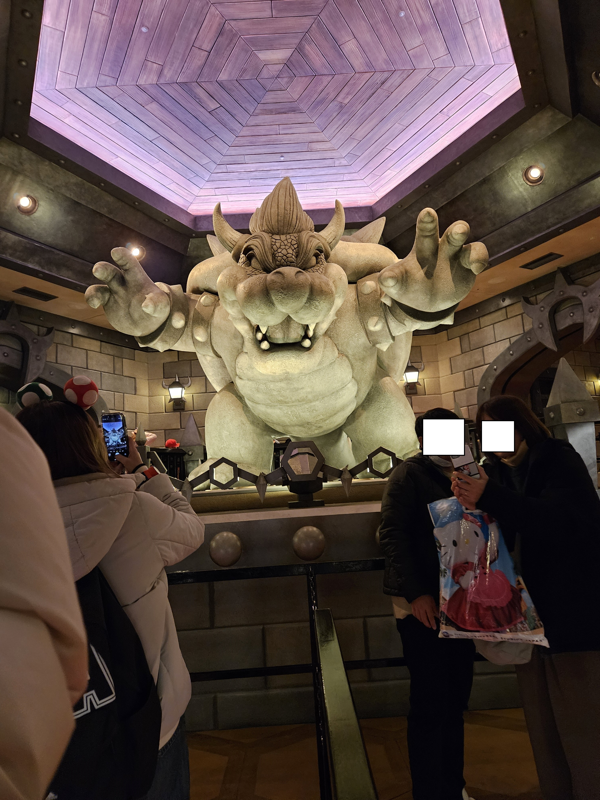

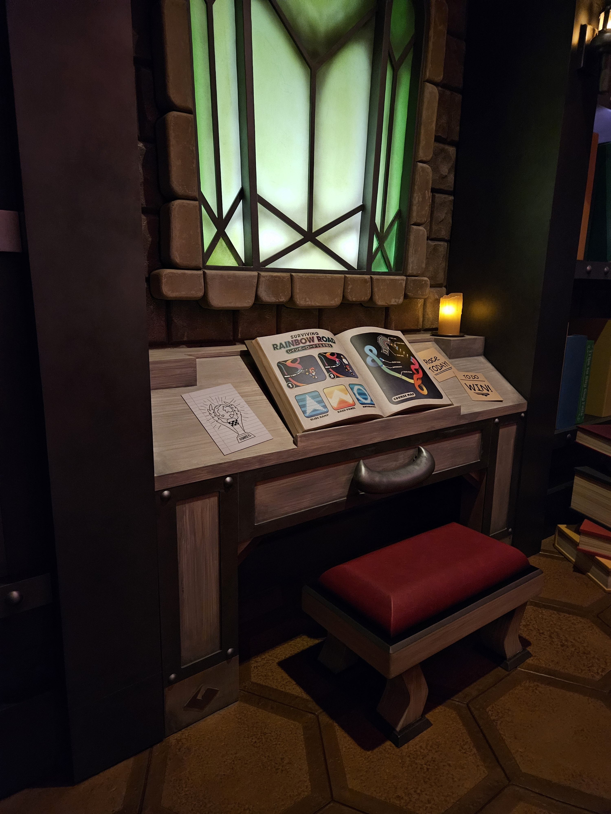

  
놀이기구 내부의 모습입니다.  
생각보다 잘 꾸며놨고, 그림과 영어로 잘 설명해줘서 이해하기는 어렵지 않았습니다.  

다만, 설명을 듣긴했지만 실제로 타면 진짜 정신이 사납다는 말로 표현될 정도로 운전은 운전대로 하고  
적은 적대로 고글로 조준해서 쏴야하고 진짜 정신없긴 하더라구요 ㅋㅋㅋㅋ  
그래도 그 정신없음이 매력인 놀이기구였던것 같습니다.  
딱 어린이들이 좋아할만한 놀이기구였고 어른은 어른대로 동심으로 돌아가는 기분이 드는 놀이기구였습니다.  

<iframe width="560" height="315" src="https://www.youtube.com/embed/Ln_ZSmNAXrc?si=qHr9aAHOABZqw1S-" title="YouTube video player" frameborder="0" allow="accelerometer; autoplay; clipboard-write; encrypted-media; gyroscope; picture-in-picture; web-share" referrerpolicy="strict-origin-when-cross-origin" allowfullscreen></iframe>

탑승 영상은 USJ 공식 영상으로 갈음하겠습니다.  

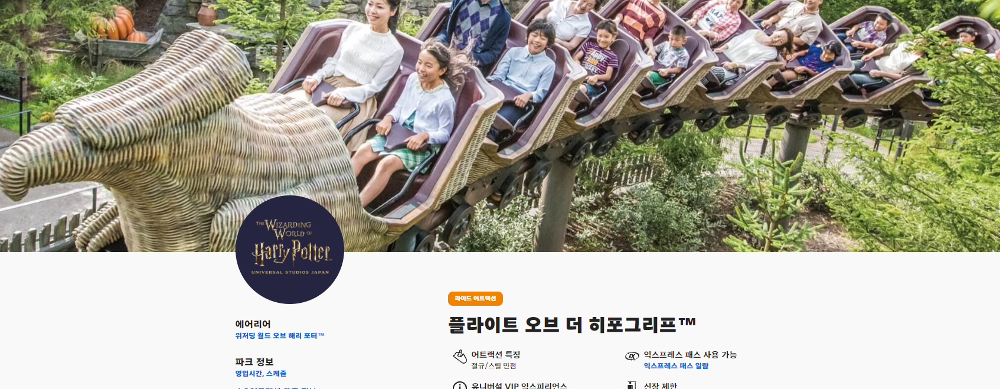  
마지막으로 탄 놀이기구도 제가 따로 사진을 안 찍어서 USJ 홈페이지 사진으로 대체하겠습니다.  
--이쯤되니 너무 힘들어서 사진찍을 기력도 안 남았던 것 같습니다. 10살만 더 어렸어도...  --

마지막으로는 다시 해리포터 위저딩 월드로 돌아와서, 익스프레스권 놀이기구 시간을 지키기 위해 못 탔던 플라이트 오브 더 히포그리프를 탔습니다.  

일단 격렬도만 따지자면 이 놀이공원의 롤러코스터 중 가장 낮은 편으로 실제로도 어린이도 탈 만한 놀이기구였던것 같습니다.  
다만 그래도 롤러코스터는 롤러코스터라고 아예 쏠리는 중력감이 없는 건 아니고 저처럼 롤러코스터 잘 못타는 사람들도 무난하게 탈 정도 수준의 격렬도를 가졌던 생각이 듭니다.  
우리나라 놀이공원을 간지가 10년도 넘게 지나서 딱히 비교할 놀이기구가 안 떠오르는 점은 양해...  

아쉽게도 이 놀이기구는 제 익스프레스4 패스에 미포함되어있던 놀이기구라 그냥 줄 서서 탔습니다.  

대기시간은 평소에는 120~150분까지도 기다려야하는 놀이기구지만  
마지막 막탐이어서 그런지 한 80분만에 입장했습니다.  

<iframe width="560" height="315" src="https://www.youtube.com/embed/pLUhTdE0MXE?si=C2Mh83nzNbYJ9azu" title="YouTube video player" frameborder="0" allow="accelerometer; autoplay; clipboard-write; encrypted-media; gyroscope; picture-in-picture; web-share" referrerpolicy="strict-origin-when-cross-origin" allowfullscreen></iframe>

탑승 영상은 이러하다고 합니다. 아쉽게도 이건 공식영상이 없었네요.

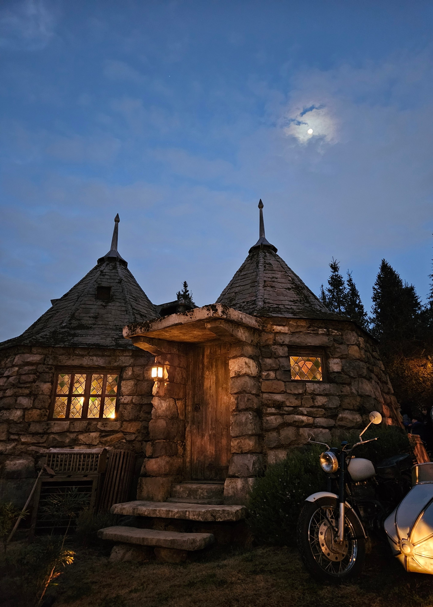  
이 놀이기구 대기장소 안에서는 금지된 숲 앞에 있는 해그리드의 오두막이 구현되어있었습니다.  
마침 달도 떠있어서 같이 원샷으로 찍어봤습니다.  

이쯤 놀고나니 폐장시간에 가까워져서 아쉽지만 발길을 돌렸습니다.  
저희가 간 날이 비수기 날이었다보니 야간 오픈도 안 하고있어서 7시만 되면 폐장을 한다는 알림이 들리더라구요.  

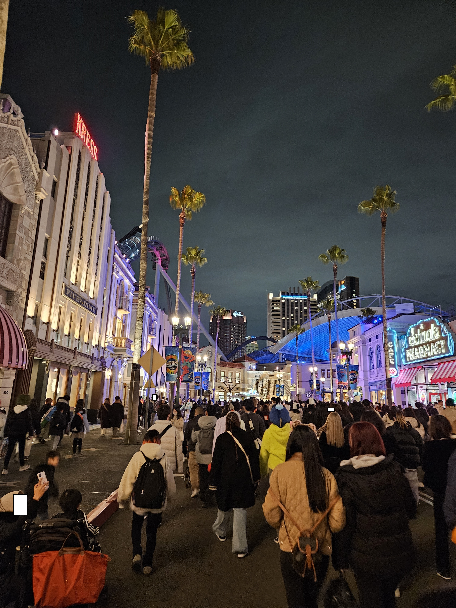
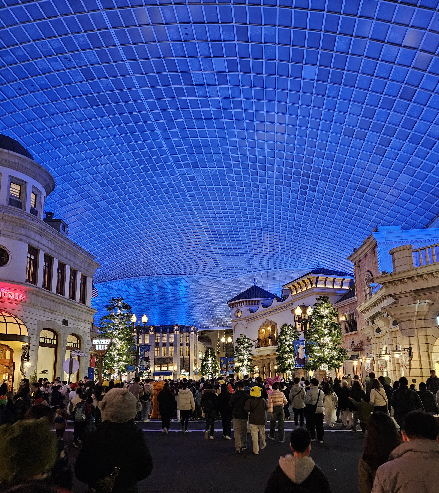  
놀이공원을 싫어하는 저도 어린시절로 돌아가서 재밌게 놀 수 있었던 USJ.  
진짜 나이 10살만 어렸어도 더 재밌게 놀 수 있었을 것 같은데,  
이렇게 삭아 20대 후반을 지내고있는 저로서는 아쉬울 따름이었습니다.  

다만, 제 경험 상으로 놀이기구의 다양성 자체는 그다지 크지는 않다고 느꼈습니다.  
만약 난 에버랜드처럼 다양한 놀이기구를 타는것이 메인이다! 하는 사람에게는 다소 실망감을 느낄 수 있겠다는 생각이 들었습니다.  
하지만 난 놀이공원의 구성요소는 놀이기구뿐만이 아니라 그 분위기 자체에 있다 라고 생각하는 사람이 있다면 어느 우리나라 놀이공원보다 즐겁게 지내다 올 수 있는 곳이라고 저는 생각합니다.  
실제로 그 놀이공원을 별로 좋아하지 않는 저도 이렇게 재밌게 잘 놀다 왔고 또 가고싶다는 생각이 드는 장소였었으니까요.  

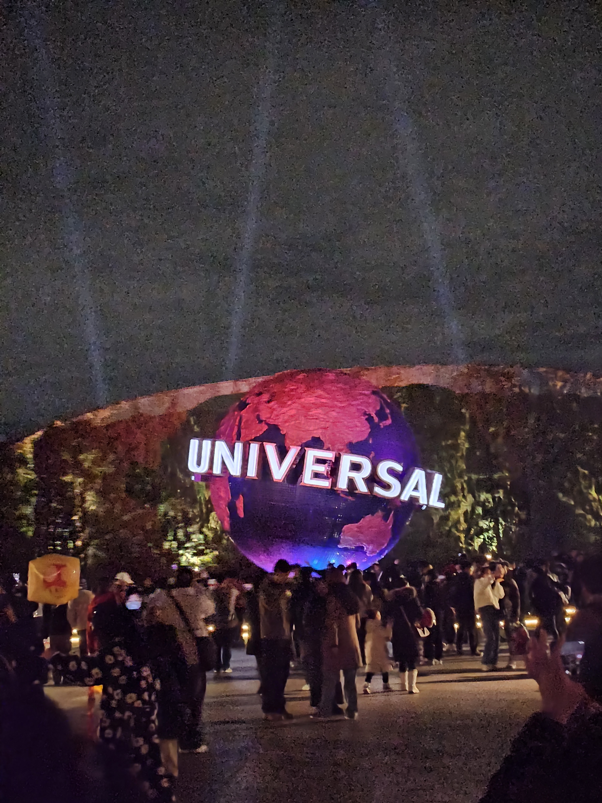  
즐거웠다 USJ! 다음에 기회가 있다면 또 볼 수 있기를~!  
깨알같은 놀부와 쉑쉑버거  

#### 사족:  
  
사실 저희 익스프레스 권에 더 플라잉 다이너소어가 있었긴 한데 실제로는 타지 않았습니다.  
첫번째 이유로는 롤코쫄보인 저는 저렇게 매달려서 탈 용기가 없었고, 롤코를 잘 타는 첫째여동생 조차 무서워 보인다고 안 타고 싶다고 하더군요.  
두번째 이유로는 부모님이 타는것을 반대했는데, 저희가 놀이공원을 가기 딱 몇일전에 문제의 기사가 나왔는데,  
USJ에서 놀이기구가 긴급정지하여 손님들이 겁에 떨어야했다는 기사를 보신분들이 있을건데. 이게 그 놀이기구였습니다. 그래서인지 어머니께서 이것만큼은 타지말라고 신신당부하셔서 아쉽게도 못 탔다는 후문이었습니다...  

<iframe width="560" height="315" src="https://www.youtube.com/embed/BiZOLQ1JhAQ?si=UKqinEZ4OiKdFLIU" title="YouTube video player" frameborder="0" allow="accelerometer; autoplay; clipboard-write; encrypted-media; gyroscope; picture-in-picture; web-share" referrerpolicy="strict-origin-when-cross-origin" allowfullscreen></iframe>

그래서 이 기구의 무서움을 체험해보고 싶으신 분이라면 해당 영상을 보시면 이해가 되시리라 생각됩니다.  
아예 사선으로 누워서 타는 놀이기구라... 무서움이 남다른 것 같습니다.  

<iframe width="560" height="315" src="https://www.youtube.com/embed/8RYZOz0MWO4?si=i7WAbKO3HzqQAB69" title="YouTube video player" frameborder="0" allow="accelerometer; autoplay; clipboard-write; encrypted-media; gyroscope; picture-in-picture; web-share" referrerpolicy="strict-origin-when-cross-origin" allowfullscreen></iframe>

어우....
