여행 일자는 24년 1월 23~24일 이었습니다.  
USJ편에서 이어지는 이야기입니다.  

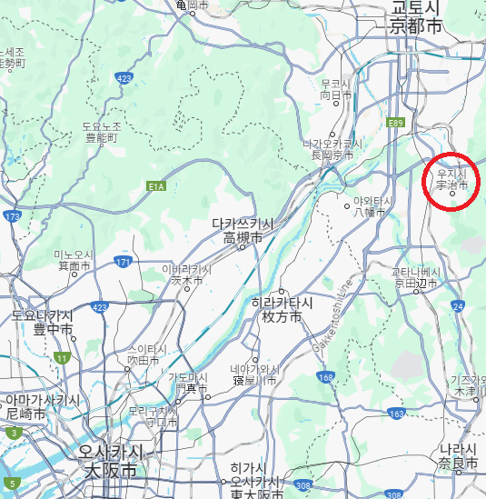  
위치상 오사카랑 교토 사이에 있었는데 가기 쉬울듯 하면서도 은근히 교통이 불편한 곳인것 같습니다.  
우메다근처에 있는 요도야바시역에서 기차를 타고 거의 1시간 반 이상을 가야하는 곳이라...  
사실 큰 맘먹고 가는거 아니면 진짜 가기 어려운 곳인것 같습니다.  
(적어도 친구 데리고 가이드 가는거라면 요청하는거 아니면 안 갈것 같습니다. 가고싶어하는 가족인 동생들이랑 가는거라 간거지...)  

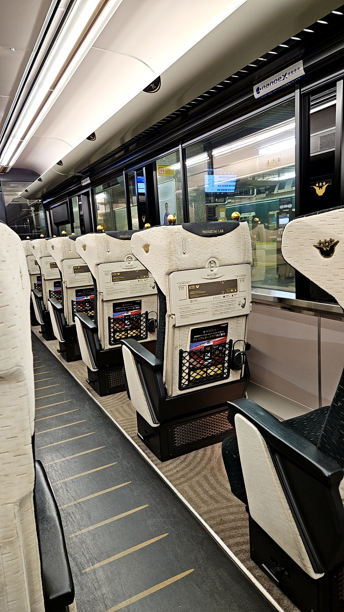  
우지로 가는 케이한 기차안.  
이번에 케이한 1day 교통 패스를 거의 3000~4000원에 구했다보니 케이한 기차를 이용하여 교통비를 엄청 절약했습니다.  
저희는 지정석 객차를 이용했는데, 패스를 이용했었어서 그런지 500엔만 내고 편하게 앉아서 갔습니다.  
물론 우지는 지선을 이용해야해서 중간에 내려서 지선으로 갈아타야했지만...  

  
케이한 기차를 타고 어렵게 도착한 우지역.  
우지에는 기차역이 2개 있는데 JR에서 운영하는 기차역과 케이한이라는 회사에서 운영하는 역 이렇게 2개가 있는데, 여기는 케이한 기차회사의 기차역입니다.  
처음가보는 장소라 짐을 어디다 둬야할 지 몰랐지만 의외로 락커가 많아서 짐 보관 걱정할 필요가 없었습니다.  

  
근데 한적한 동네라 그런지 역 바로 앞에는 놀라우리만치 조용했던게 참 인상적이었던것 같았습니다.  

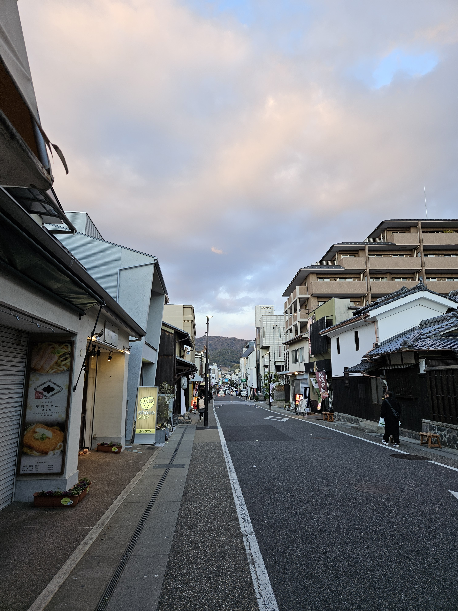

  
우지시 시내. 제가 거의 상점가 막탐 직쩐에 도착했다보니 굉장히 고즈넉하고 포근하고 한적한  
전형적인 일본 소도시 분위기가 너무 좋았습니다.  

  
사실 우지시를 간 가장 큰 이유가 여기가 녹차로 굉장히 유명한 동네라,  
막내 여동생이 녹차를 엄청 좋아해서 제가 굳이 데리고 갔습니다.  
녹차 음료수는 굉장히 맛있었는데, 저기 파르페에 밑에 깔린 녹차젤리는  
녹차를 좋아하는 저나 여동생이나 좀 호불호 갈리는 반응이 나왔었습니다.  
으음... 집을 다른집을 갔으면 더 좋았을려나.  

아쉽게도 우지시는 오래 머문 곳은 아니라 사진은 이정도가 전부인것 같습니다.  
녹차 관련 기념품도 많았고 조용한 동네라 편하게 산책하기에도 좋아보여서,  
이런 분위기가 좋으면 한번쯤 짬내서 가보는 것도 나쁘지 않을 것 같습니다.  

특히 최근에는 닌텐도 박물관도 우지시에 생겼는데,  
닌텐도 작품을 좋아하신다면, 가볼만하다고 생각됩니다.  
다만 예약이 좀 빡세서, 여행 몇달전에 신청을 해야 할 듯 합니다.  

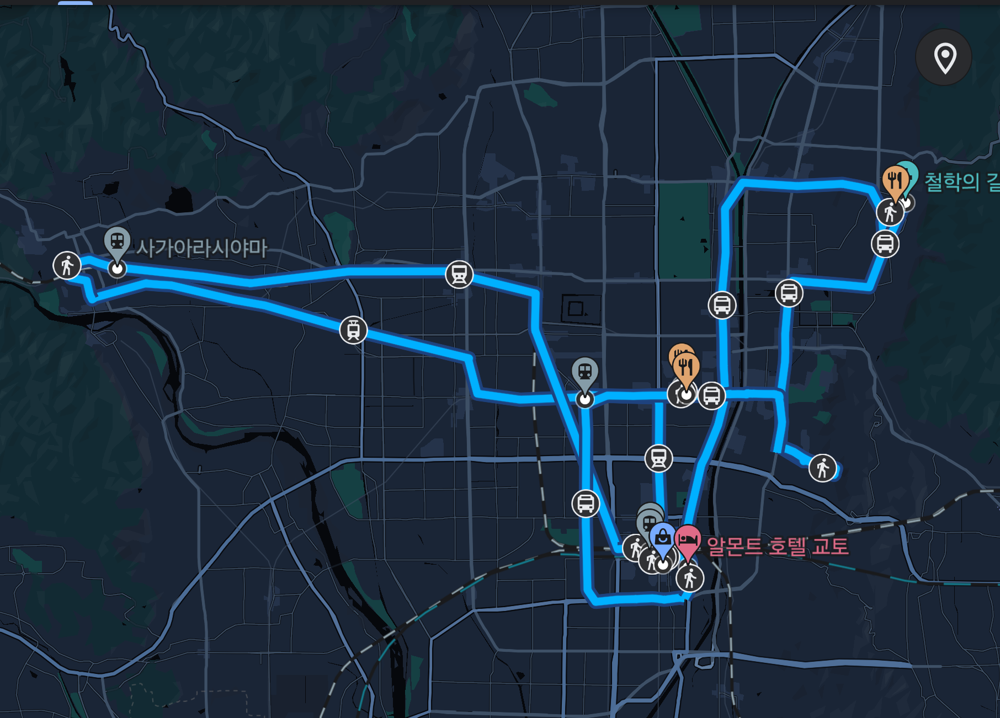  
교토는 이번이 2번째 인데도,
아직도 교토의 전부를 보지 못했다고 아직 생각할 정도로 볼게 많은 도시인 것 같습니다.

  
우지시에서 출발하여 도호쿠지 역에서 내려서 숙소까지 살살 걸어왔습니다.  
숙소 앞 편의점 앞에 서있는데 신칸센 하나가 지나가고 있습니다.  
일단 밤이 늦은 관계로 이날은 저녁만 먹고 푹 쉬기로 하였습니다.  

  
참고로 이날 저녁은 스키야끼를 먹었습니다.  
저희 여행중에 먹은 음식중 단가로는 제일 비쌌었던 음식이었습니다.  
맛은 솔직히 제 입맛에는 좀 많이 달았던 것 같습니다.  
처음에는 맛있었는데, 점점 먹다보니까 입이 물리는 느낌?  
그래도 비싼값은 하던 그런 스키야끼였습니다.  

이거 스키야끼를 구워주시는 직원분 놀랍게도 한국어가 굉장히 능숙하신 분이었는데,  
제가 일본어로만 대화를 하다보니까 한국어를 하실줄 아는것을 모르고 있다가 옆자리에 한국분이 오셔서 한국어로 안내 받는걸 보고 눈치챘다는 웃픈 해프닝이 있었습니다. (머쓱)  
한국어를 잘 하게된 계기가, K-POP을 좋아하고 한국 요리를 좋아해서 서울, 부산에 많이 놀러오셨고, 조만간 대구에 오신다고 하셨던것 같습니다.  
그래서 대구만 보면 볼거리가 많이 없으니 KTX타고 경주까지 여행하셔야 괜찮을거라고 소소한 팁만 좀 드리고 왔습니다.  
어쨋든 덕분에 일본여행와서 일본어를 못해서 입을 꾹닫고있었던 두 여동생의 입이 열리는 흔하지 않은 관경을 봤습니다 ㅋㅋ.  

  
그리고 짜잔. 다음날이 되었습니다.  
사실 전날 감기몸살끼에 속이 좀 안좋았어서 소화제+테라플루를 먹고 골골대고 있었는데,  
다행이도 다음날 완벽하지는 않지만 돌아다니기에는 문제없는 상태가 되어서 문제없이 여정을 지속하기로 했습니다.  

  
일단 제 속이 완전히 돌아오지 않은 관계로 아침겸 점심으로 일본 가정식집을 방문하였습니다.  
나이 지긋하신 어머니분과 아들분이 티키타가하시며 운영하시는 가정집을 개조한 소박한 식당이었습니다.  

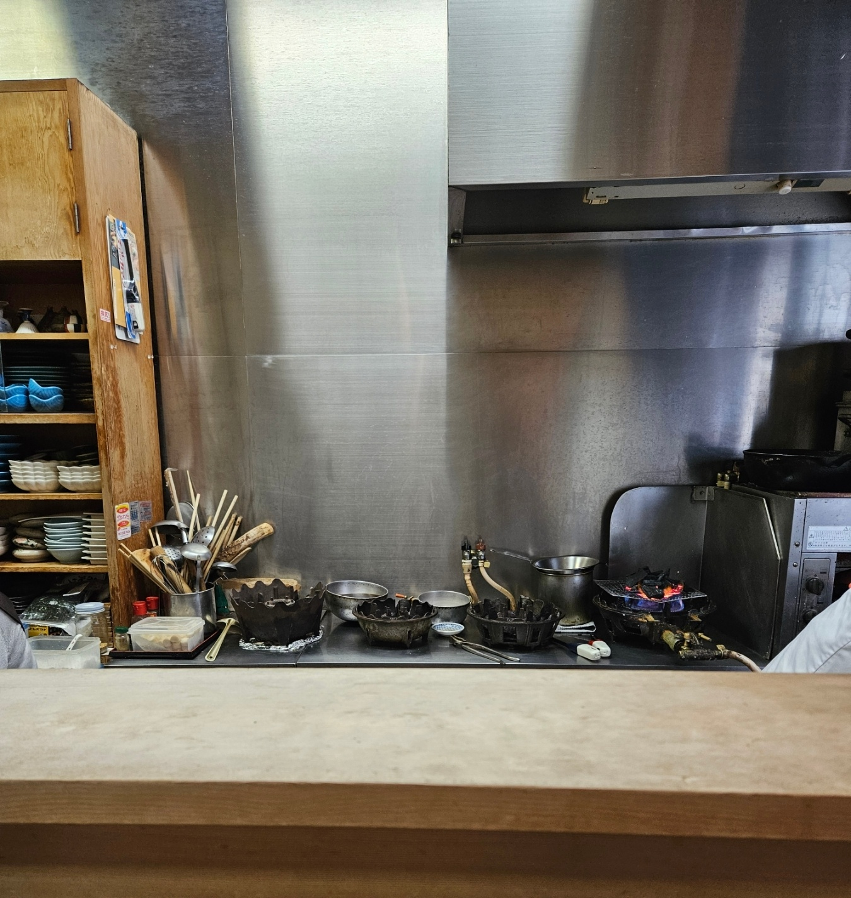  
조그마한 방에 바테이블 하나를 놔두고 바로 주방과 이어져있는 형태의 식당이었습니다.  
손님은 저희 일행만 있었다가 조금 있다가 모르는 한국분 일행이신 손님이 오셨습니다.  
참고로 여기 식당은 영어, 한국어가 안 통하는 진짜 찐 로컬 식당입니다.  
주인분들도 나이가 좀 있으신 분들이라 외국인 손님분 대하는게 좀 어려워하시는 분위기가 없지않게 있었습니다.  
(열심히 설명해주시고 대응해주시려고 노력은 하는데 손님들이 못 알아먹는 느낌? ㅠㅠ)  
따라서 어느정도 생활 일본어는 아시거나 파파고를 쓰는 편이 좋으리라 생각됩니다.  

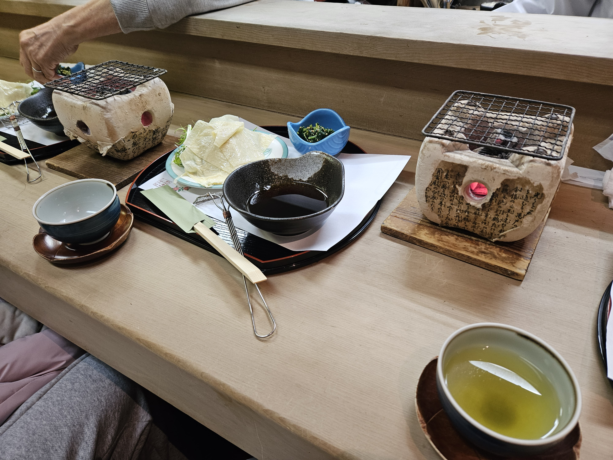  
  
그리고 저희가 시킨 유두부 정식이 도착했습니다.  
사진에는 안 찍혔지만 밥 역시 막 따끈하게 지은 흰밥을 미소국과 함께 주셨었습니다.  
유두부 끓는 물에 쌈채소와 쌈을 살짝 데쳐서 두부랑 같이 싸서 간장에 찍어먹으면 되는 요리였습니다.  
안 좋았던 속을 따뜻하게 풀어주는 담백한 한끼 식사였던것 같습니다.  

  
그러고 나서 청수사(기요미즈데라)를 향했는데, 올라가는길에 있는 스튜디오 지브리에서 운영하는 지브리 스튜디오 숍 교토에 잠시 들렀습니다.  
막내 여동생이 지브리 영화 팬이기도 해서 청수사보다 여기오는 걸 더 기대했다고 하네요.  

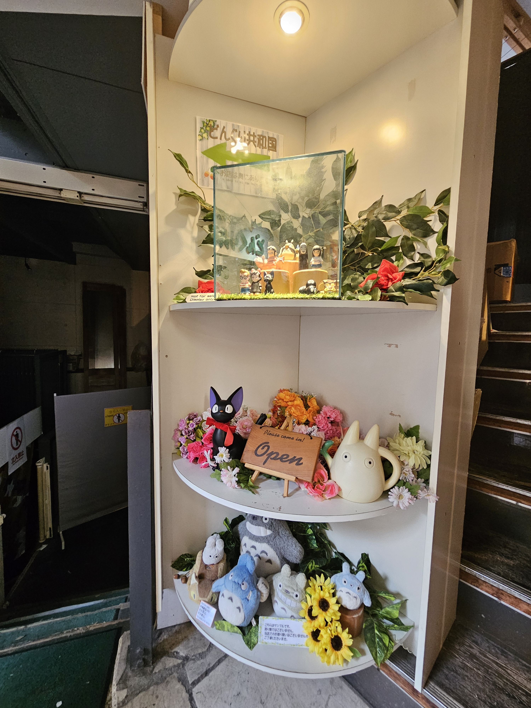

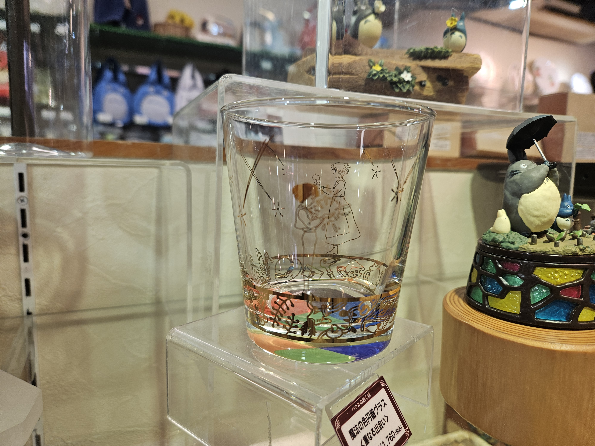

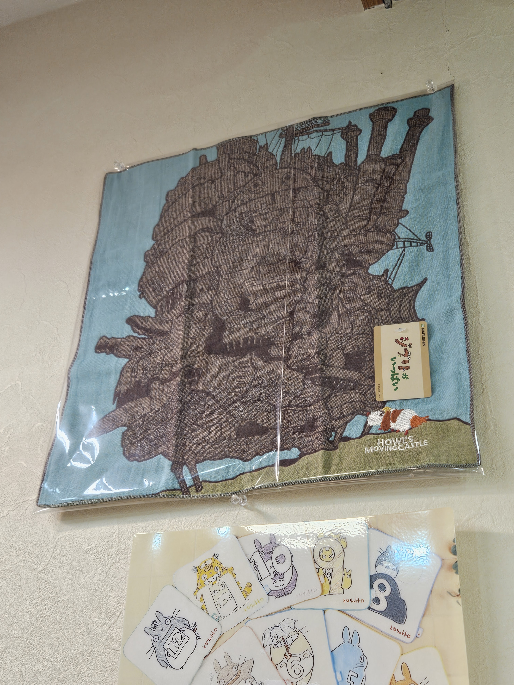

  
가게자체는 매우 작은 기념품점처럼 생겼지만, 아기자기하게 잘 꾸며두고  
굿즈들도 그릇, 필기구 같은 실용성 있는것 부터 인형, 미니 뽑기 등등 다양한 굿즈들이 있었습니다.  
다만, 지브리 굿즈들의 비싼 가격은 악명 그대로 였는지라 살짝 웃펐네요.  

  
청수사로 본격적으로 들어가려고 하는데, 눈이 펑펑 쏟아지기 시작했습니다.  
제가 일본여행을 간 이래로 이렇게 눈이 오는 거리를 걷는거는 처음이었던 것 같았습니다.  
그것도 홋카이도를 여행하는것도 아니고 무려 교토 구경중에요.    
이런 행운을 누리게 될 줄이야...  

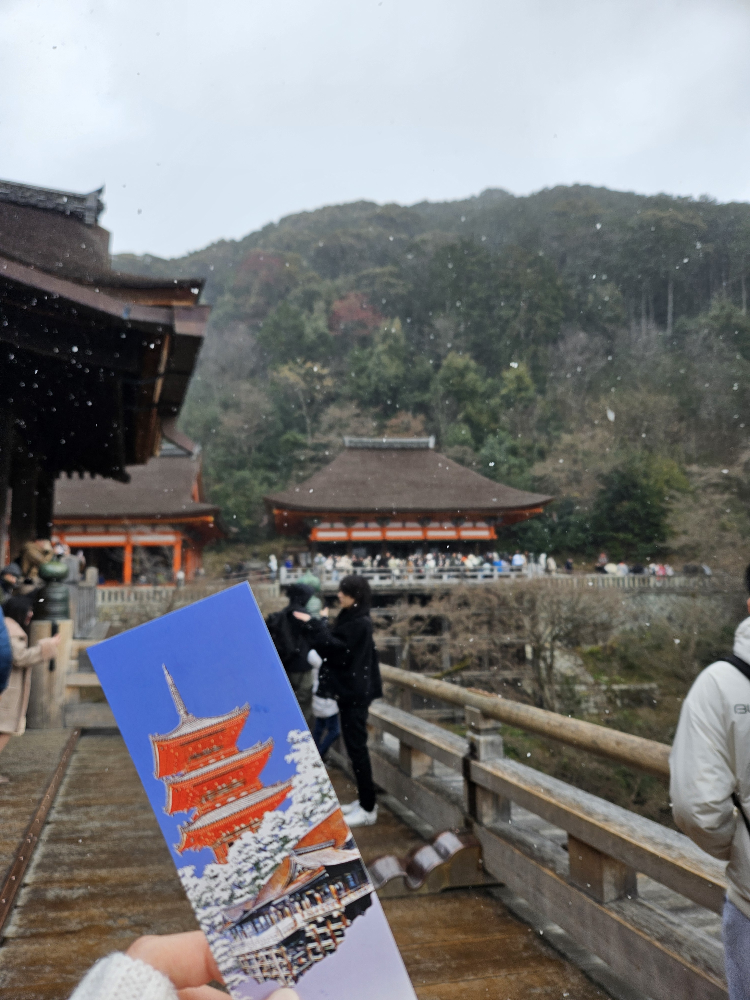  
눈이 많이 내리고있지만 청수사는 예전이랑 변함없이 인산인해로 이루고 있습니다.  
물론 일본인보다 외국인분들이 훨신 많았던 느낌이 들었습니다.  

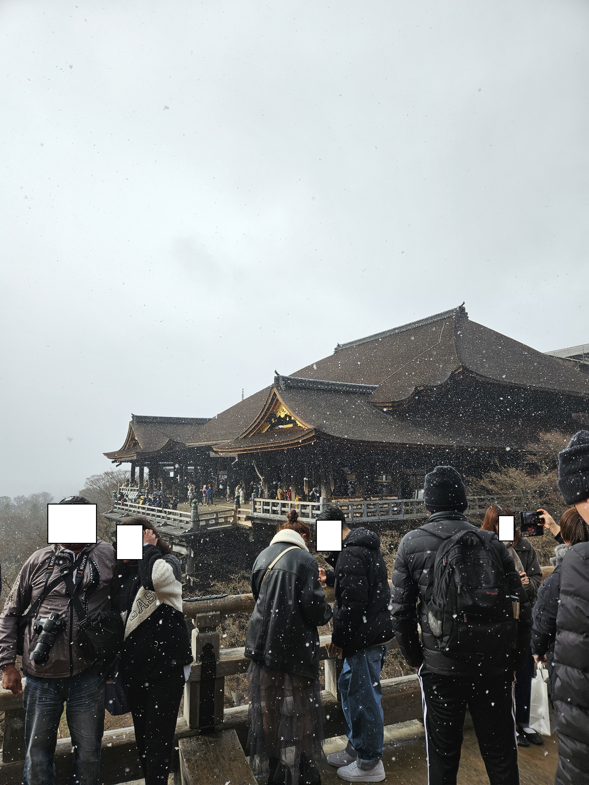
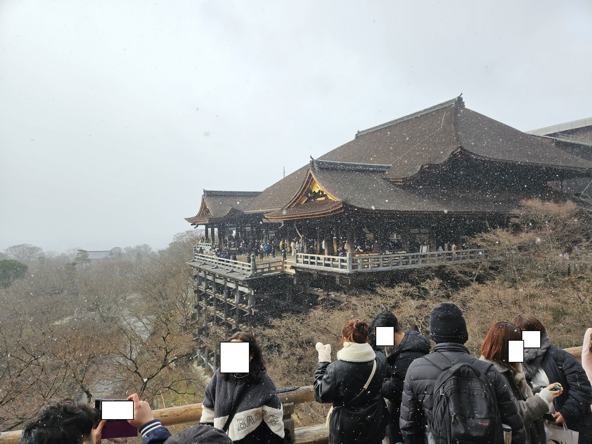  
청수사의 유명한 그 구도로도 한번 더 찍고 와봅니다.  
아쉽게도 사람이 너무 많아서 여러장 찍기에는 애로사항이 좀 있는것 같습니다.  
그래도 저번 청수사랑 다른 점이라는 이렇게 눈오는 모습을 찍을 수 있었다는 점!  
그것 하나만으로도 행운으로 알고 안고 내려갑니다.  

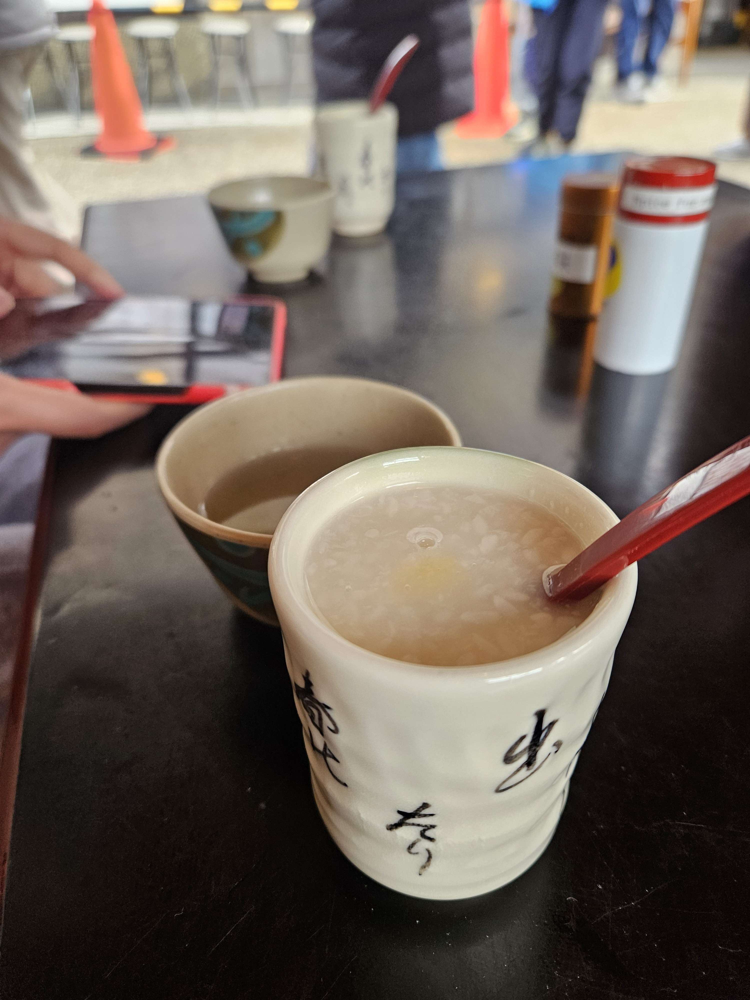  
추가로 아래서 파는 일본 감주(아마자케)도 하나 마셔셔봤습니다.  
우리나라 식혜와는 다르게 약간 쌀죽 느낌이 있는 다디단 음료수 같았습니다.  
동생들은 취향이 좀 아니라던 것 같습니다.  
추신: 이후 교토를 한번 더 가고 다른 집에서 아마자케를 마셔봤는데, 겁나 맛있었습니다.  
이 집이 맛이 없었던 것...  

  
그렇게 청수사를 내려가고 대나무숲 아라시야마 치쿠린 가는 길에는 교토의 명물 노면전차를 타고 가봤습니다.  
엄청 시끄럽습니다! 신호등에도 멈춥니다!! 신기합니다!!!

<iframe width="560" height="315" src="https://www.youtube.com/embed/Q0kP2DGWRRU?si=k40MwP8ApW8MPLib&amp;start=287" title="YouTube video player" frameborder="0" allow="accelerometer; autoplay; clipboard-write; encrypted-media; gyroscope; picture-in-picture; web-share" referrerpolicy="strict-origin-when-cross-origin" allowfullscreen></iframe>  
노면전차는 따로 사진찍은 부분이 많이 없어서 운행 영상으로 대체하겠습니다.  
노면부분 시작지점으로 맞춰뒀습니다.  

  
종점 지점인 아라시야마역에는 이렇게 기모노 천으로 장식을 해둬서
색다른 분위기가 느껴졌습니다.
우리나라 한복 천으로도 이렇게 만들면 꽤 괜찮은 느낌이 나지않을까 싶네요.

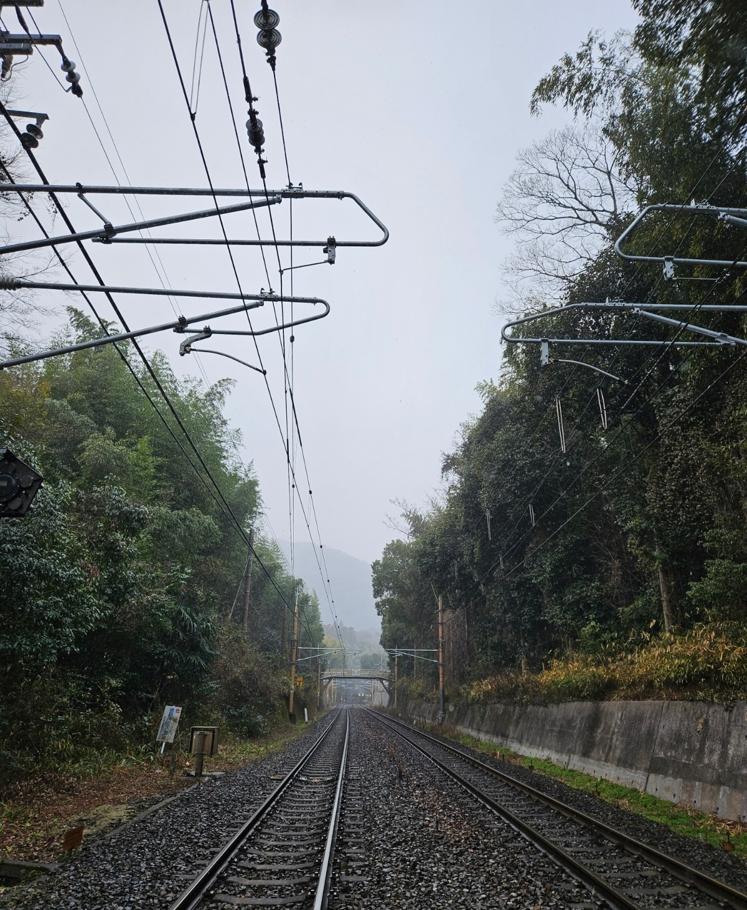
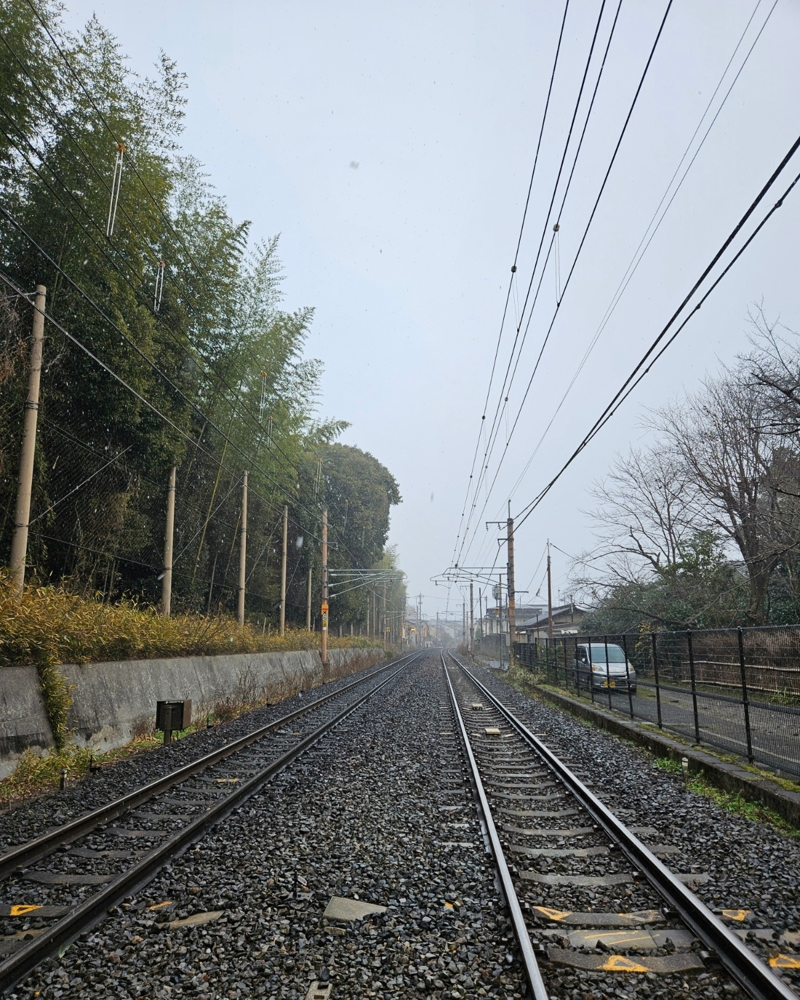
아라시야마 치쿠린(대나무숲)은 담양에 있는 대나무처럼 사방이 대나무로 가득찬 숲을 걷을 수 있는 산림욕 코스였습니다. 중간에 JR에서 운영하는 기차길도 지나는데 실제 운영중인 교토선 철로라고합니다.  
실제로 기차가 지나가기도 하였구요.  

<iframe width="560" height="315" src="https://www.youtube.com/embed/Lms31qCKCxo?si=aNgwAAPfAh2Jg0lI" title="YouTube video player" frameborder="0" allow="accelerometer; autoplay; clipboard-write; encrypted-media; gyroscope; picture-in-picture; web-share" referrerpolicy="strict-origin-when-cross-origin" allowfullscreen></iframe>  
그 대나무숲의 사라락 거리는 소리를 한번 체험해보세요.  

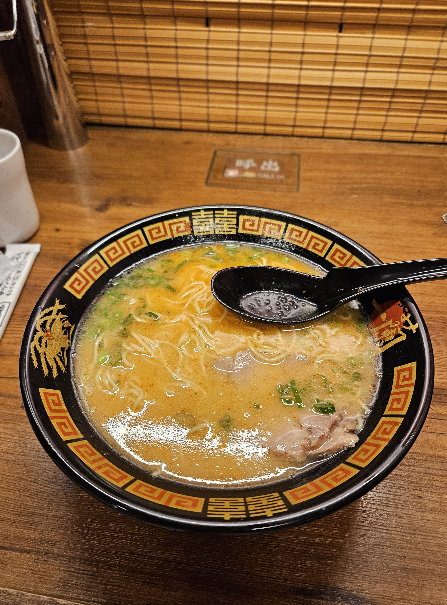
그러고나선 다시 교토 시내로 돌아와 잠시 이치란에 들러서 저녁을 먹고 나왔습니다.
그리고 그날 저녁에 저는 숙소에 있는 목욕탕에 들러서 목욕한번 하고,
딸기 우유 한잔 마신뒤 그대로 뻗어버렸답니다.

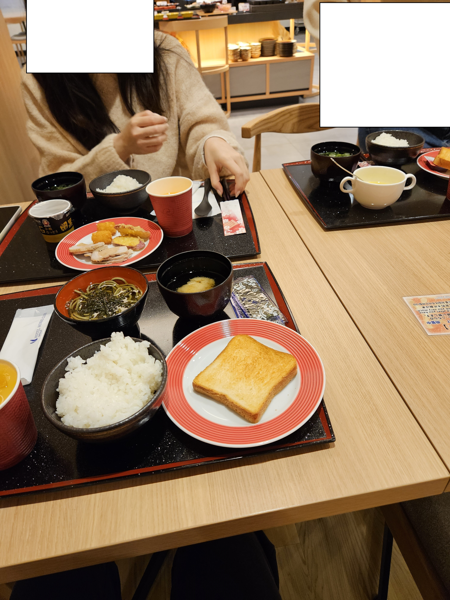  
다음날 집으로 돌아가는날에, 숙소에서 나오는 아침 뷔페를 먹었습니다.  
개인적으로 여기 호텔의 아침 뷔페의 질이 상당히 좋아서 놀라웠습니다.  
낫토, 밥, 죽, 온소바, 빵, 디저트 등등 종류도 다양했고 생색내기용 메뉴 하나 없이 매우 충실했습니다.  

  
집에 가는날까지 함박눈이 펑펑내리는 교토였습니다.  
이대로 저희는 오는 특급 하루카를 타고 바로 간사이공항으로 탈출하고 집으로 돌아갔습니다.  

역시나 교토는 하루에 돌아보기에는 너무 넓고 볼게 많은 도시였습니다.  
저희는 실질적으로 단 2-3군데만 둘러봤고, 못 둘러본 곳이 많아서 아쉬웠습니다.  
다음에 교토를 온다면 1-2일정도 더 투자해보는게 좋아보일것 같네요.  

이렇게 아쉽다면 아쉽고 충실했다면 충실했던 24년 1월 남매여행은 이렇게 끝났습니다.  
후반부에 교토 여행때 제 속이 말썽을 부려서 좀 힘들었던 여행이었지만,  
아픈데 없이 무사히 돌아왔으니 만사 OK였습니다.  
