# 1주차

## 2월 3일

[Top Page](#)  

입실 8시 58분

너무 늦게 출발해서 카페서 음료까지 뽑아갈려 했더니 진짜 지각할 뻔 했다.  

다음에 카페서 음료 뽑아먹으려면 10분 일찍 출발해야겠다.  

오늘도 파이썬을 배웠다.  
슬슬 이제 막바지에 다다르고 있다.  
기본 문법에 이어서 함수, 모듈, 파이썬내 데이터에 OOP까지 길지 않은 기간내 제대로 배울 수 있다는 것은 놀랍다.  
짧다면 짧고 길다면 긴 기간동안이었지만, 전혀 급하게 배웠다는 느낌은 들지 않았고 오히려 적당한 속도였다고 생각된다.  

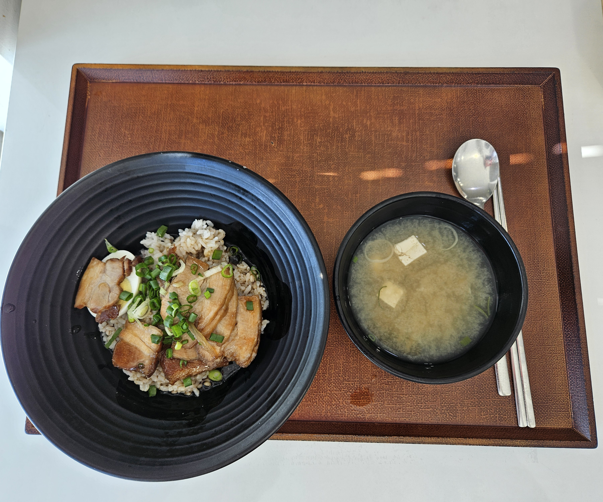  

오늘의 점심은 뚝배기동태알곤탕/차슈 덮밥 중 택1 이었다.  

부가반찬은 고로케였는데 딱히… 땡기지 않아서 역시 안 받았다.  

나는 차슈 덮밥을 택했는데, 내가 1빠따로 가길 망정이지 차슈덮밥 줄이 생각보다 길었다.  

소스는 진짜 맛있었는데, 고기가 사전에 조리해서 그런지 식은 건 마이너스 포인트.  

오후는 마찬가지로 오전에 배운 거 실습 + 알고리즘 스터디 그룹 문제 풀기로 시간을 때웠다.

오늘의 석식은 각각 돼지순대국밥/오므라이스/프랭크버거 세트인데, 별로 땡기지 않아서 그냥 저녁은 알아서 해결하기로 했다.

퇴실 18시 01분

---

## 2월 4일

[Top Page](#)  

입실 8시 51분  

오늘은 놀랍게도 파이썬을 배우는 마지막 날이다.  
내일부터는 시험을 치고 알고리즘 수업으로 넘어간다는 것 같다.  

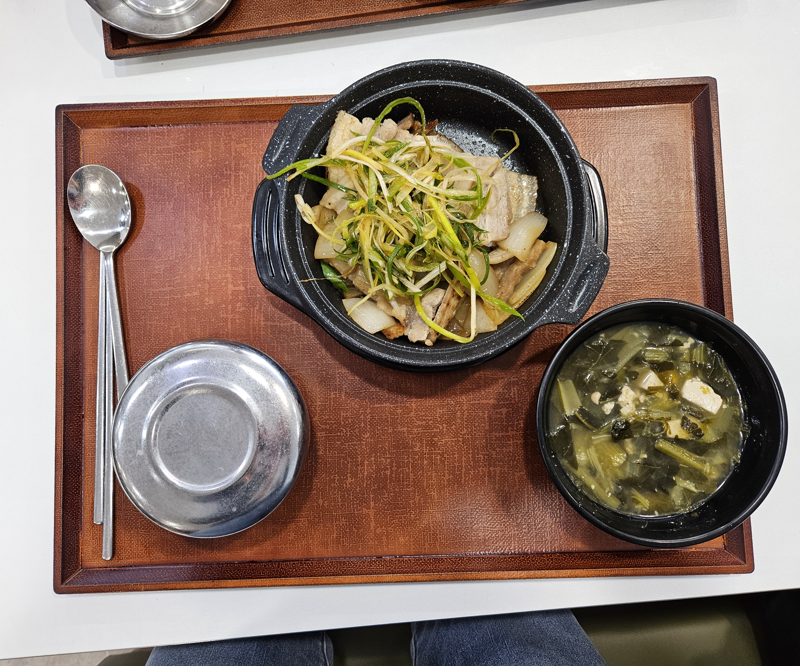

오늘의 점심은 삼겹살허브구이/짜장덮밥 이었다.  
나는 삼겹살 허브구이를 택했는데, 내가 김치를 좀 싫어하는 편이라 김치를 빼고 달라고 부탁드렸더니 흔쾌히 해주셨다.  
그래도 허브향이 솔솔나서 돼지 잡내도 없고 굉장히 맛있었다.  

오후는 별일 없이 술술 넘어갔다.  

저녁은 그냥 고봉민김밥인 가서 떡국 하나 시켜먹었다.  
오늘은 마치고 보충 수업에다가 취업 준비관련 해야할 일이 있어서 좀 바쁜 하루였다.  
다행이도 오늘 바쁠 것 같아서 어제 스터디 그룹 관련 과제는 오늘치까지 다 해뒀는데, 그래도 여전히 할 게 산더미 같았다.  

거기에 시험공부까지 할려니 참 죽을 맛이긴 하였다.  

퇴실 18시 02분

---

## 2월 5일

[Top Page](#)  

입실 8시 50분

오늘은 첫 시험 날이었다.  
내가 정리해둔 파이썬 문법 인덱스 노트와 인터넷이라는 요소가 빠지면 얼마나 무력해지는지 깨닫는 기회가 되었던 것 같다.  
커트 라인에 좀 아슬아슬하게 걸쳐져 있어서 정답이 1개라도 안 나오는 순간 나는 이번 시험 과락 확정일 듯 하다.  

하아….  
오늘은 점심 메뉴가 별로 마음에 들지 않아서 입실 전에 스타벅스에서 빵좀 사와서 때웠다.  
시험 결과가 그다지 좋지 않아서 입맛도 없기도 하였고…  

그나마 좋았던 소식은 SSAFYcial에 붙었다는 소식을 알게되었다.  
다음 주 부터 OT를 한 뒤 본격적으로 시작할 예정인 듯해 보인다.  
그나마 다행이었다.  

오늘 저녁은 알고리즘 스터디 맴버들과 버거킹에 가기로 하여서 거기서 해결하기로 하였다.  

퇴실 18시 02분  

---

## 2월 6일

[Top Page](#) 

입실 8시 46분

어제의 알고리즘 스터디 덕분에 재귀에 대해 어느 정도는 감을 잡을 수 있을 것 같은 느낌이 들었다.  
다음 주 발표 차례는 내 차례인데 탐색 알고리즘 파트를 분석해서 알려줘야해서 이번 주말 중에 공부를 좀 해야할 듯 하다.  
오늘도 알고리즘 스터디가 메인으로 진행되었다.  
아는 개념인듯 하면서도 전체적으로 생소한 느낌이라 조금만 정신줄 놓으면 못 따라갈 느낌이 강하게 들었기 때문에 평소보다도 정신 바짝 차리고 들어야할 것 같다.

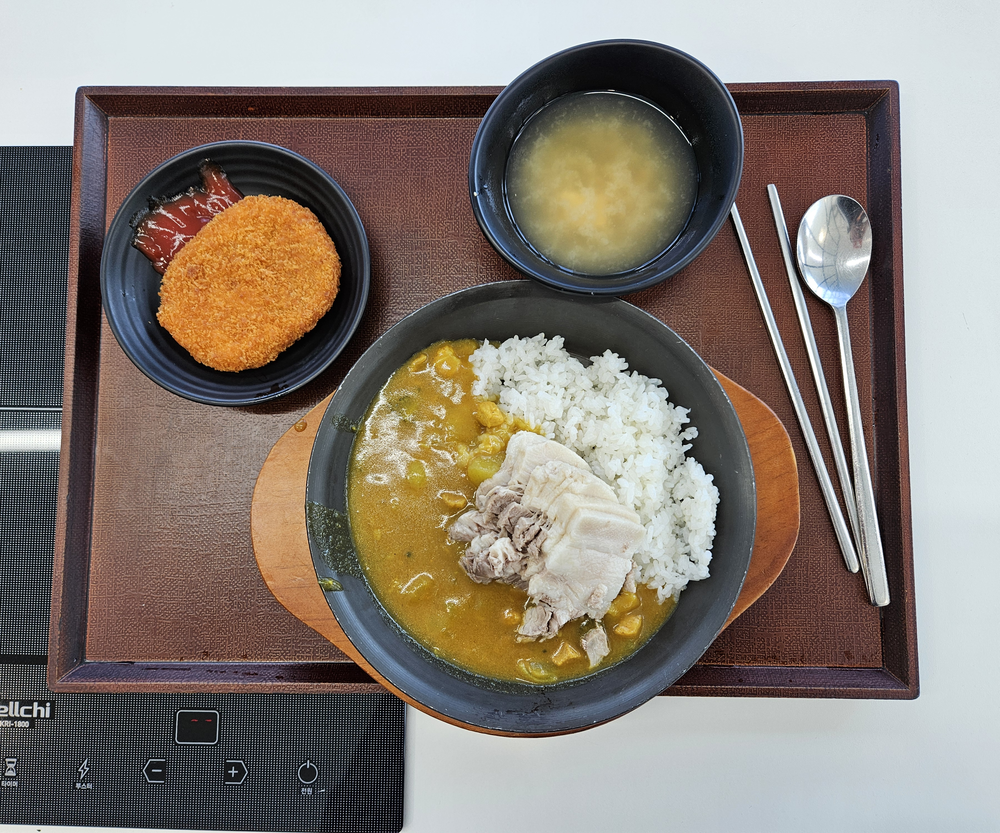

오늘이 점심은 아구찜/삼겹카레 덮밥 중 택 일인데, 후자를 골랐다.  
다만 이번의 삼겹살 토핑은 좀 많이 차고 말로 표현하기 뭐한 그런게 좀 있어서 저번에 비하면 아쉬웠다.  

오후에는 계속 끙끙대면서 알고리즘 문제를 풀었다.  
웃긴데 더 쉽게 푸는 방법이 있는데, 첫번째 문제만 오늘 배운 내용대로 정석적으로 풀었고, 나머지 문제는 사파 방식으로 풀었다.  
그래서 더 쉽게 끝낼 수 있는 걸 집에 가서 붙잡고 낑낑대면서 풀었다는게 유머였다.  
뭐… 그런데 재밌으면 그만이지 ㅋㅋㅋㅋ  
어쨋든 이러한 이유로 오늘 저녁도 집에서 해결하였다고 한다.  

아 참고로 수업중에 푼 알고리즘 문제는, 이 블로그의 알고리즘 칸에는 적지 않을 예정이다.  
문제 자체는 누구나 검색하면 찾을 수 있는 공개 문제이긴한데,  
수업 내용에 대한 직접적인 누설일 것 같아 삼가하기로 하였기 때문이다.  

퇴실 18시 00분  

---

## 2월 7일

[Top Page](#) 

입실 8시 41분

오늘 새벽부터 아침까지 구미에 눈이 많이 왔다.  
다행이라면 미끄럽진 않았다 정도?  
어쨌든 천천히 와야 할 것 같아서 오늘은 좀 일찍 출발했다.  

오늘 역시 알고리즘 주간이었다.  
오늘은 앞으로 많이 쓸 알고리즘 풀이법 이라고 해서 평소보다 좀 더 집중해서 봤다.  

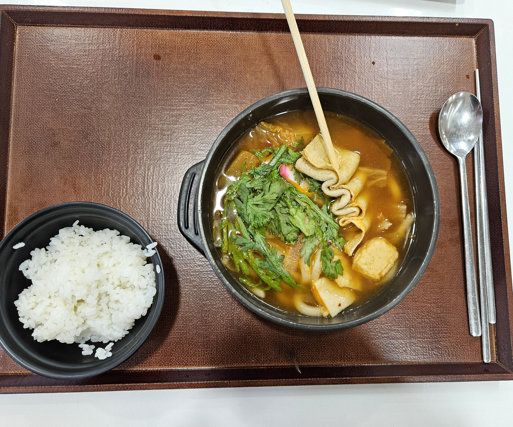

오늘의 점심은 돈갈비찜/김치우동어묵전골 이였다.  
돈갈비찜도 땡기긴했는데, 최근에 또 갈비를 먹기도 했고, 유독 김치나베/우동류들이 여기 맛있게 만드는것 같아서, 후자를 택했다.  
그리고 그 선택은 옳았다!  
반찬은 단무지에 +a 하나 있었는데, 굳이 싶어서 안 가져왔다.  

오늘은 처음으로 실습문제를 한문제조차 제 시간내 풀지 못 해서 모든 문제를 집에서 푸는 걸로 넘겼다.  

오늘 몬스터 헌터 와일즈 베타 날이라서 빨리 집가서 하고싶어서 저녁은 패쓰했다.  
아 아무리 코딩으로 바쁜 나날이지만 몬스터 헌터 와일즈는 어떻게 참아 ㅋㅋㅋ  
실습문제는 내일의 내가 해결해주겠지...  

퇴실 18시 00분

---

## 2월 1주차 총평

[Top Page](#) 

네. 내일의 저, 실습에 숙제까지 다 처리완료했습니다.  
고맙다. 어제의 나 -_-^.  

현 시점까지 시험 결과는 모르긴한데, 잊어버리고...  
이제부터 알고리즘 주간이 시작되는데, 알고리즘 코딩 경험이 적은 사람에게 생각보다 숨이 턱 막히는 난이도로 나온다.  
그렇다고 못 따라갈 정도냐?  
신기하게도 따라는 가진다. 어떻게든 고민하면 답은 나온다.  
문제점은 이제 그 속도를 좀 높혀야된다는 점인데, 아직까지는 꽤 느린 속도로 정답이 나오고 있다.  
조금 자존감이 낮아졌지만, 어쨋든 어쩌겠는가? 열심히 해야지.  

이외에도 SSAFYcial 13기 기자단에 선정되었다.  
다음주에 OT가 있을 예정이라고 한다.  
조금 기대가 된다.  
블로그에도 빈칸으로 두던 메뉴칸을 SSAFYcial로 용도 전환하였다.  
앞으로 기사는 이쪽에 쓸 예정이다.  

**이번 한 주를 버티게 해준 고마운 애니메이션**  
[약사의 혼잣말 2기(OTT: 넷플릭스) 4화](https://www.netflix.com/kr/title/81712068)  
[푸른 상자(OTT: 넷플릭스) 17화](https://www.netflix.com/kr/title/81663323)  
[나의 행복한 결혼 시즌 2(OTT: 넷플릭스) 1-3화](https://www.netflix.com/kr/title/81564905)  

---

# 2주차

## 2월 10일

[Top Page](#) 

입실 8시 50분

이번 주말에도 본 수업 과제 처리에 스터디 그룹 과제에 이번 주 스터디 그룹 발표 차례가 나인지라 PPT 제작까지 동시에 진행한다고, 정신차려보니 일요일 6시가 되는 휴일 없는 삶을 산 것 같다.  

물론 내가 선택해서 하는 길이니까 후회는 없고, 오히려 집중하면서 힘을 쏟을만한 것들이 생겨서 의미있게 보내는 기분이 들었다.  

아 그래도, 진짜 곤란한 알고리즘 문제 하나가 있었는데 그거 푸는 건 진짜 뇌가 녹아내리는 기분이 들어서 다 풀고나서는 아무 것도 하고 싶지 않은 느낌이 들긴 했다. ㅋㅋㅋ  

오늘은 저번 주에 이어서 알고리즘 수업의 연장이다.  

아마 이번 주까지는 쭈욱 알고리즘 수업을 들을 것 같다.  

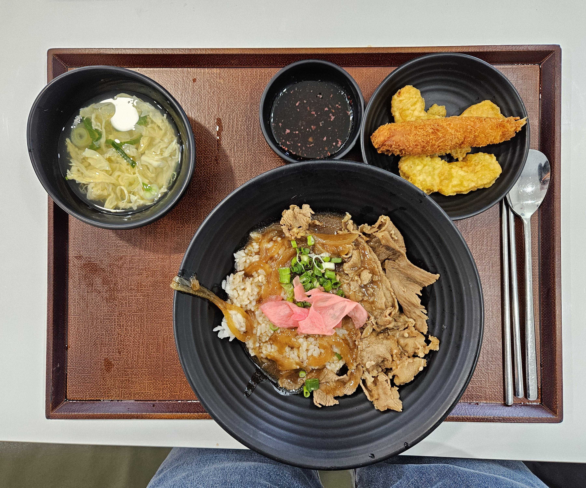

오늘의 점심은 뚝배기닭볶음탕 & 당면사리 / 규동 이었다.  

후자를 선택.  

규동은 의외로 그럴듯하게 맛있게 잘 나왔다.  

계란은 빼달라고 했다 참고로.  

시험 결과가 나왔는데 예상대로 진짜 턱걸이로 통과였다고 한다.  

다음 시험은 개념 위주로 좀 더 공부하고 도전 해야 할 것 같다.

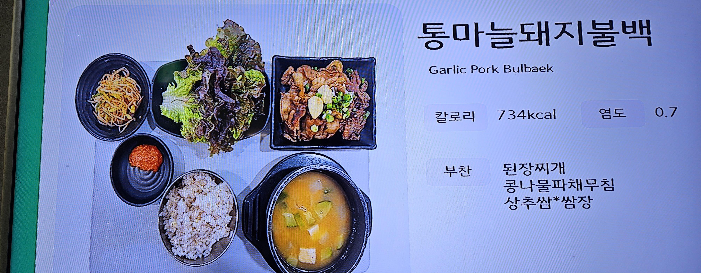

오늘은 정말 간만에 저녁 싸밥도 사먹었다.

저녁은 돼지불백 / 가래떡볶이 중 택1이었는데 떡볶이보단 불백이 밖에서 먹기 힘들 것 같아 택하였다.

사진찍는거 깜빡해서 메뉴 예시사진으로 대체.

퇴실 18시 28분

---

## 2월 11일

[Top Page](#) 

입실 8시 50분(입실 자체는 40분에 했는데, 컴퓨터 세팅 먼저하고 출석한다고 10분 늦어졌다)  

점점 자는 시간이 늦어지고 있다는 느낌이 들고 있다.  

알고리즘 난이도가 점점 어려워지고 알고 써야 할 개념이 많아질 수록 어떤 걸 써야 풀릴지 고민하거나 헷갈리게 되고 이로 인하여 문제를 푸는 시간이 점점 길어지다 보니 점점 그렇게 되어가는 것 같다.  
거기에 곧 첫 IM시험이 있다 보니 추가 대비로 문제를 더 풀다 보니 더더욱 늦게 잘 수 밖에 없는 것 같다.  
어제자 숙제도 전체 반에서 딱 절반 순위로 풀었고, 문제 개념 해석에 gpt의 힘을 한 번 빌리긴 했으니, 아직 나는 개발자로 1인분 하려면 멀긴 멀었나 보다.  

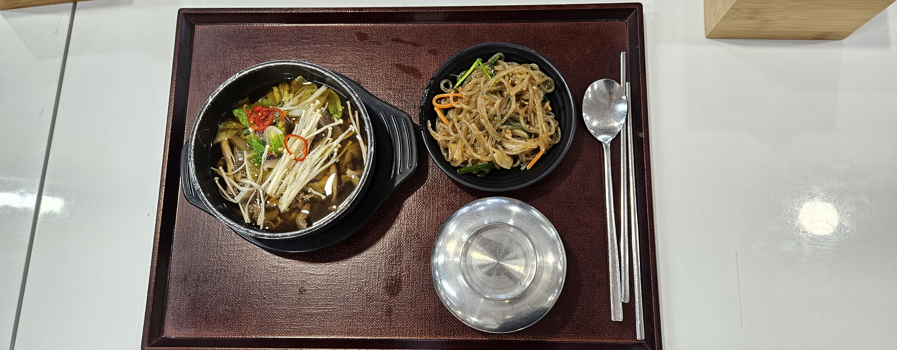

오늘 점심은 버섯소고기전골 / 야끼소바 중 택 1이었다.  
전자 선택. 이유는 소고기 전골이 내 대학생활 소울푸드였었기 떄문에, 훨씬 친숙하고 정감가는 음식이기 떄문이다.  

개인적으로 추가로 문제를 풀어본 결과 확실하게 난 델타 탐색 알고리즘에 굉장히 약하다고 해야 할까? 이해를 잘 못하고 있다는 느낌이 들었다.  
나중에 시간 나면 델타 알고리즘쪽 다시 보기 수업으로 좀 복습을 해두는 편이 좋을 것 같다.  

오늘은 실습과 과제도 수업 중에 에러 무더기로 인하여 다 못하기도 하였고, 기자단 오리엔테이션도 있기도 해서 쉴 수 없는 하루가 될 것 같은 느낌이든다.  
빨리 집 가자마자 할일 처리를 해야할 것 같다.  

퇴실 18시 00분

---

## 2월 12일

[Top Page](#) 

입실 8시 56분  

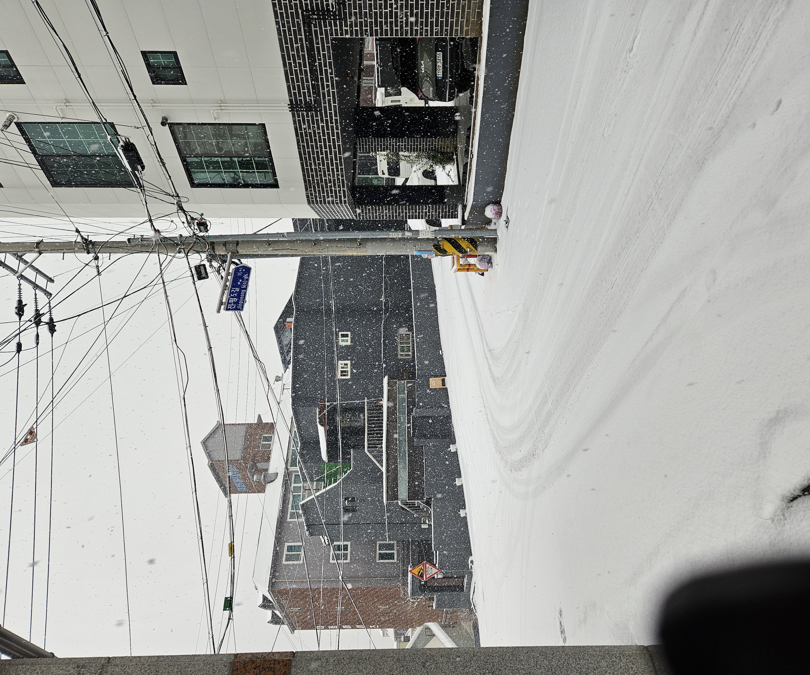

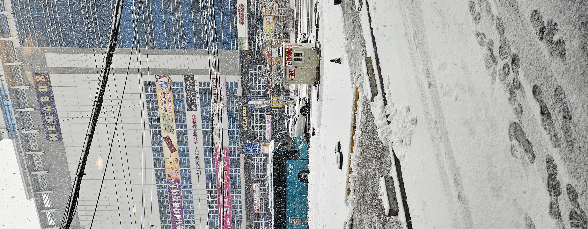

눈이 엄청나게 쌓여있고, 엄청나게 내려서 오늘 입실 전에 통학은 조심조심 하였다.  
아 물론 스타벅스는 못 참는다.  아사히에이드 한잔 뽑고 딱 맞게 입실하였다.  

어제는 결국 스터디그룹 일일 과제는 계속 붙들다가 새벽 1시 30분쯤에 내일 수업 컨디션이 우려되는데다 이걸 작성하는 시점에서 이미 컨디션 난조, 피곤함으로 인하여 너무 지쳤기 때문에 양해를 구하고 건너 뛰어버렸다.  
그렇다고 오늘이라고 넉넉한 건 아니다.  수업 종료 전까지 발표 준비도 해야 하고, 이제부터 나오는 과제는 수업 시간 내 다 못 풀 정도로 난이도가 꽤 올라간 상태라 사실상 다 푸는 날보다 하나도 못 푸는 날이 더 많을 지경에 다다랐으니,  

이제 뭐 12시 전에 자는 거는 주말 전에는 불가능해 보인다.  
그렇다고 주말은 안 바쁜 것 같은가? 아니다.
기자단 기사는 이번 달부터 작성을 시작해야 한다.  진짜 할 일이 태산같이 쌓인다.

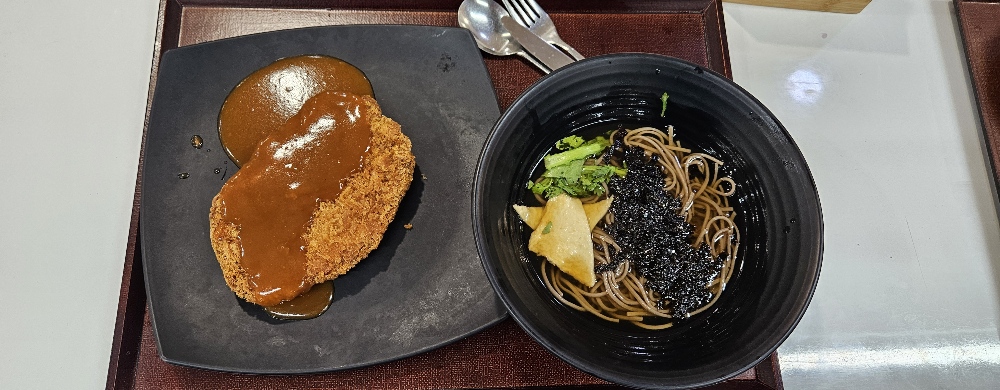

오늘의 점심 싸밥은 오곡영양쌀밥/경양식돈까스 중 택1 이었다.
후자를 택하긴했는데, 압도적일 정도로 돈까스로 줄이 몰리는 모습을 볼 수 있었다.  

점점 여유가 없이 톱니바퀴처럼 맞물리는 시간을 살아가는 것 같은데,  
앞으로는 지금보다도 더 어려운 알고리즘으로 나온다는 것 같다.  
솔직히 말하자면 조금… ‘따라 갈 수 있을까?’ 에 대한 막연한 두려움이 나오는 것 같기도 하다.  
가장 큰 두려움은 시각적으로 내가 다른 학우들에 비해 속도가 매우 뒤쳐지기 시작했다는 것이 체감되기 시작한다는 압박감이다.  
항상 새벽 1,2시까지 공부하다 자고, 여가활동도 반납하고 코딩에 몰빵하고 있는 나로서는,  
이렇게 해도 다른 아이들에게 밀린다는 것을 체감하는 순간의 압박감은 조용하지만 순식간에 찾아와서 말없이 쳐다보고 있는 듯한 무언의 압박감이 생각하기 싫어도 들 수 밖에 없다.

공부 방법을 바꿔야 하는가? 라고 하기에는 다른 방법을 수행할 물리적인 시간이 부족한 것이 크다.  
오늘도 방과후에 할일이 태산같이 많다.  저녁은 집에 가서 신속하게 해결하기로 하였다.  

퇴실 18시 01분

---

## 2월 13일

[Top Page](#) 

입실 8시 50분  

오늘 처음으로 실습/과제 알고리즘 문제를 당일에 풀지 못 하는 일이 발생하였다.  것도 2문제나. 
내가 기본적인 개념이 부족한 건가?  아니면 설계를 잘 못 떠올리는 건가?  둘 다 인가?  
라는 엄청난 잡념이 밀려오는 기분이 든다.  

하지만 일단은 떨쳐내는 것이 중요하다. 과거에 JAVA를 배울 때도 들었던 자존감 추락이 아니었던가?  
밀린 과제는 일단 주말로 미뤄버리고 다시보기 보면서 개념을 다시 리마인드 해나가는 방식으로 해결하려 시도를 해보기로 하고,  
당장에 하루하루 쌓이는 과제들을 먼저 처리하는 것이 급선무라는 생각이 든다.  

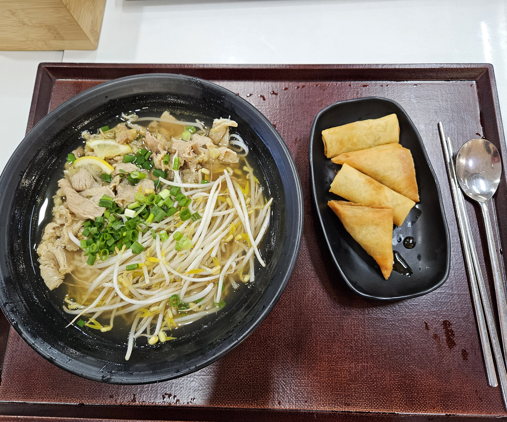

오늘의 점심은 쭈꾸미볶음밥 / 양지쌀국수 중 택 1이다.  

쌀국수를 딱히 싫어하진 않아서 후자를 택하긴 했는데, 오늘은 별로 많이는 안 먹고싶어서 조금 남기긴 하였다. 그래도 맛 자체는 평타이상은 했는 메뉴였는 듯.  

추가로 담당 프로님과 개별 면담이 있었다.  
크게 특이한 사항은 없고 고생이 많다고 격려를 많이 해주셨다.  
이후 역시 과제나 이후 일정이 밀린게 많아 칼퇴 후 자취방에서 추가 공부를 하고 현재 1시 40분에 종료하였다.  
결국 오늘치도 전부 끝내지 못한게 아쉽다.  

퇴실 18시 01분

---

## 2월 14일

[Top Page](#) 

입실 8시 52분  

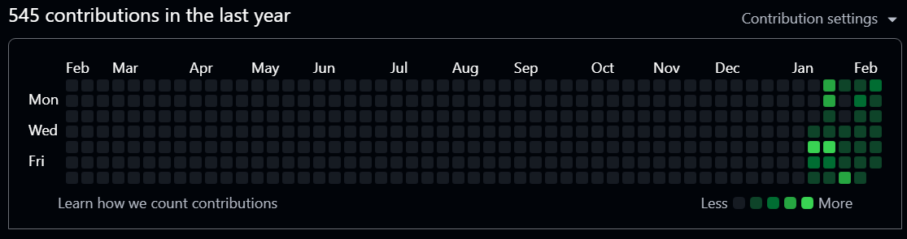

여전히 바쁘고 힘든 일이 정말 많지만 블로그 관리는 최소 한도로 일기는 올리려고 행동하고 있다.  
그래서인지 설 전후만 제외하면 현재까지는 빼곡하게 잔디가 심어지고 있다.  
아직까지는 개발능력이 부족해서 개발 유지 관리 보수를 위한 잔디 심기가 아니라서 그렇지, 블로그 관리도 일종의 시스템 유지 관리라 생각하고 임하고 있다.  

또한 영양가 없는 글만 계속 올리진 않는다.  알고리즘 스터디나 개인적인 공부로 푸는 알고리즘도 풀이 방법과 어떻게 접근했는지 같이 올리는 방식으로 착실히 정보도 올리고 있다.  
아직까지는 보잘 것 없어보일지도 모르지만 이 모든게 쌓이면 나만의 개발 노트가 될지 혹시 누가 알겠는가?  

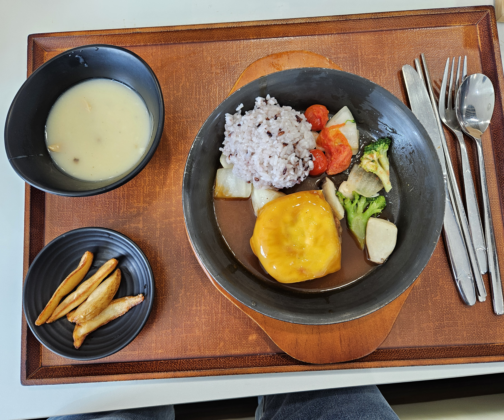

오늘의 점심 싸밥은 산더미뼈찜/도쿄식 함박 스테이크 였다.  
참고로 계란후라이도 있었는데 먼저 처리하고 정신차려보니 사진찍을땐 없게되었다.  
나는 도쿄식 함박 스테이크를 선택하였다.  
의외로 오늘 둘은 5:5 선택률을 가지고 있는데 각각 장단점이 있어서 그렇다.  
산더미뼈찜은 자체는 꽤 괜찮았는데 동기에게 물어보니 양이 좀 애매했다고 했고,  
함박스테이크는 소스는 괜찮았는데, 고기가 좀 아쉬웠다는 개인적인 느낌이 있었다.  

오늘 안 그래도 과제/실습에 스트레스를 받는 학생들이 많다고 강사님이 말씀하셨는데,  
실제로 우리들의 진도는 한정된 시간에 많은 정보를 받아들여야하니 빠른 건 강사님 입장에서도 빠른 편인 건 부정할 수 없다고 말씀해주셨다.  
너무 안 풀린다면 따로 요청하면 더 쉬운 문제를 대체 과제로 내주거나 다시 세세하게 배웠던 내용 리마인드를 시켜주거나 여하튼 도와주겠다고 부담 없이 말하라고 하였다.  
그리고 너무 다 푸는데 스트레스 받지 말고 끝까지 노력하고 배우려는 자세가 중요하고 배운 걸 어떻게든 쓸 수만 있으면 잘 가고 있는것이니,  
부담감을 가지지 않았으면 좋겠다는 당부를 추가했다. 그냥 여러 번 써보는 것만이 답이라는 팁도 추가로 알려주셨다.  
부담감이 사라진 건 아니지만, 그래도 의지가 되는 말씀이었다고 생각한다.  

오늘 저녁은 반 회식이 있을 예정이고 보충 수업도 있으므로 바로 칼퇴근 하였다.

퇴실 18시 00분

---

## 2월 2주차 총평

[Top Page](#) 

여러모로 이번 주는 좀 자존감이 많이 떨어진 상태로 일기를 적는 날이 많았다보니,  
좀 네거티브한 느낌이 많은 주간이라고 느껴졌으리라 생각된다.  
실제로도 지금 이 총평을 쓰는 토요일에도 나는 강의 다시보기로 복습하면서,  
이해가 안 되는 부분을 계속 반복 복습하고있다. 
SSAFY가 이런 점에서 일명 후발주자(슬로스타터)에게도 상당히 관대한 시스템을 갖췄다고 생각된다.  

솔직히 지금도 불안감이 훨씬 더 많은 상황인 건 달라지지 않았다.  
하지만 불안해한다고 해결되는 문제가 아니다.  
노력하는 과정은 씁쓸하지만, 현재까지로 봤을때는 노력이 배신한 적은 거의 없었던 기분이 든다.  

말이 길었다.  
빨리 일기쓰기 끝내고 복습으로 돌아가야겠다.

**이번 한 주를 버티게 해준 고마운 애니메이션**  
[약사의 혼잣말 2기(OTT: 넷플릭스) 5화](https://www.netflix.com/kr/title/81712068)  
[푸른 상자(OTT: 넷플릭스) 18화](https://www.netflix.com/kr/title/81663323)  
[지. 지구의 운동에 대하여(OTT: 넷플릭스) 4- 14화](https://www.netflix.com/kr/title/81765022)  
[Re : 제로부터 시작하는 이세계 생활 3기(OTT: 라프텔) 9-10화](https://laftel.net/item/42429)

---

# 3주차

## 2월 17일

[Top Page](#) 

입실 8시 48분  

오늘은 시험이 있었다.  
물론 실수해서 2군데 정도 틀리긴 했는데, 부분점수 감안하면 무난하게 통과한다는 계산이 나와서,  
딱히 걱정하고 있진 않다.  
사실 이번 시험까지는 어렵지는 않은 부분이라 반드시 통과해야한다는 마음가짐으로 주말 중으로 꽤 공부 하고 도전했는데, 다행이도 집중 공부했는 부분에서 꽤 나왔다.  

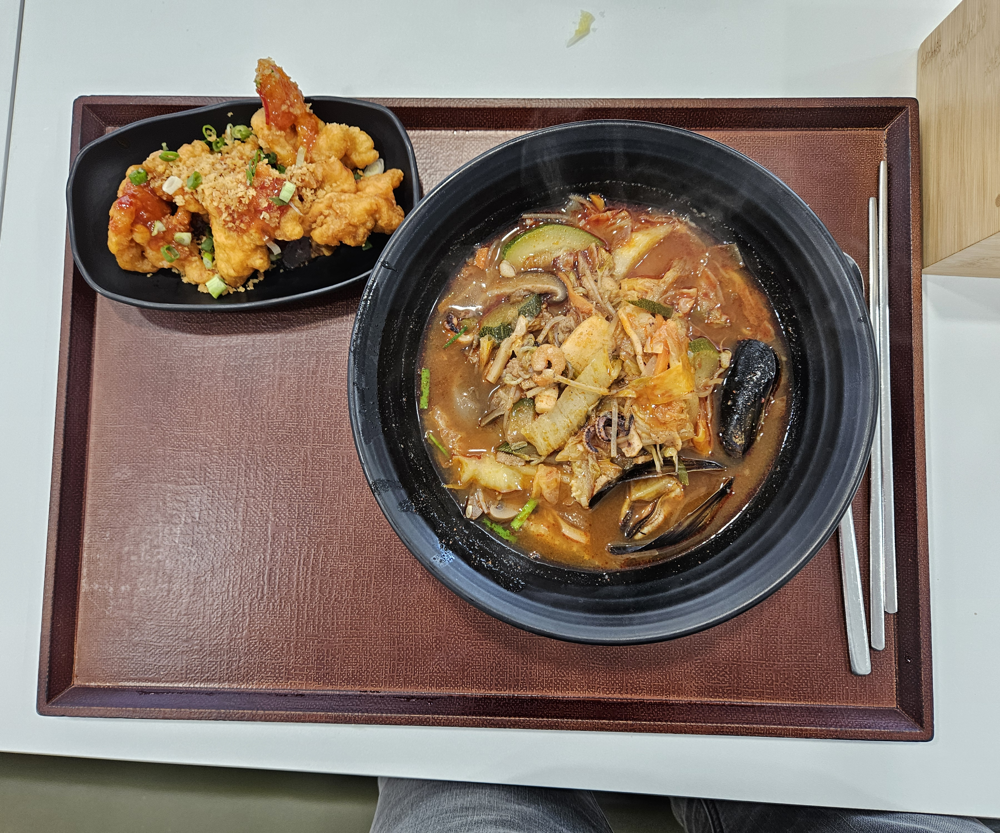

오늘의 점심은 설렁탕과 해물짬뽕중에 선택이었는데,  
여기 짬뽕은 괜찮은 편이라 짬뽕을 선택했다.  

내일은 SW테스트 날이라 그런지 꽤 준비할 것이 많아서 수업은 그렇게 많이 진행되진 않았다.  
어쨋든 집에서도 좀 대비해야할 게 있어서 마찬가지로 칼퇴하였다.  
솔직히 이젠 될대로 되란 마인드라…  
어짜피 SW테스트는 학기중에 2번 더 기회가 있으니 말이다.  
근데, 그래도 한번에 통과되면 좋긴할 것 같다.  

퇴실 18시 00분

---

## 2월 18일

[Top Page](#) 

입실 8시 51분  

오늘은  IM등급 SW테스트이 있었다.  
과정이 참 드라마틱했는데, 테스트 케이스 중 하나 output이 계속 잘못 나와서, 끙끙대고 있었다.  
남은 시간이 30분도 안 남았을 때, ‘아… 나는 여기까진가?’ 싶었다가, 마지막으로 변수나 한번 둘러보자 싶어서 봤는데,  
코드 구현한다고 임의로 집어넣은 고정값 하나를 발견해서 그걸 변수로 원복 시키고 돌리니 댕고생한 것에 비해서 싱거울 정도로 합격이 떴다.  

그 때의 남은 시간은 겨우 19분… 잘못된 변수 하나로 나는 지옥과 천국을 왔다갔다했다.  
어쨋든 한번만에 IM 통과했으니 SW테스트 조건 미충족으로 인한 1학기 광탈이라는 불안 요소는 일단 사라졌다. 만세!  

오늘의 점심은 닭보쌈*파채 / 날치 알밥이 점심인데,  
개인적으로 둘 다 불호라서 오늘 점심은 자체 점심으로 해결하기로 하였다.  
몰랐던 내용인데 가까운데 갈꺼면 잠깐은 캠퍼스 밖에 나가도 되는 모양이다.  
하긴 담배 피는 장소가 캠퍼스 밖이라는 말을 들었는데, 나가면 안 된다는 말은 서로 안 맞는 점이 있었으니 말이다.  
(참고로 나는 비흡연자라 더더욱 나갈 일이 없었다)  

오후는 늘 그렇듯 알고리즘 공부다.  
그런데… 오늘 자 수업 내용은 굉장히 빡세다.  
꽤 수학적인 내용을 코딩으로 풀어내야하는데, 게다가 중요도도 높은 개념이라 쉽지 않아 보인다.  
이거 복습을 얼마나 여러 번 해야 이해할 수 있을까…  
약간 암담해졌지만, “뭐 어쩌겠습니까?”
이 악물고 이해하라면 이해하도록 노력하는 수 밖에 없을 듯하다.  

오늘 역시 보충수업이 있어서 칼퇴.  
사실 최근 들어서 저녁 싸밥 먹는 날 보다 안 먹는 날이 많아진 것 같은 건 함정이다.  

퇴실 18시 01분  

---

## 2월 19일

[Top Page](#) 

입실 8시 52분  

시험이 일단은 끝나서인지 다들 조금 늘어지는 느낌이 없지않게 있는 것 같다.  
그거와 별개로 수업 내용의 난이도는 상당히 올라서 이젠 바로 한번만에 이해하기는 솔직히 너무 힘든 것 같다.  
정신 똑바로 차리자.  

오늘의 점심 싸밥은 삼겹 묵은지찜 / 김치볶음밥 중 택 1이었다.  
전자를 택하긴 했는데, 생각보다 기름이 많아서 내가 생각했던 맛과 너무 차이나서 좀 실망했는듯?  

오전부터 계속 징징댔던 부분인 스택 큐 알고리즘은 아직까지도 나에게는 꽤 어렵게 느껴진다.  
그런데 오후중에 천천히 이해해보려 한줄한줄 리딩해보려고 시도해보니까,  
원리랑 각 코드가 어떻게 작동하는지 겨우 보일락말락 하는 것 같다.  
주말중에 좀 빡세게 공부해봐야할 것 같다. 이부분은.  
확실한건 어렵지만 이해 못 할 수준은 아니라는 점이다.  

퇴실 18시 00분

---

## 2월 20일

[Top Page](#) 

입실 8시 51분  

첫번째 기사를 쓴다고 시험이 끝났는데도 바쁜 하루를 보내고 있다.  
특히 SSAFYcial에서 밀고있는 주력 포지션이 영상 제작이다보니(숏폼이든, 롱폼이든)  
영상 제작 특유의 속도 문제로 인하여 더 힘들기도 한다.  

거기에 이번에 조금 탬플릿화를 시켜놔야 앞으로도 찍어내는데 더 효율적으로 낼 수 있기때문에,  
공을 좀 들이고 품을 들여서라도 기반을 잘 다져놔야한다.  

문제는 그러면서도 스터디그룹 숙제랑 수업 과제까지 할려고 하니까 시간이 모자라는 것이다. ㅋㅋ  
다른 분들이라면 SSAFYcial과 양동 가능할 정도로 코딩 속도가 나오겠지만,  
나는 불행하게도 코딩 속도나 이해 속도가 꽤 느리다고 스스로 생각하고 있기 때문에,  
조금 아쉬운 것일 뿐이다.  

오늘의 점심 싸밥은 매운 소갈비찜 / 장어 덮밥 중 택1인데,  
둘 다 인기가 꽤 많았다.  
나는 매운 소갈비찜을 선택… 했는데 나는 꽝을 골라서 고기가 좀 질겼다.  
옆의 학우님은 별로 안 질겼다는데 흐음…

오후는 다음에 있을 시험에 대한 안내가 있었다.  
왜 안내가 있었냐하믄, 시험이 일반적인 형태의 과목평가가 아니었기 때문이었다.  
그렇다고 막 완전 이상한 시험은 아니고, 꽤 도전해볼만한 것 같다.   
이후 마저 알고리즘 실습 시간을 가지고 오늘도 보충수업으로 인해 빠른 사출!  

퇴실 18시 00분

---

## 2월 21일

[Top Page](#) 

입실 8시 52분  

오늘부터 다시 원래의 코딩 파트로 돌아와 1주일간 프론트엔드 파트의 기본을 배운다.  
저번 국비수업에서 프론트엔드 개념을 집중할 수 없는 상태에서 상당히 얕게 배웠는게 아쉬웠는데, 이번 기회에 제대로 배워서 프론트엔드를 겁내지 않는 개발자가 되길 기대해야겠다.  

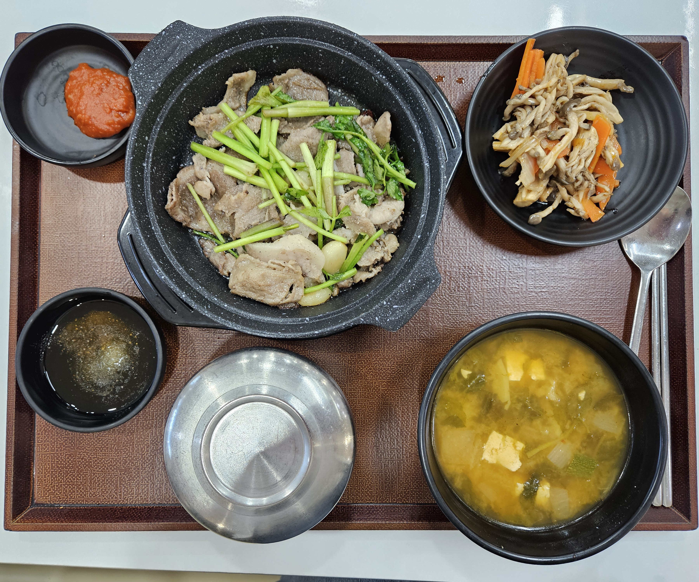

오늘의 점심 싸밥은 돈목살미나리쌈 / 모둠까스 선택인데,  
최근 돈까스를 먹기도 했었고, 모둠으로 나오는 건 별로 선호하지 않아서 전자를 선택했다.  
오늘껀 합격. 지글지글하게 아래 잘 눌러붙어서 빠삭하게 잘 구워져나왔다.  
된장도 맛있었다.  

오늘은 졸업식 시즌이라 그런지 반에 거진 텅텅비었다.  
덕분에 조용하기도 하고 썰렁하기도 한 분위기에서 진행되었다.  
예상대로 프론트엔트 파트는 여전히 성가셨지만, 그래도 꼭 제대로 배워보고 싶었던 내용이라 크게 실증내지 않으면서 열심히 들었던 것 같다.  
이후 잠시 중앙로에 들를일이 있어서 오늘 역시 칼퇴하고 셔틀버스를 타고 대구로 내려갔다.  

퇴실 18시 00분  

---

## 2월 3주차 총평

[Top Page](#) 

역시나 알고리즘은 만만한 상대가 아니었다.  
스택, 큐 개념은 이해하는데 결국 실패하였다.  
그래도 포기한 것은 아니다. 금요일날 잠시 대구로 내려갔던 이유가 급하게 영풍문고에서 책좀 사려고 내려간 것인데,  
Do It! 코딩테스트 파이썬편을 보충강사님께 추천받아서 잠시 사러 내려갔었다.  
강사님 추천대로 이 책은 자세하게 적혀있고, 그림에 슈도코드까지 세세하게 적혀있어서 큰 도움을 받을 수 있을 것 같다.  
물론 아직은 내가 이 개념을 정복할 수 있을지는 모르곘다. 솔직히.  
그래도 해야지 다음주 심화 알고리즘 파트에서 나가리되지 않기때문에, 선택지는 없다.  
하자.  

**이번 한 주를 버티게 해준 고마운 애니메이션**  
[약사의 혼잣말 2기(OTT: 넷플릭스) 6화](https://www.netflix.com/kr/title/81712068)  
[푸른 상자(OTT: 넷플릭스) 19화](https://www.netflix.com/kr/title/81663323)  
[Re : 제로부터 시작하는 이세계 생활 3기(OTT: 라프텔) 11화](https://laftel.net/item/42429)

---
