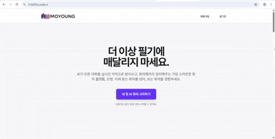
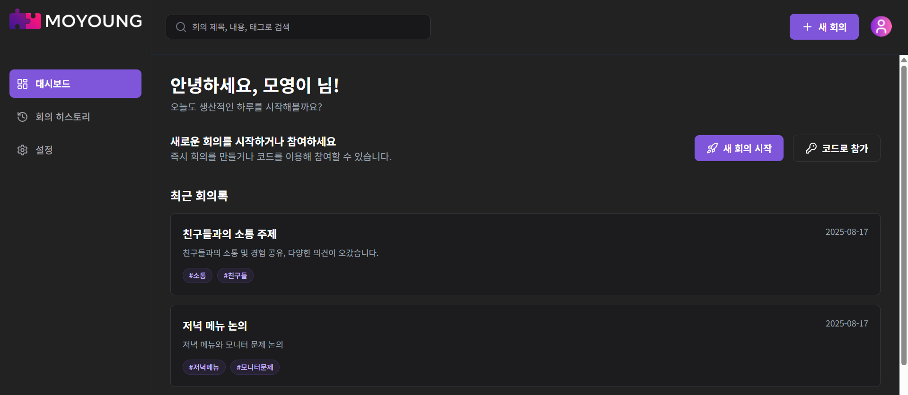
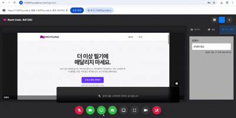
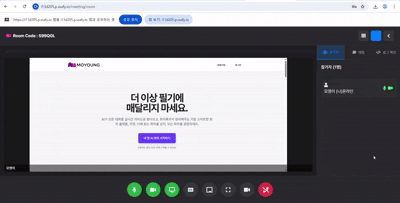
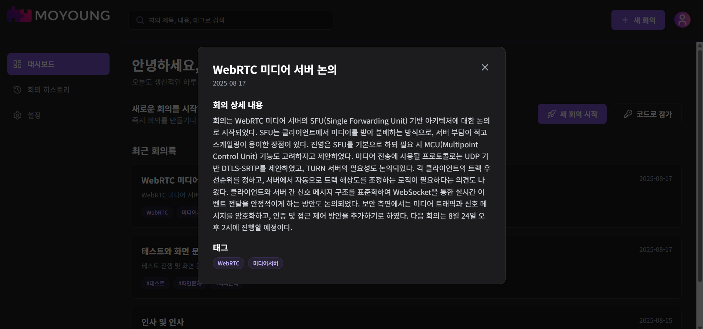
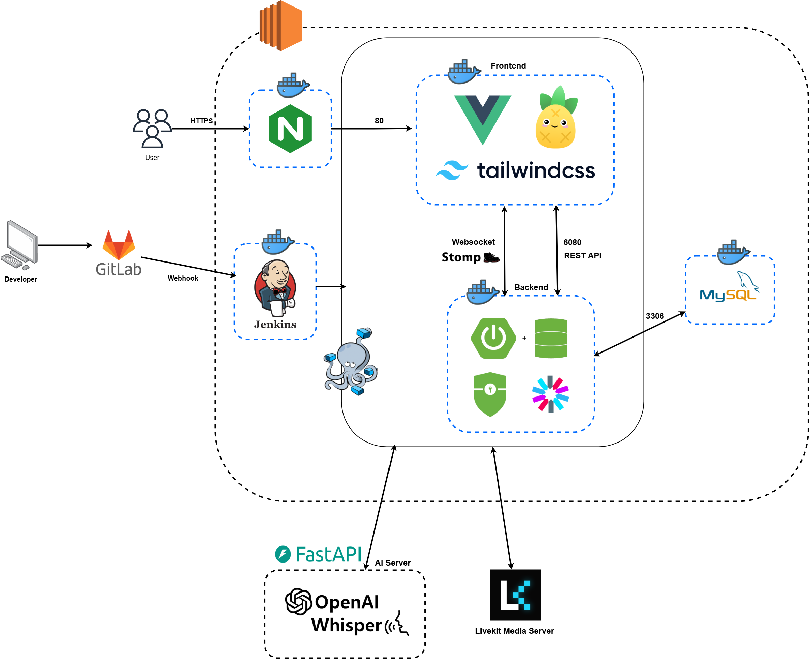

# 주의 사항

SSAFY 프로젝트는 보안 관계상 모든 소스코드 파일 열람이 불가능합니다.  
열람이 필요하실 경우 저에게 연락한 뒤 제가 SSAFY를 통하여 소스코드 열람을 허가를 받은 뒤 공개가 가능합니다.  

---

# 🗣️ MoYoung

실시간 화상회의에서 사용자별 음성을 Whisper를 이용해 실시간으로 전사하고, 자막을 제공하는 화상 회의 플랫폼입니다.

## 📋 목차

- [프로젝트 소개](#-프로젝트-소개)
- [주요 기능](#-주요-기능)
- [기술 스택](#️-기술-스택)
- [프로젝트 구조](#-프로젝트-구조)
- [시스템 아키텍처](#️-시스템-아키텍처)
- [설치 및 실행](#-설치-및-실행)
- [API 문서](#-api-문서)
- [참가 팀원](#-참가-팀원)
- [해당 프로젝트 기여내역](#-해당-프로젝트-기여내역)

## 🎯 프로젝트 소개

MoYoung은 실시간 화상회의 플랫폼으로, 다음과 같은 특징을 가지고 있습니다:

- **실시간 음성 전사** : OpenAI Whisper를 활용한 실시간 음성-텍스트 변환
- **화상회의 기능** : LiveKit을 통한 고품질 화상회의 서비스
- **회의 요약** : AI를 활용한 회의 내용 자동 요약
- **실시간 채팅** : WebSocket을 통한 실시간 채팅 기능
- **화이트 보드** : WebSocket을 통한 실시간 협업툴 제공

## 📱 화면



*MoYoung 메인 화면*



*MoYoung 대시보드 화면*



*MoYoung 실시간 자막 기능 - Whisper 기반 음성 전사*


*MoYoung 화이트보드 기능 - 실시간 협업 그리기*



*MoYoung 실시간 채팅 기능 - WebSocket 기반 메시지 전송*



*MoYoung 회의 요약 기능 - AI 기반 자동 요약 및 키워드 추출*

## ✨ 주요 기능

### 🎥 화상회의
- 실시간 비디오/오디오 통화
- 화면 공유 기능

### 🎤 실시간 음성 전사
- OpenAI Whisper 기반 실시간 음성 인식
- WebSocket 기반 실시간 자막 전사
- 사용자별 개별 자막 표시

### 💬 실시간 채팅
- WebSocket 기반 실시간 메시지 전송
- 채팅 히스토리 저장

### 🎨 실시간 화이트보드
- WebSocket 기반 실시간 협업 그리기
- 다양한 색상과 선 굵기 선택
- 지우개 모드 지원
- 사용자별 커서 표시
- 캔버스 초기화 기능

### 📝 회의 요약
- AI 기반 회의 내용 자동 요약
- 키워드 및 해시태그 추출
- 회의록 자동 생성

### 🔐 인증 및 보안
- JWT 기반 인증
- Google OAuth2 소셜 로그인
- 이메일 인증 시스템

## 🛠️ 기술 스택

### Backend
- **Framework**: Spring Boot 3.5.3
- **Language**: Java 17
- **Database**: MySQL 8.0
- **Security**: Spring Security, JWT
- **WebSocket**: STOMP
- **Media**: LiveKit Server SDK
- **Build Tool**: Gradle

### Frontend
- **Framework**: Vue.js 3.5.17
- **Language**: TypeScript
- **State Management**: Pinia
- **UI Framework**: Tailwind CSS
- **Media**: LiveKit Client SDK
- **Build Tool**: Vite

### AI
- **Speech Recognition**: OpenAI Whisper (faster-whisper)
- **Text Processing**: Transformers
- **Audio Processing**: NumPy, SciPy, noisereduce
- **Language**: Python 3.11

### Infrastructure
- **Container**: Docker, Docker Compose
- **Web Server**: Nginx
- **CI/CD**: Jenkins

## 📁 프로젝트 구조

```
(보안 관계상 원 파일명 삭제)/
├── Backend/
│   └── mainServer/                 # Spring Boot 백엔드
│       ├── src/main/java/com/ssafy/moyoung/
│       │   ├── auth/              # 인증 관련
│       │   ├── board/             # 화이트보드 기능
│       │   ├── chat/              # 채팅 기능
│       │   ├── media/             # 미디어/화상회의
│       │   ├── subtitle/          # 자막 기능
│       │   ├── summary/           # 회의 요약
│       │   └── user/              # 사용자 관리
│       └── build.gradle
├── Frontend/                       # Vue.js 프론트엔드
│   ├── src/
│   │   ├── components/            # Vue 컴포넌트
│   │   ├── views/                 # 페이지 뷰
│   │   ├── stores/                # Pinia 스토어
│   │   └── api/                   # API 클라이언트
│   └── package.json
├── Whisper-MoYoung/               # Whisper AI 서비스
│   ├── whisper_moyoung/           # Whisper 모듈
│   └── requirements.txt
├── nginx/                         # Nginx 설정
├── docker-compose.yml             # Docker Compose 설정
└── Jenkinsfile                    # CI/CD 파이프라인
```

## 🏗️ 시스템 아키텍처



*MoYoung 시스템 아키텍처 - 전체적인 서비스 구성 및 데이터 흐름*

## 🚀 설치 및 실행

### 사전 요구사항
- Docker & Docker Compose
- Java 17 (로컬 개발용)
- Node.js 18+ (로컬 개발용)
- Python 3.11+ (Whisper 서비스용)
- PyTorch cu128 (Whisper 서비스용)

### 1. 저장소 클론
(보안 관계상 삭제)

### 2. 기본 서비스 실행
(보안 관계상 삭제)

### 3. Whisper 서비스 실행
(보안 관계상 삭제)

### 4. 접속 URL
- **Frontend**: http://localhost:80
- **Backend API**: http://localhost:6080
- **Whisper AI**: http://localhost:8000

## 📚 API 문서

API 문서는 Swagger UI를 통해 제공됩니다:

- **개발 환경**: http://localhost:6080/swagger-ui.html
- **운영 환경**: https://your-domain.com/swagger-ui.html


## 📄 라이선스

본 프로젝트는 MIT 라이선스를 따릅니다.

## 참가 팀원

* 김XX(팀장, 백엔드 및 AI)
* 성XX(백엔드)
* 손XX(인프라, 서버)
* 임XX(백엔드)
* 정XX(프론트엔드, 화상회의 프론트엔드 기능 구현)
* 정승재(프론트엔드, TailwindCSS UI/UX)

## 해당 프로젝트 기여내역

저는 해당 프로젝트에서 Vue 프론트 엔드 프로그래밍과, TailwindCSS UI/UX 파트를 담당하였습니다.
프론트엔드의 Auth(회원가입, 로그인 등), 메인페이지와 로그인 후 대쉬보드(단, 실시간 회의 요약, 회의 히스토리 파트는 정XX님이 담당하였습니다.), 설정 파일, 화상회의의 실시간 채팅 부분을 담당하였습니다.  
또한 전반적인 TailwindCSS 디자인 작성을 담당했습니다.

---

**MoYoung Team** - 실시간 화상회의 플랫폼
