# 1주차  

## 1월 7일
[Top Page](#)

8시 30분 싸피 목걸이 배부, 8시 42분 출석.  

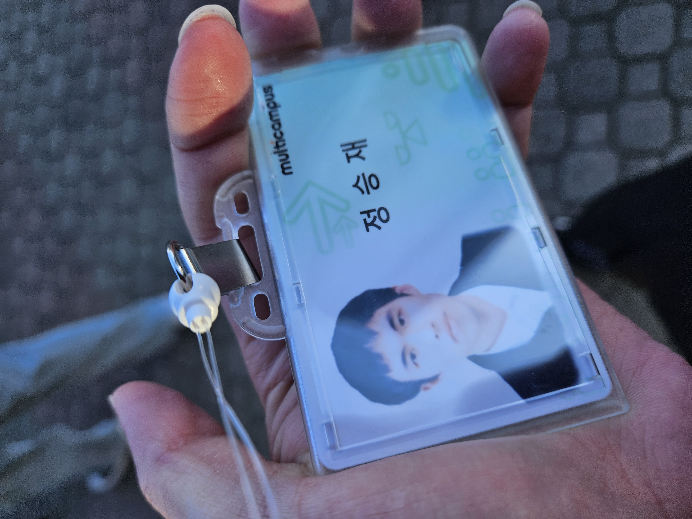  
첫날 목걸이 받으니까 이제 진짜 SSAFY 시작이구나 하는 느낌을 받았음.  
싸피 강의장은 입구에서 가까운 곳에 있어서 통학하면 10분 정도 잡으면 좋겠다 싶었다.  
첫날은 한 게 많지는 않고 전반적인 싸피에 대한 OT에 관련된 전달사항들 전파가 9to6에 거쳐서 진행되었다.  

  

오늘의 점심 싸밥  

낙지 볶음/삼겹삼합 중 택 1인데 나는 낚지 볶음 선택  
맛 자체는 상상하기 쉬운 짬뽕의 정석인데  
싸밥의 명성답게 상당히 맛있으면서 건강한 맛이 드는 게 묘함  

오후 수업도 매나 OT였는데 총프로님(일명 싸버지, 상추쌤)의 마지막 말이 의미심장했다.  

> Hello 에서 o를 빼면 뭐가 될까요? 이상입니다.
>  

오우, 학기 초에 살인 예고 날리는 프로님 ㄷㄷ  
마치기 한 교시 전에 일 년 간의 각오를 적으래서 적음.  

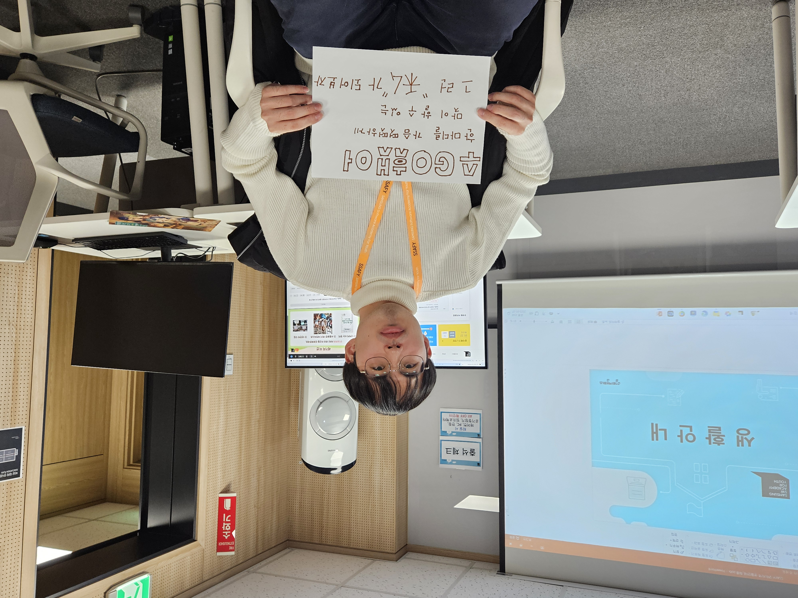  

“수고했어” 한마디를 가슴 떳떳하게 맞이할 수 있는 그런 내가 되어보자  

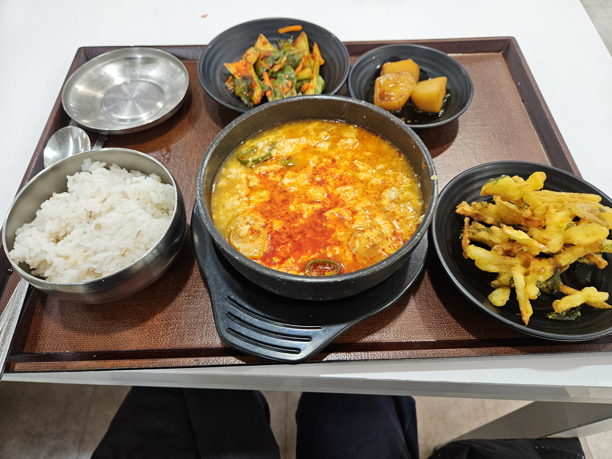  

저녁 싸밥은 몽글두부찌개 / 막국수 중 택1(저녁 싸밥은 돈 내고 먹어야한다. 그래도 저렴)  
말해 뭐해. 진짜 존맛.  

내일 분반테스트 라고 한다.  
솔까 컴퓨팅사고 파트는 SWEA를 봐도 10년 간 수학과 담 쌓았던 나라서 합격 직후 지금까지 봐도 이해가 전혀 안 되었다. 아니 학생 시절때 공부했던 컴퓨터 개론보다도 어렵게 느껴졌다.  
그래서 반 쯤 마음 놨다.  

18시 40분 퇴실  

---  

## 1월 8일
[Top Page](#)

8시 37분 출석  

  
p.s. 어제 찍은 사진이다.  

오늘은 분반테스트다. 힘내자.  
한 가지 마음가짐이자 루틴으로서  
반드시 7:30분 전에 일어나고 출근 목표 시간을 8:30으로 목표하여 지각할 일을 1도 없도록 하기로 하였다.  

분반테스트는 당연히 구미 비전공반이라 Python을 선택.  

이유는 전공자반에 섞여 들 깡은 나에게 없고 Python은 예전부터 배워보고 싶은 언어 버킷 리스트에 있었기 때문이다. 다소 힘들긴 하나 비전공자라도 JAVA, mobile 반에 들어갈 길은 있는 것 처럼 보인다. **보안 상 상세 내용은 말해줄 수 없으나** 그 수준에 맞는 시험을 잘 치면 된다. 인터넷에 좀 만 검색해보면 대외비 경계를 아슬아슬하게 줄타기하여 말해둔 다른 선배의 수기가 있을지도 모르니 함 찾아보자. 나는 쫄보라 어디까지 말해도 되는질 몰라서 몸을 사리도록 하겠다.  

일간 시험 후기는 사전에 겁먹을 필요가 전혀 없었다. 이 이상의 말은 안 하겠지만, 부담이 갈만한 수준은 아니다. 물론, 사전에 파이썬은 당일 날 아침에 대충 벼락치기로 명령어 셋 한 두번만 훑어본 수준이고 SWEA는 아예 집어 던진 수준이라서 못 풀거나 찍은 부분도 많긴 한데, 어? 생각보다… 로 마무리 하겠다.(아 참고로 본인은 첫 언어가 JAVA다. 파이썬이 첫 언어가 아니라는 점은 고려를 부탁한다.)  

아, JAVA 공부는 계속 하기로 마음먹었다. 어짜피 추후 알고리즘 B형 자격을 딸 거라면 JAVA도 아는 게 맞는 것 같다. 최근 정신없었어서 진행을 더 못했는데, 지금같은 여유로울 때 해야겠다.  

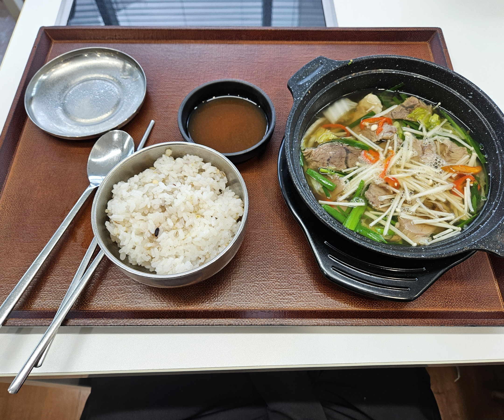  
오늘의 점심 싸밥은 우사태수육전골 과 에비동 중 택 1이다.  
나는 우사태수육전골을 택했다. 사유는 진짜 별거없다.  
난 해산물을 잘 못 먹는다. 추가로 김치도 잘 못 먹는다.  
편식을 줄여보려 노력하지만 김치만큼은 안 익숙해지더라.  
고로 반찬류가 좀 허하게 찍혀있더라도 이해해주길 바란다.  
버릴 반찬이면 안 가져온다가 내 철칙인지라.  

  
  
전날 수업 받는 공간을 찍을 여유가 없어서 못 찍었는데  
분반테스트가 끝난 지금은 살짝 여유가 나서 내 강의실이 위치한 층의 휴게 공간 전경을 한번 찍어봤다.  
사진 보안은 싸피 구미캠퍼스 내라면(즉, 삼성전자 구미사업장 부분만 안 찍으면) 자유롭게 찍어도 된다고 허락 받았으니 걱정은 안 해도 될듯하다.  
상당히 깔끔하고 개방적인 분위기가 물씬 풍기니 앞으로의 여유 없는 날이 되더라도 환경에서 만큼은 갑갑함을 느끼지 않길 간절히 소망 해본다.  
오후 수업은 어떤 개발자가 되고 싶냐는 비전 수립과 관련된 레크리에이션으로 진행되었다.  

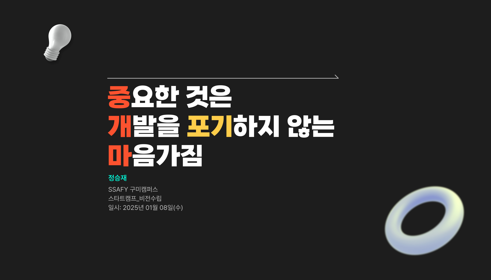

어제랑 맥락은 같은 비전을 모토로 삼고 전진하기로 하였다.  
이후는 프로젝트를 짜는 요령을 훈련하는 듯한 레크레이션을 하루 종일 진행하였다.  
어렵진않고 오히려 즐거웠다.  
쉬는 시간에 나가봤는데 눈 오더라 오늘… 것도 펑펑.  

마지막으로  
Feeling - 피드백을 통해서 타인의 의견을 보완하는 과정의 뿌듯함과 기여감을 느꼈다.  
Fact - 올바른 PT를 만드는 과정은 고되다.  
Finding - 타인의 피드백으로 우리 조의 PT를 쉽고 효율적으로 보완할 수 있다는 사실을 깨달았다.  
Future - 협력을 통하여 어려운 과제를 서로서로 분담하여 효율적으로 해결해나갈 방안을 미래에 적용시킬 수 있게 되었다.  

오늘 배운 4F를 통하여 오늘의 하루를 정리하는 것으로 마무리.  

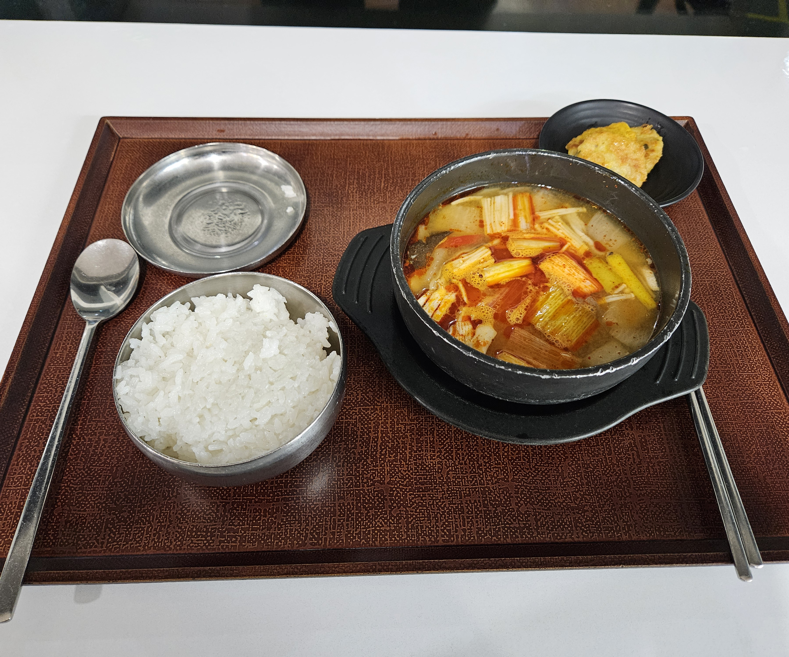  
오늘의 저녁 식권싸밥은  
차돌버섯된장찌개/김치잔치국수/프랭크버거(C코너는 식권사면 먹을 수 있단다)라고한다.  
된장찌개 선택. 마무리는 단촐하게.  
18시 21분 퇴실 완료  

---  

## 1월 9일
[Top Page](#)  

8시 38분 입실.  

딱 30분에 맞게 출입하여 사내 이디야 커피서 차 한잔 뽑고 하루 시작.  
한파주의보 무셔, 겁나 추움.  

오전 수업은 교양 및 SSAFY생활정보 등의 강의 위주로 진행되었다.  
아직은 코딩,알고리즘,기초 관련 강의는 아니긴한데 내용은 **보안 규정상 밝힐 수 없다는 점**이 아쉽다.  
이외에는 별로 기술할만한 사항이 없으므로 생략.  

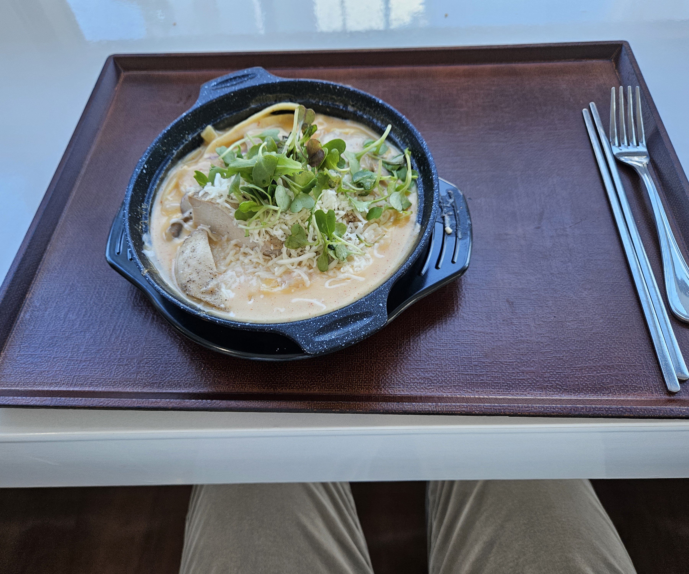  
오늘의 점심은 뚝배기한돈김치찜/치킨투움바파스타 중 택 1이었다.  
나는 치킨투움바파스타 선택. 아니 이걸 어떻게 참냐고 ㅋㅋ  
다만 같은반 분에게 물어보니 일부는 면이 설익어서 나와서 복불복이 좀 있었나보다.  

오후는 어제 오후의 수업의 연장선으로 어제 만든 팀 자료를 피드백 받은 부분을 다시 고친 뒤 발표하는 시간을 가졌다.  
내용이 적은 이유는 피피티 고치는데 서로 머리싸매며 거의 2시간 이상을 쏟아부었기 때문에 사실 말할 것이 없긴하다.  
머리는 좀 아픈데, 팀 협력적인 부분이나 아이스브레이킹 용으로는 꽤 좋은 시간이 었던것 같다.  
다만, 우리 선정 주제가 다소 애매해서 그런지 발표할 때 질문을 엄청시리 많이 받았다.  

오늘도 4F로 마무리 하겠다.  

Feeling - 내 의견이 최선이 아닐 수 있다는 겸손함  
Facts - 사람의 의견은 각양각색이다  
Findings - 그럼에도 내 의견이 합쳐져 완성도 높은 팀 의견으로 도출 될 수 있다는 사실  
Future - 협력이 필요할 사항이 생기면 망설이지말고 협력하자  

오늘은 집에 유통기한 끝나가는 식재료가 있어서 그거 좀 소비해야해서  
저녁싸밥은 패스하기로 하였다.  

참고로 오늘의 저녁은 들깨수제비국/삼겹김치볶음밥/쉬림프버거 였다고한다.  

퇴실 18시 00분  

---

## 1월 10일  

8시 40분 입실  

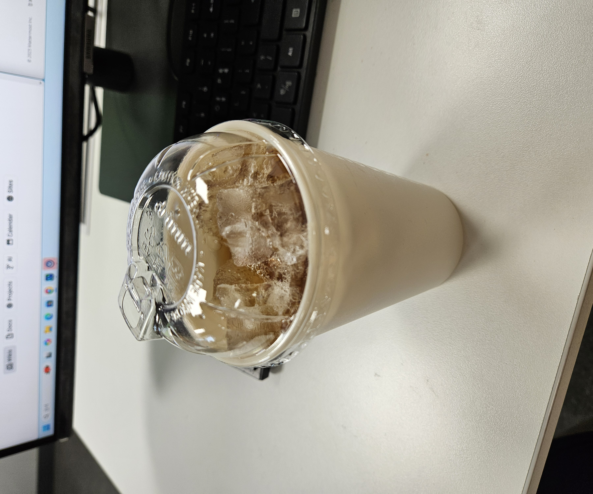  
시시콜콜한 잡담을 하자면, 삼성 사내 이디야커피는 아이스 음료를 줄 때, 리유저블 컵을 테이크아웃용 컵으로 사용하는 듯 하다.  

개인적으로 이디야는 그다지 선호하는 커피 브랜드는 아닌데(사유는 저가형 카페 브랜드 중 내 기준에서는 **가장 맛이 없다**.  
나는 저가형 브랜드 중에서는 더벤티를 제일 선호하고, 프로모션 음료 마시러 스타벅스 다니고, 핫밀은 팀홀튼을 가장 선호하고, 홍차는 투썸플레이스를 선호하고 이외에 자잘한 음료는 달콤커피를 가장 선호한다.  
나는 먹는 거 마실 거 취향은 꽤 또렷한 사람이다.  
커피는 학생 시설 때는 혈관에 꽂다 못해 콩까지 사서 직접 갈아 내려서 다니던 사람이었으나 나이를 먹으니 속에서 잘 받는 체질이 아니게 바뀌어서(마실 순 있는데 하루 속 뒤집어 질 각오하고 마셔야 한다.) 요즘은 안 마신다.  ~~매우 속상하다~~) 이런 건 또 신기했다.  
다 마신 컵은 사내 리유저블컵 회수함에 버리면 깨끗하게 씻어서 재활용하는 모양이다. 하긴 이 정도 대기업이면 자원 선순환 프로젝트 같은 것도 참가하는 모양이다.  

오전은 어제와 마찬가지로 싸피 생활 관련 안내에 대한 온라인 강의 위주로 진행되었다.  
역시 특이한 내용은 없고 정말 SSAFY 생활 안내 내용이라 언급은 생략하도록 하겠다.  
이러한 강의는 이번 주 까지고 다음 주부터 본격적인 강의가 시작되는 모양 인가보다.  

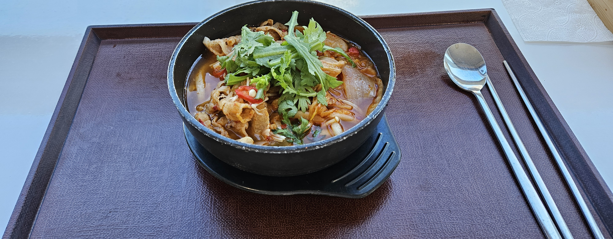    
오늘의 점심 싸밥은 자반고등어구이/우삼겹김치나베우동 중 택1.  
내 선택은! 우삼겹김치나베우동.  
내가 김치를 싫어한다 말해서 의외의 픽일 수 있는데 생김치를 비선호할뿐, 김치찌개 같은 파생은 잘 먹는편이다.  

오후 역시 전반은 SSAFY 생활에 관련된 안내 강의가 다수였는데, 놀라운 사실은 SSAFY에서 수업은 본인의 반 수업을 기본적으로 듣게되겠지만, **원한다면 다시 보기 듣기로 타 반 수업도 들을 수 있다는 사실을 알았다. 내 JAVA 지식도 내 노력만 따라가면 SSAFY식으로 배울 수 있다는 점은 놀랍다.** 최대한 활용해봐야겠다.  

또 하나의 놀라운 점이다.  
SSAFY에서는 intelij, mangoDB같은 상업용 프로그램들을 라이선스를 줄 뿐만이 아니라, GPT-4o, Gemini등의 다양한 AI들을 종합시켜 싸피만의 통합 인공지능으로 제공하고있다. 프로그래밍할 때 요긴하게 쓰일 것 같다. **이것만으로도 일반 국비 교육을 아득히 초월할만한 메리트가 있다고 판단했다**.  
1년 열심히 공부해서 SSAFY 도전했길 잘했다는 말은 몇 번째 되새기고 있는지 모르겠네.  

마지막에는 SSAFY 게이미피케이션 싸피레이스 12기 선배분들이 하는 경기를 관람했다.  
싸피 홍보영상에 나왔던 그 자동차 게임이 맞다.  
미래에는 우리가 하게 될 거라고 하는데, 언어는 C++, JAVA, Python 뭘로 해도 되고 각 인터프리터간 차이는 거의 없다고 한다.  

5시 경에 분반 확정되었다. 물론 비전공 Python반이다.  

    

오늘의 저녁싸밥은 총각두부짜글이찌게/돌솥비빔밥/BHC순살레드킹 중 택 1이라고한다.  
원래 BHC고르려고했는데 매진이란다. 찌게를 골랐다.  
역시 반찬 다 안 가져와서 허한건 ㅈㅅ. 내 입이 많이 짧은 편이라 용서를.  

퇴실 18시 29분  

---

## 1주차 총평  

1주차는 스타트캠프라는 말 그대로 SSAFY의 교육과정 및 내부 규정, 생활 수칙들을 전파하고 코딩/알고리즘 수업에 앞서 SSAFY와 앞으로의 개발자 생활을 위한 교양 수업 + 트렌드를 강의하는 주차였던 감상평을 남기고 싶다. 특히 요즘 개발 트렌드가 인공지능에 상당히 집중되어 있는듯한 인상을 받았다.  

상세한 강의 내용은 **당연히 대외비이자 싸피 교육의 영업 비밀로서 외부에 발설**할 수 없기 때문에  나 역시 여기에 써내려갈 순 없겠으나, 나는 적어도 그러한 인상을 받았고 실제로 관련 강의는 워낙 유용한 내용이 많았다보니 나도 모르게 저절로 필기를 하는 나 자신을 볼 수 있었다.(**나는 쫒겨날거면 차라리 내 실력과 노력 부족으로 쫒겨나는게 덜 억울하다. 적어도 보안규정 위반으로 불명예스럽게 싸피에서 쫒겨나긴 싫다.** 담당 프로에게 일기에 강의 자체의 상세 내용은 적지말고 개인 감상 수준에서 풀어나가는 것을 권장 받았다. 앞으로도 나는 내가 기획하고 제작한 수준의 코드라면 모를까 순수하게 오늘 코딩/알고리즘 수업에서 어떤걸 배웠는지 상세히 적는 것(즉, 내 방식으로 가공된 지식이 아닌 싸피에서 가르친 그 자체의 지식)은 이 글을 볼 사람에게는 미안하지만 작성을 지양할 예정이다.)  

혹자는 이 스타트 캠프 기간을 아깝고 지루하고 실망스러운 기간이라고 저평가 하는 분들이 간혹 있던데, 물론 그 느낌이 틀린 감상이라고는 말하진 않겠다. 누군가에게는 싸피에서 더욱 많은 실무능력과 코딩능력을 얻길 기대했을지도 모르고 그게 그 사람에게 더 도움이 될 수 있을지도 모르니 어찌보면 나같은 비전공자들 때문에 더 나은 실력을 갖출 수 있는 분들이 더 빨리 더 많은 것을 배우지 못해 더 좋아질 수 있었던 포텐셜이 묶였을 수도 있다. 이해한다 그리고 죄송하다는 말씀을 드리고싶다. 그리고 이게 애초에 사람 생각은 다 같을 수 없고 저마다의 생각과 입장, 지식차이가 있기에 내 입장이 그들과 같을 순 없고 그렇기에 이를 간과하고 함부로 그 생각을 재단하는 행동은 무례할 수 있다고 생각한다. 그래도 이것만큼은 하고싶은 말은 다른 국비교육을 수강한 경험이 있고 무엇보다 경험이 적은 비전공자인 내 입장에서는 하루하루 수업이 매우 소중한 수업이었다고 생각한다.  

~~앞의 빌드업은 이 한마디를 위한 양해의 제스처라고 봐줍시사.~~  

다음주부터 본격적인 싸피 수업의 시작이다. 물론 분반 직후 첫주까진 맛보기+실전압축 미리 학습해보기 수준의 튜토리얼 코딩 수업이지만 방심말고 주말간 파이썬과 예습용 학습자료로 공부할 필요성을 느꼈다. 힘내자.  

이번 주를 버티게 해준 고마운 애니메이션  
푸른 상자(OTT: 넷플릭스) 14~15화  
별 내리는 왕국의 니나(OTT: 라프텔) 11~12화  

---

# 2주차  

## 1월 13일  

입실 8시 38분  

주말 간은 쉬면서, 파이썬의 명령어에 익숙해지는 예습을 미리 하였다. 개인적으로 자료형에서 튜플(tuple)이 신기했는데, 기본적인 형식은 list와 비슷하나 정의 한 뒤로는 변경이 불가능한(다만, 튜플+튜플(혹은 리스트)로 새로운 튜플을 만드는 건 가능하다고한다.) 특징이 있는게 신기하였다. 따로 변경하면 안 되는 array를 작성할 때 유용할 듯 하다.  

쉬다가 다시 9to6를 소화하려니 평소보다 더 피곤한 느낌이 들었다. 딱히 밤샘작업을 한 것도 아니고 평소처럼 잘 잤는데도 말이다. 이래서 직장인들이 월요일을 극혐하는 건가 싶기도 하였고 예전에 국비교육 받을 때의 악몽이 생각나기도 하였다.  

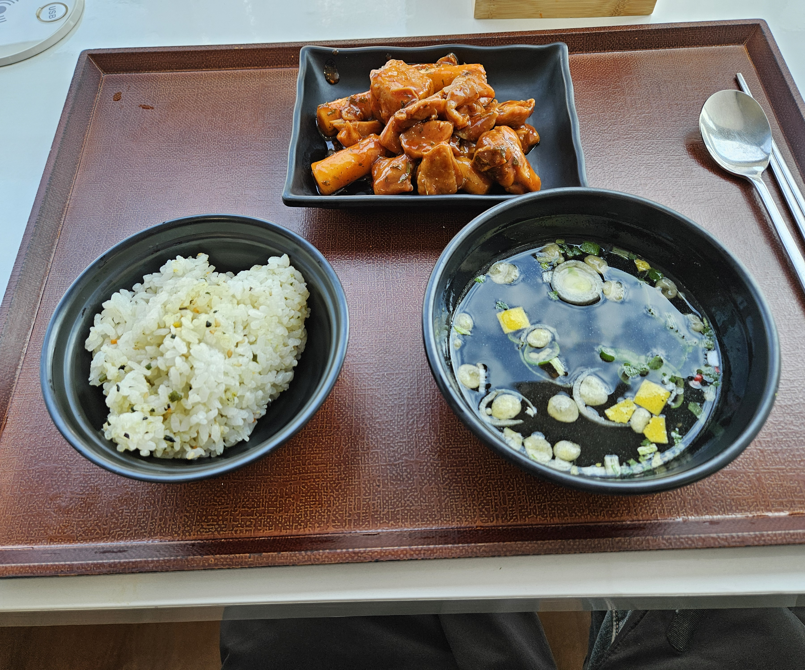    

금일 점심은 우삼겹두부김치삼합/숯불양념순살치킨 중 택 1이었다.  
그리고 숯불양념순살치킨을 선택했는데, 튀긴 놈이 아니라 담백한 닭가슴살 구운 치킨으로 나왔다.  
역시나 건강함의 풀무원…  

    
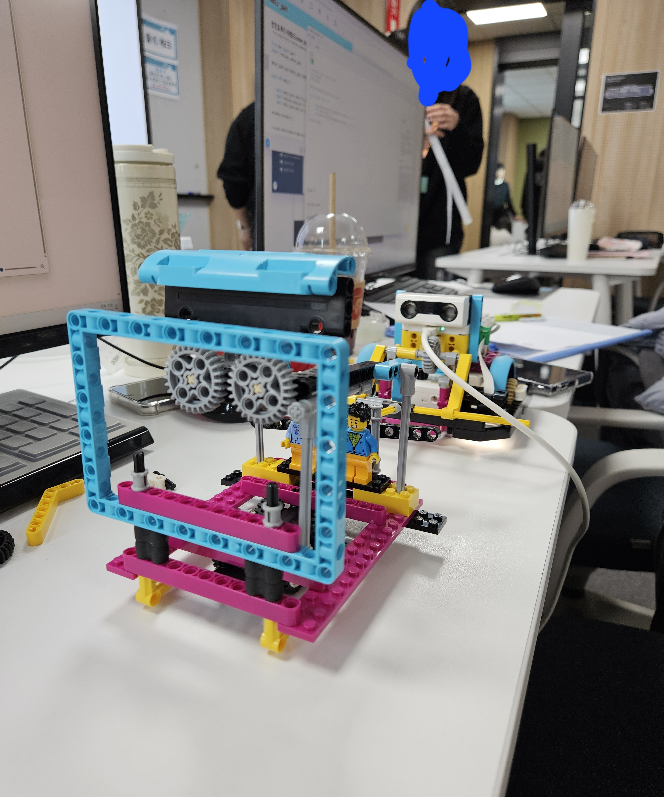    
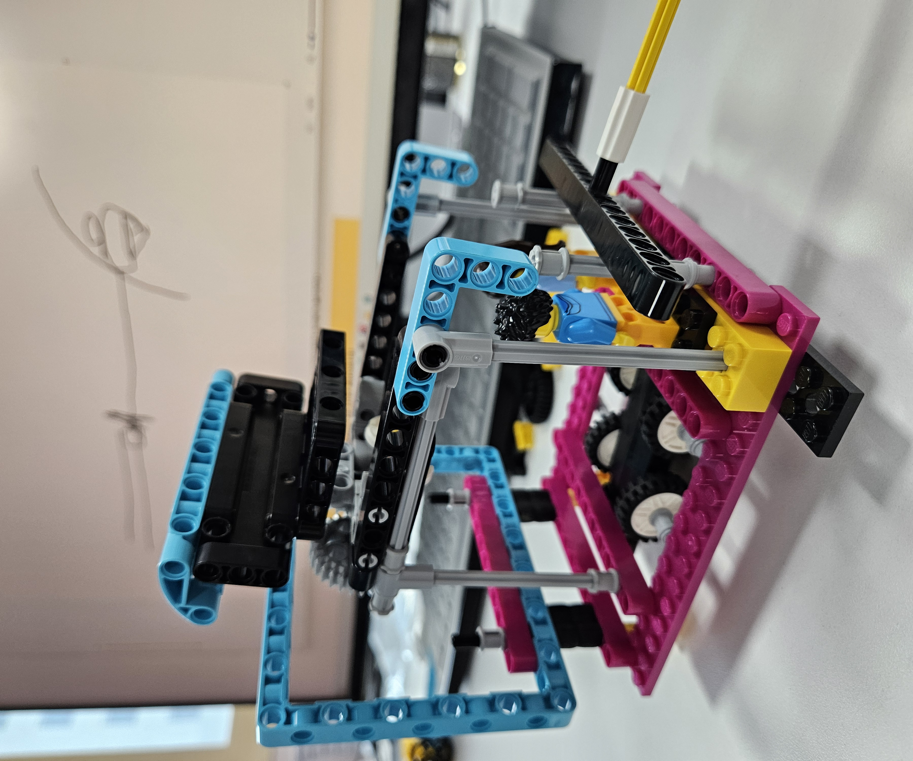    

오늘은 하루 종일 레고 키트(spark)와 파이썬을 이용하여, 팀플레이로 프로그래밍+로봇 체험을 하는 시간을 가졌다.  
1번 사진이 우리 조원 들과 같이 만든 키트. 2번 사진이 제품 개발 아이디어 발표용으로 만든 레고 모형(주제는 인공지능과 가상현실을 결합한 체험형 쇼핑 프로그램)  
3번 사진이 실제로 레고 전동 자동차가 돌아다는 모습을 찍은 사진이다.  

이동 경로나 집게 위 아래 움직임은 파이썬으로 일일이 각도나 이동 거리를 입력시키고,  
세팅이 완료되면 미리 입력된 정보대로 자동차가 움직이는 형태로 작동되었다.  

확실히 우리가 짠 코딩이 눈 앞에서 움직이는 모습을 보이니 아직은 맛보기 수준의 코딩일지라도 확실히 개발에 대한 동기부여로는 확실한 것 같아 보였다. 정말 간만에 재밌게 즐겼다.  

    

저녁 싸피는 불향오징어볶음/만두버섯전골/프랭크 버거 중 택1인데,  
햄버거가 좀 땡겨서 프랭크 버거를 택했다.  
참고로 좀 식어서 나오기 때문에 전자레인지 몇 초정도 돌려주면 괜찮아진다.  

퇴실 18시 29분  

---

## 1월 14일

출석 08시 38분  

감기에 걸려서 목상태가 영 메롱하다. 안 그래도 요즘 감기랑 독감 엄청 유행 중이라고 한다. 백신 맞았다고 안심하지 말고 조심조심하는 하루하루를 보내는 게 좋아보인다. 일단은 테라플루나 판콜 까먹으면서 버티는 중이다.  

    
오늘은 AI 프롬프트에 관해서 오전에 배웠는데, AI는 사전에 어떠한 설정을 부여해주면 그 설정에 맞게 스타일을 변형하여 좀 더 정확한 결과를 도출하게 하는 기술 중 하나다.  
여러 방법이 있는데, 역할 지정(페르소나 기법), 마크다운 기법, Shot 기법 등등 다양하게 있다고한다.  
앞서 말한 기법이 바로 페르소나 기법이고, 마크다운 기법은 프롬프트에 서식을 입력하면 결과물에 서식을 출력해주는 기법이고, Shot 기법은 내가 찾고자 하는 질문에 대한 예시를 제시하여 답변의 정확도를 높히는 기법이라고 한다.  

새로운 것을 알았다.  
[https://gptforwork.com/](https://gptforwork.com/)  
해당 플러그인을 이용하면 Google Sheets나 MicroSoft Excel에 GPT Plug-in을 설치시켜,  
내용 요약, 자동화 등등 다양한 기능을 시켜주는 것 같다.  
앞으로 자동화 최적화 시킬 일이 있다면 참조해도 괜찮아 보인다.  
다만 제대로 활용하기 위해서는 이것도 유료 서비스로 이용해야하는 것으로 보인다.  

    
오늘의 점심 싸밥은 돼지순대국밥/해물해장파스타.  
나는 해물해장파스타 선택.  

오후는 레드브릭이라는 자바스크립트 기반 게임제작툴로 게임을 만들어보는 체험을 가졌다.  
일단 결론부터 말하자면, 원하는 게임을 만드는데는 실패하였다.  

주제가 워낙 두루뭉실한 어려운 주제였기도 했고, javascript에 아직 안 익숙하다보니 뭔가 새로운 것을 만들어내려 시도하면 오류를 터트리기 일수라, 기존의 예시 게임에서 몇개만 추가하고 고치는 정도로 타협하여 제출했다.(참고로 다른 조라고 다르지 않았던 것 같다. 우리보다 좀 더 완성도 높았을 뿐 다른 조들도 원하는 만큼의 퀄리티가 나오지 않아서 마지막까지 다들 분주했던 기억이난다.)  

게임은 제대로 공부된 상태로 다음에 제작해보고 싶다.  
우리 팀장이었던 분이 계획대로 안 되어서 좀 많이 분하셨던 것 같던데,  
나도 꽤 분했지만 이번 경험을 토대로 다음에는 제대로 된 계획을 세워서 완성품을 제출할 수 있는 날이 찾아오면 좋겠다.  

금일은 고봉민김밥 돈까스가 땡겨서 저녁 싸밥은 패쓰  
눈꽃치즈닭갈비/베트남쌀국수/프랭크 버거  
였다고한다. 별로 땡기는 요리는 아니었다.  

퇴실 18시 10분  

---

## 1월 15일

입실 8시 48분  

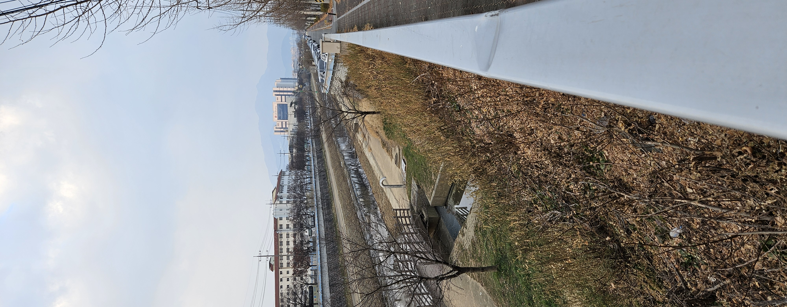    
오늘은 오전에 좀 밍기적 거리다보니 37분에 출발해버려서 늦게 도착한 듯 하다.  
늘 그렇듯 7시 30분 기상, 8시 30분 목표로 도착 루틴을 포기하지는 않을거다.  
앞으로는 좀 조심해야겠지만.  

    
오늘부터 본격적인 **파이썬 교육의 시작**이다. 참고로 그날 내가 작성한 코드 올리는 것도 허락 받았다.  

오전에는 강사 님과 학생들 간 자기소개 시간을 가졌다.  
[PPT도 만들어서 제출했는데 이건 직접 확인해보시라…](https://www.canva.com/design/DAGcOCz7kgo/3tqOyBpSN1NhME3l2Zieyg/view?utm_content=DAGcOCz7kgo&utm_campaign=designshare&utm_medium=link2&utm_source=uniquelinks&utlId=h15705eb4d4#6)

앞으로의 사용 프로그램 버전들은  

git-2.47.1 (git bash)  

pycharm community 2020.3.5  

vscodeUser 1.95.3  

python 3.9.13  

pypy3.7 v.7.3.4  

mysql 8.0.37.0  

spring tool suite 4-4.22.1 release e4.31.0  

bellsoft-jdk17.0.9 +11  

이다.  

    
오늘의 점심 싸밥은 한방설렁탕/동파육덮밥 이었다.  
나는 한방설렁탕을 선택했다.  
둘다 진짜 좋아하는거라 엄청 고민 많았는데, 고심끝에 내 기준 원탑 국밥인 설렁탕이 너어무 땡겨서 선택하였다.  

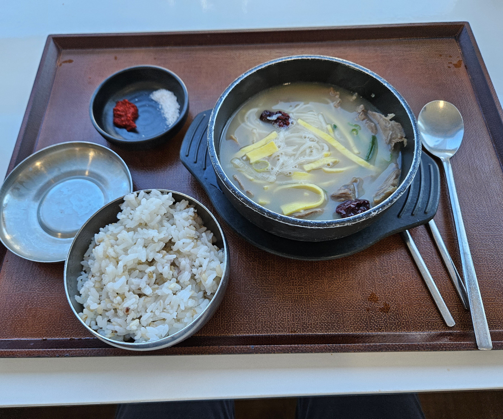    

오전에 이어 파이썬 강의다.  

먼저 GIT 사용에 대해 배웠다.  

> git bash 사용 설명서
>  

$ls : 현재 위치의 파일 목록 표시  

$cd <폴더명> : 디렉토리 이동  

$cd .. : 상위 디렉토리로 이동  

$Python : 현재 설치된 파이썬 정보 ( 윈도우에 깔려있는 파이썬을 인식, 개발환경 구축하기 전에 이 명령어를 입력하여 혹시 사전에 깔린 python 정보가 있는지 확인해야한다. 만약 윈도우 스토어가 뜬다면 안 깔려있는거고 버전명이 뜬다면 파이썬이 깔려 있는 것이다.  

$Python -V : 현재 파이썬 정보를 확인하는 명령어  

$git init : git 레퍼지토리 경로 마스터 설정(CLI에서 가장 중요한 점은 내가 지금 어느 경로에 있는가를 확인하는 것이 중요하다.)  

$touch [README.md](http://README.md) : readme 파일 생성  

$notepad [README.md](http://README.md) : 메모장으로 readme 파일 열기  

$git log  : 커밋 로그 확인  

$git log —oneline : 커밋 로그 한 줄로 보기  

$git log —oneline -l : git global 설정 정보 보기  

$git status : git 현재 상태 확인(현재 상태를 보고 싶을 때 수시로 부담없이 확인할 것)  

$git add <파일 명> : 깃 변경 사항을 Staging Area로 이동.  

$git add . : 현재 경로 아래에 있는 모든 변경 사항/신규 사항을 전부 Staging Area로 이동시킴  

$git remote add origin https://github.com/<사용자명>/<레파지토리 명> : github에 리모트 시키는 명령어  

└origin : 원격 저장소 명  

$git push origin master : github에 푸쉬하기  

$git clone <git URL> : 사본 가져오기(최초 1회때 사용 권장)  

$git pull <git URL>  : github에서 가져오기  

$git clone <git URL> .  : 폴더가 만들어지지 않고 바로 만들어짐.  

$git commit -m “<커밋 메시지>” : Staging Area의 내용을 Repository로 보내겠다.  
└ -m : 메세지 적겠다는 선언  

    

$git commit —amend : amend 모드 진입(바로 직전에 commit한 내용 편집)  

└ 명령어 모드에서 i 누를 시 insert 모드(편집모드)로 변경됨  

└ 편집모드에서 esc 모드를 누를 시 다시 명령어 모드로 변경됨  

└ 명령어 모드에서 dd 입력시 1줄식 삭제  

└ :wq : 저장 후 나가기  

└ :q! 저장하지 않고 강제로 나가기  

$git config —global [user](http://user.name).email “<이메일 명>” : git 정보 입력 이메일명.  

$git config —global [user](http://user.name).name“<닉네임 명>” : git 정보 임력 이름.  

└ 둘 다 하면 된다.  

만약 오류가 생겼다면  

> 시스템 설정 - 환경변수 - Path 환경변수 편집 - Window 부분 삭제, Python 경로 설정 되어있는지 확인  
> 

> C:\Users\<사용자명>\AppData\Local\Programs\Python\Python39 
> 
> 
> "C:\Users\<사용자명>\AppData\Local\Programs\Python\Python39\python.exe"  
> 

VS Code의 기본 실행을 윈도우 파워셀에서 gitbash로 설정하는 방법  

> Ctrl + ~ → +: 클릭 → select default profile → gitbash  
> 

이 형태로 설정하면 된다고 한다.  

> GIT 유의사항  
> 

중첩된 형태로 git을 만들지 말것.(하위 폴더에 .git 폴더가 있는 것을 지양할 것)  
작업하고 add 하고 commit 하기  

레퍼지토리의 상태가 3가지 정도 있을 수 있다.  

Working Directory - 작업하는 공간  

Staging Area - 임시 저장 공간, WD에서 변경된 파일 중 다음 버전에 포함시킬 파일들을 추가하거나 제외할 수 있는 중간 준비 영역  

Repository - 버전, 이력, 파일 들이 영구적으로 저장되는 영역  

   

오랫만의 묵직한 git의 감각. 서늘하다.  

자치위원 중 CA를 신청 해봤는데, 경쟁자분이 경력이 너무 쟁쟁하고 소개를 너무 잘하셔서 아쉽게도 떨어졌다. 그래서 직후 바로 SSAFYcial 신청에 도전하기로 하였다.  

오늘 저녁도 나랑은 영 별로일것 같아서 집와서 먹었다.  

금일 저녁 메뉴였던 것.  

돈육김치찜/참치김치밥버거/프랭크버거  

퇴실 18시 05분  

---

## 1월 16일  

---

이번 주를 버티게 해준 고마운 애니메이션

약사의 거짓말 2기 1화(넷플릭스)

토라도라 1-2화(라프텔)
